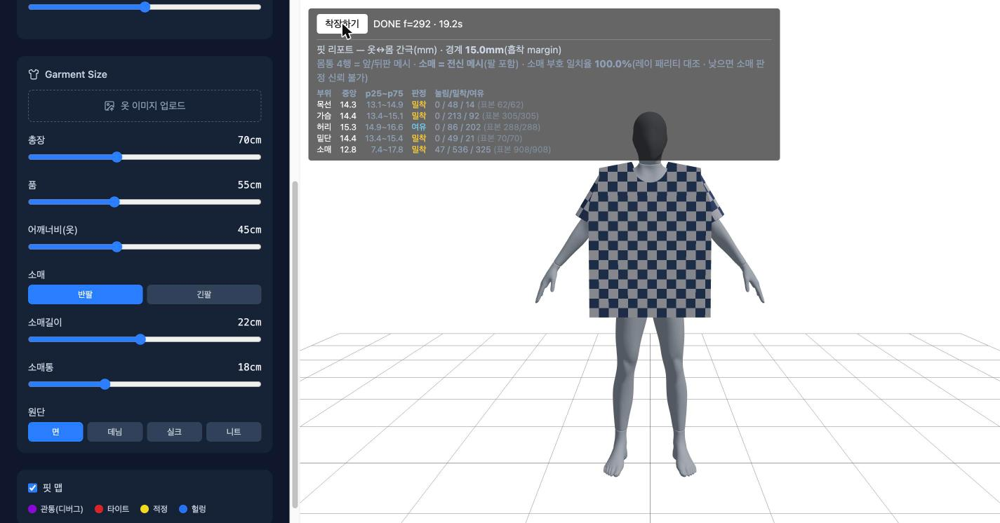

# Fit Simulator

**옷의 실측 치수와 몸의 실측 치수를 넣으면, 그 옷을 그 몸에 실제로 입혀 보고
어디가 끼고 어디가 남는지 숫자로 알려주는 시뮬레이터.**

치수를 «그림에 맞추는» 것이 아니라 **패턴을 제도하고 → 몸에 배치하고 →
물리로 입힌다**. 옷 사진을 올리면 원단색·프린트를 뽑아 텍스처로 입힌다.

> **데모** — https://banshk445.github.io/fit-simulator/?patterncore=1
> 왼쪽에서 치수를 맞추고 **「착장하기」**를 누르면 15~40초 뒤 결과가 나온다.
> 「핏 맵」을 켜면 부위별 여유가 표로 나온다. (`?patterncore=1`이 패턴 경로다 —
> 파라미터 없이 들어가면 예전 격자 기반 경로가 뜬다.)

**지금 되는 것**

- **몸 5축 · 옷 5축이 전부 살아 있다** — 키·가슴·팔·다리·어깨너비(몸) /
  총장·품·어깨너비(옷)·소매길이·소매통. 슬라이더를 움직이면 **패턴이 다시 제도된다**
  (그림을 늘이는 것이 아니다).
- **핏 리포트 5부위** — 목선·가슴·허리·밑단·**소매**의 옷↔몸 간극을 mm로 낸다.
  판정 경계는 물리가 흡착 목표로 쓰는 그 거리(15.0mm)이고, 화면이 그 값을 스스로 밝힌다.
  소매 행은 부호를 두 채널로 교차검증해 **일치율까지 함께 띄운다**.
- **반팔 · 긴팔** — 긴팔은 팔꿈치에서 꺾인 콜라이더를 따라 전완을 타고 내려가고,
  소맷부리는 **손목 실측(14.88cm)에서 도출**해 좁힌다.
- **입력이 삼켜지면 그렇다고 말한다** — 어깨너비가 몸 관절에 걸리면 실제 적용값을
  띄우고, 품이 가슴을 감쌀 수 없으면 **실행하지 않고** 필요한 값을 알려준다.



---

## 어떻게 도는가 — 파이프라인

```
몸 슬라이더 ──► 마네킹(본 스케일) ──► 몸 스냅샷 ──┐
                                                  ├─► 제도 ─► 배치 ─► 착장 ─► 렌더
옷 슬라이더 ─────────────────────────────────────┘
```

| 단계 | 파일 | 하는 일 |
|---|---|---|
| 몸 스냅샷 | `src/lib/bodySnapshot.ts` | 살아있는 마네킹을 구워 정점·인덱스·프록시 캡슐·포즈를 뽑는다 |
| 몸 실측 | `src/lib/bodyMeasure.ts` | 1cm 슬라이스로 가슴·허리·목밑·어깨 통과 둘레와 어깨 능선을 잰다. **팔은 축에 수직인 단면**으로 따로 잰다(위팔 27.25 · 팔꿈치 23.30 · 전완 19.47 · 손목 14.88cm) — 소매 제도의 입력이다 |
| **제도** | `src/lib/patternDraft.ts` | 몸 실측 + 옷 치수 → **2D 패턴**(앞판·뒤판·소매 · 목선·암홀·소매산 곡선) |
| **배치** | `src/lib/patternGarment.ts` | 패턴을 삼각화하고 몸 앞뒤 평면·팔 축 원통으로 **3D에 놓는다**(시접 쌍 포함) |
| **착장** | `src/lib/patternDressCore.ts` | 상태기계(S0→S1→S2→S3)로 시접을 당겨 봉합하고 중력·충돌·마찰로 정착시킨다 |
| 물리 | `src/lib/clothPhysics.ts` · `sdfCollision.ts` · `selfCollision.ts` | PBD 거리 제약 · SDF 마찰 · 자체충돌 |
| 렌더 | `src/components/PatternPreview.tsx` | 패널별 지오메트리 + 시접 브리지 |

**스크립트와 브라우저가 같은 코어를 쓴다.** `patternDressCore`가 물리 호출
순서의 **단일 출처**이고, Node 하네스(`npm run dress:pattern`)와 브라우저 워커
(`src/workers/patternDressWorker.ts`)가 그 함수를 부른다. 하네스는 계기(계측
인쇄)를 옵저버로 끼워 넣고, 브라우저는 하나도 넘기지 않는다 — **물리는 한 벌뿐이다.**

## 실행

```bash
npm install
npm run dev                                  # http://localhost:5173/?patterncore=1

RINGTOTAL=0 PATTERNCORE=1 npm run dress:pattern   # 같은 물리를 Node에서(계측 로그 938줄)
PATTERNCORE=1 npm run check:pattern               # 제도·삼각화·배치 게이트
npm run check:weld && npm run check:sleeve && npm run check:seambridge && npm run check:demo
npx tsc -b && npm run build
```

## 스택

React 19 · TypeScript · Vite · Three.js / @react-three/fiber ·
[three-mesh-bvh](https://github.com/gkjohnson/three-mesh-bvh)(최근접점·SDF) ·
Zustand · Tailwind CSS · Electron(데스크톱 패키징) ·
물리는 Web Worker에서 Position-Based Dynamics.

---

## 이 저장소의 성격 — 검증 방식

기능보다 **무엇이 참인지 확인하는 방법**에 더 많은 코드가 들어가 있다.

- **스크립트 ↔ 브라우저 9채널 일치.** 같은 옷·같은 몸이면 Node 하네스와 브라우저가
  같은 값을 내야 한다(cov · maxStrain · maxSeamGap · Δ20 · 자기교차 · 관통 ·
  정착 프레임 · 밑단 사슬 합 · 목선 링). 배포된 사이트에서도 확인한다.
- **md5 + 로그 938줄 diff 게이트.** 리팩터가 항등인지 확인할 때 최종 좌표 해시만으로는
  부족하다 — 계측 인쇄 938줄을 통째로 비교한다(시간만 마스킹). 실제로 md5는 통과하고
  로그가 잡은 결함이 있었다.
- **단계별 항등 리팩터.** 큰 구조 변경은 묶음으로 쪼개 묶음마다 게이트를 통과시키고
  커밋한다. 깨진 지점을 이분하기 위해서다.
- **기준선 두 벌.** A = 고정 fixture(회귀용) · B = 살아있는 마네킹(제품용).
  둘은 «다른 몸»이라 값이 다르고, 그 차이의 원인과 크기를 문서에 적어 뒀다.

### 캠페인 로그 — `.obsidian-log/`

드레이프 물리를 고치려던 **109회차의 실험 기록**이 Obsidian 볼트로 남아 있다.
회차마다 표적 · 사전 등록한 판정 갈래 · 실측 · 판정 · 등재가 있고, 반복해서
밟은 함정 32가지가 별도 노트로 정리돼 있다(계기가 이름과 다른 것을 재고 있었다,
문턱을 결과에 맞춰 조정했다, 기준선에 의존한 판정을 했다 …).

**대부분의 회차는 「실패」나 「기각」으로 끝난다.** 그 기록이 이 저장소에서 가장
값이 나가는 부분이다 — 무엇을 시도했고 왜 버렸는지가 없으면 같은 것을 다시 한다.

## 알려진 한계 (패턴 경로)

**미해결을 정확히 적는 것이 이 프로젝트의 성격이다.** 아래는 «지금 그런 상태»이고
숨기지 않는다. v1(격자 경로)의 한계는 뒤쪽 「알려진 한계」 절에 따로 있다.

| 항목 | 상태 |
|---|---|
| **밑단 톱니** | 밑단 사슬이 톱니처럼 꺾인다. **기하 몫이 확정**됐으나(렌더 아님) 관측량이 아직 확립되지 않았다 |
| **세로 균열 2줄** | 앞판에 세로 균열처럼 보이는 자리가 있다. 시접 브리지 미배선(δ②)이 **아니라는 것까지** 확인됐고, 벌어짐인지 접힘인지는 미판정 |
| **소매 뜸** | 어깨~소매 대역이 뜬다. 기전은 특정됐고(몸 메시에서 팔이 `excludeArms`로 지워져 그 자리에 콜라이더가 없다) **처방 경로 3종이 전부 봉쇄**됐다 |
| **옷감 물성값** | 면·데님·실크·니트 프리셋의 강성·감쇠는 **실측이 아니다**. 상대 비교용 눈대중 값이다 |
| **긴팔 커프 — 밴드 미완** | 소맷부리는 **팔 실측에서 도출해 좁혔지만**(테이퍼 · 손목 14.88cm + 소매산이 가진 여유) 접어 박는 **커프 밴드가 없다**. 밴드는 패널 신설이라 위상 리팩터(`panelStarts[2]`·리졸버 4칸·미러 2↔3)가 선행한다 |
| **관통 1~2%** | 정착 후 옷 정점의 1~2%가 몸 안쪽으로 판정된다(반팔 54/5204 · 긴팔 118/6320). **자리는 특정됐다** — 87~93%가 소매이고 소매 안에서 **암홀 대역과 소맷부리 대역 두 곳뿐**이다(중간 구간은 정확히 0). **원인은 미규명이고 처방은 없다** |
| **어깨너비 상한** | 「어깨너비(옷)」 슬라이더 최대 70cm는 **기본 몸에서 착장이 실패한다**(55cm는 통과 · 62cm부터 `S1 예산 초과`). 하한도 몸에 걸린다 — 어깨 핀이 어깨 관절 안으로 못 들어가 화면에 「실제 적용 XX.Xcm」로 고지한다 |
| **하네스 ≠ 제품 옷** | 커밋 fixture가 팔꿈치·손 좌표 이전 판본이라 Node 하네스는 **직통 원통 소매**를, 브라우저는 **테이퍼 소매**를 돈다. 기준선 A와 `dress-state` 해시는 그래서 유효하지만 **하네스 숫자가 제품 소매를 대표하지 않는다** |
| **몸 좌표 민감도** | 몸 정점이 0.14mm만 달라도 자기교차가 13% 움직인다. 기준선 B는 **「새 로드 직후 · 기본값」**에서만 재현된다 |
| **옷 타입 1종** | 티셔츠(반팔·긴팔)뿐이다. 셔츠·바지는 조사 결과 **위상**이 달라(닫힌 목선 · 어깨 매달림 · 몸판2/소매2 전제) 큰 작업이다 — `docs/product-axis/P7-scope.md` |

### 제품 축 문서

치수 배선부터 배포까지의 판단 기록은 `docs/product-axis/`에 있다 —
경로 진단(P1) · 코어 추출(P2b) · 이중 경로 해소(P2d) · 품 배선(P3) ·
게이트 정리(P4) · 몸 연속화(P5·P5b) · 기준선 이원화(P6) · 옷 타입 범위(P7) ·
핏 리포트(P8) · 매듭(P9) · 긴팔 마감(P10) · 팔 둘레 계기(P11) ·
소매 테이퍼(P12) · 소맷부리 여유(P13) · 관통 자리(P14) · 어깨너비(P15) · 매듭 갱신(P16).

**전제가 뒤집힌 판이 셋 있다**(그것도 결과다): P10은 「관통 2배는 전완 콜라이더 탓」을
반증했고, P14는 「눌림과 관통은 다른 채널」을 반증했으며(완전히 같은 집합이었다),
P15는 「옷 어깨너비가 미배선」이라는 전제 자체를 반증했다(이미 배선돼 있었다).

---

## 이 프로젝트가 남긴 것 — 과정 문서

이 저장소의 특징은 결과 코드보다 **기각 이력과 측정 규약**이 더 두껍다는
점이다. 옷감 물리는 "고쳤다고 생각한 것이 지표에서만 고쳐진" 사례가
반복되는 영역이라, 무엇을 시도했고 왜 버렸는지가 코드만큼 중요한 자산이
된다.

- **[docs/metrics-log.md](docs/metrics-log.md)** — 모든 실험의 실측 로그.
  단계마다 전/후 수치, 판정, 화면 확인 결과, 원복 사유가 블록으로 쌓여
  있다. 하네스 2종(12콤보 캡슐-only / fixture 전체 파이프라인)의 차이와
  절대값 비교 금지 규약도 여기 상단에 있다.
- **[docs/pattern-redesign.md](docs/pattern-redesign.md)** — 패턴 재설계
  과정과 기각된 시도들(각도 재배분, 강성 완화, 해상도 증가 등).
- **[CLAUDE.md](CLAUDE.md)** — 자동 판정 루프와 게이트 문턱. 문턱값은
  전부 실패 이력에서 역산했다(예: 잔물결 절대 4.5mm는 화면에서 확인된
  실패값 5.03mm에 여유를 둔 선).

### 반복해서 밟은 함정 13가지

측정 쪽 9건, 제어 쪽 1건, 측정 대상 쪽 1건, 시간 쪽 1건, 기록 쪽 1건. 전부 실제로 당한 것이고,
각각 최소 한 번은 "지표는 통과인데 화면은 실패"로 이어졌다.

1. **max()가 무관한 지배점에 인질로 잡힌다** — 암홀 톱니는 패널 경계
   2점에, bodyGap 전역 max는 밑단에, 어깨 max는 핀된 코너에 고정돼
   개선에 반응하지 않았다(4회 재발). 이후 모든 max 지표는 `maxAt`(위치)을
   함께 낸다.
2. **거리 지표는 커버리지 손실을 원리적으로 못 잰다** — 덮이지 않은
   자리엔 잴 천 정점이 없고, 천이 미끄러져 다른 데 밀착하면 오히려
   "개선"으로 보인다. 그래서 몸 표면에서 천으로 레이를 쏘는
   `coverageMetric.ts`를 따로 만들었다.
3. **지표가 사실을 하드코딩하면 곧 stale이 된다** — 진단에 "삼각형 수 0"
   같은 값을 적어 넣었다가 기능이 바뀌는 순간 거짓이 됐다. 사실은 항상
   실제 데이터에서 도출한다.
4. **평균과 중앙값을 혼동하면 정반대 결론이 나온다** — 어깨 hover 평균
   24.5mm를 "접촉 없음"으로 읽었으나 중앙값은 18mm로 접촉 상태였다.
   평균을 끌어올린 건 목선 개구부의 긴 꼬리(231mm)였다.
5. **지표와 보정의 창이 겹치면 그 보정을 끈 상태에서만 측정이 유효하다** —
   잔물결 지표(2차 차분)가 스무딩 연산자의 잔차와 같은 식·같은 창이라,
   스무딩이 켜진 채 잰 값은 무엇을 바꿔도 고정점에 붙었다.
6. **대역은 몸 기준으로 잡는다 — 옷 기준은 명시적 사유가 있을 때만**
   (규범). 천 행 인덱스 / 몸 표면 샘플 / 캡슐 근사는 서로 다른 영역이고,
   섞으면 인과가 뒤집힌다. **3회 재발**했다: (1) 캡슐 기준 지표를 메시
   기준 목표로 오용, (2) 어깨 접촉을 천 행 인덱스로 재고 hover는 몸 표면
   샘플로 재서 서로 다른 영역을 비교, (3) 가슴 단면 둘레 대역을
   `layout.topY`(옷)에 걸어 몸이 바뀌자 다른 높이를 재고, 팔 제외를
   `|x|>0.22m`로 하드코딩해 굵은 몸통을 잘라냄. 몸에 대해 재는 값이면
   대역도 몸 메시에서 도출할 것.
7. **(제어 쪽) 스윕은 그 파라미터가 실제로 연속일 때만 유효** — 핀 강도
   스윕이 사실은 불리언을 뒤집고 lerp하는 구조여서 중간값 셀이 전부
   "핀 없음" 쪽이었다. 자매 항목: 두 모드를 비교하려면 파라미터의
   연속성뿐 아니라 **적용 빈도**(프레임당 1회 vs 솔버 반복 안 n회)가
   같은지도 확인해야 한다.
8. **(측정 대상 쪽) 기준이 버전 관리 밖에 있으면 조용히 바뀐다** —
   `scripts/fixtures/`가 `.gitignore`에도 없이 그냥 미추적이었다. 1~7은
   전부 **측정 방법**의 문제였지만 이건 **측정 대상**이 바뀐 사례다:
   같은 명령·같은 코드인데 coverage가 6.2%에서 15.1%로 옮겨 앉았고,
   그게 코드 회귀인지 fixture 교체인지 구분할 방법이 없었다. 이후
   fixture는 커밋해 고정하고, 절대값 보고에는 항상 **프레임 수와
   fixture 해시**를 병기한다.
9. **(시간 쪽) 시간에 따라 조용히 발산하는 상태** — 지금까지의 함정은
   전부 정적이었다(같은 입력이면 같은 출력). 이번 것은 달랐다: 매 프레임
   본 쿼터니언에 누적 곱을 하는 코드가 비균등 스케일 아래에서 크기 1이
   아닌 쿼터니언을 곱해, 가슴 101 마네킹의 팔이 **25초 뒤에야** Float32
   포화로 터졌다. 9초에 구우면 정상, 3초에 구우면 "아직 커지는 중"이
   잡힌다 — 즉 **측정 시점이 결과를 바꾼다**. 짧은 주행으로는 안 걸리고,
   임계 탐색은 분기처럼 보이는 가짜 상수(포화값 38.9%)를 보여준다.
   이후 굽기·측정 보고에는 **경과 시간을 병기**하고, 상태 누적이 있는
   경로(누적 곱, +=, lerp 잔차)는 장시간 방치 후에도 검사한다.
10. **(기록 쪽) 백로그 항목명이 다음 진단을 오도한다** — 1~9는 측정·제어·
    시간의 문제였지만 이건 **우리가 적어둔 문장** 자체가 원인이다. 백로그
    이름은 발견 당시의 *가설*인데, 시간이 지나면 *사실*로 읽히고 그 이름이
    다음 사람의 탐색 범위를 미리 잘라낸다. 실제 사례 2건:
    - "특정 가슴 치수에서 몸이 터진다"(101 정상 / 110부터 손상 38.9%로
      적혀 있었다) → 실제로는 **치수 임계가 없었다**. 시간에 따른 지수
      발산이라 같은 101도 25초 뒤엔 터진다. 38.9%는 분기점이 아니라
      Float32 포화값이었다(함정 9). 임계 탐색에 시간을 썼다.
    - "구 플랩 열 = 렌더에 안 나오는 유령 정점" → 실제로는 **몸판을 몸에
      붙드는 장력원**이었다. 지우자 등판 커버리지가 +8.2pp 붕괴했다.
      "유령"이라는 이름 때문에 순수 삭제로 착수했다.

    **규범**: 백로그 항목에 착수하기 전, 그 항목의 **증상 표현을 먼저
    재측정으로 검증**한다. 이름이 단정형이면("~이다", "원인은 ~") 그
    문장 자체를 가설로 되돌리고 시작한다. 항목명에는 확인된 관측만 남기고
    추정 원인은 "가설:"로 표시한다.
11. **(측정 쪽) 관통 정점 "수"는 노출 면적을 대변하지 않는다** — 함정 2의
    쌍둥이다. 2번이 "거리 지표는 커버리지 손실을 못 잰다"였다면 이건
    **부호 지표**도 마찬가지라는 것이다. 소매 콜라이더 실험에서 SDF
    부호거리가 음수인 정점이 18.1%→15.3%로 줄었는데 **화면의 맨살 노출은
    되레 넓어졌다**(오른쪽 어깨: 뭉친 반점 → 위팔을 따라 내려오는 긴 띠).
    수가 주는 경로가 둘인데 계기는 그걸 구분하지 못한다 — (a) 천이 몸
    표면으로 **밀려나** 덮는다(원하는 것) (b) 천이 몸에서 **떨어져** 나가
    애초에 안쪽이 아니게 된다(원하지 않는 것). 부호만 세면 둘이 같은 값이다.
    **관통을 고치는 실험의 게이트에는 반드시 면적계(coverage 계열)를 함께
    걸 것.** 지금 `coverageMetric.ts`는 몸통 대역만 봐서 어깨/삼각근 구간에
    이 역할을 못 한다 — 그 구간을 재려면 대역 확장이 선행이다.
12. **(측정 쪽) 계기 구성이 제품 구성에서 도출되지 않으면 한쪽만 바뀌어도
    침묵한다** — fixture 하네스가 smoothing을 기본 on으로 하드코딩한 채,
    워커(제품)는 신 코어에서 스무딩을 껐다(M2 제거 ②). 이후 이틀치 측정
    블록이 전부 "스무딩 off"라는 라벨을 달고 실제로는 스무딩 on 계기로
    측정됐다(2026-07-30 발견, metrics-log 정정 블록 참고). 함정 3
    ("지표가 사실을 하드코딩하면 stale")의 구성판이다 — 값이 아니라
    **계기의 구성 자체**가 하드코딩이면, 제품 쪽 변경이 계기에 전파되지
    않아 계기는 계속 그럴싸한 숫자를 내면서 다른 것을 잰다.
13. **(측정 쪽) 지표 이름이 계산되지 않은 물리량을 주장하면, 문턱 설계까지
    그 거짓말을 타고 퍼진다** — `jitter`(떨림)라는 이름의 지표는 실제로는
    **열 인덱스 방향 공간 4차 차분을 최종 프레임 위치 1장에서** 낸 값이다.
    식에 시간 축도 `SUBSTEP_DT`도 없다. 그런데 이름이 시간 떨림을 주장한
    탓에 (a) CLAUDE.md 게이트에 "지그재그 판정의 **주 채널**"로 승격됐고
    (b) "정착 후에도 떨리는가"라는 진단 질문이 그 위에 얹혔다. 실측하니
    프레임당 최대 변위 정점(앞판 x21)은 이 지표의 상위 집합에 없다 —
    두 채널은 애초에 다른 것을 가리킨다. 덤으로 **정규화가 없어** 절대값이
    변위가 아니다(순수 교대 이득 16 → mean 14.99mm의 실제 진폭은 0.937mm,
    같은 값을 파장 4열 매끈한 폴드 3.7mm도 낸다).
    **함정 12(스무딩 라벨 오기)와 같은 뿌리다: 검증 없이 라벨을 믿었다.**
    두 번 연속 같은 방식으로 당했으므로 규범으로 승격한다.
    개명 완료: `jitter` → `columnRipple`(축과 시점을 이름에 박음).
13-2. **(측정 쪽 · 같은 계열 재발, 2026-07-30) `자기교차`가 근접을 세고 있었다** —
    v2 Stage 2b 1회차의 하드 게이트 `자기교차`는 실제로 **비인접 정점 쌍의
    문턱(3.20mm) 위반 수**를 셌다. 뭉친 천의 **정상적인 폴드 접촉**이 그대로
    잡히므로 게이트가 될 수 없는 채널이었고(1회차 2,674쌍 중 뒤판↔뒤판
    1,893이 자기 폴드), "교차 0"이라는 문구가 계산하지 않은 물리량을
    주장했다. 처분: 그 채널은 `proximityPairs`로 **개명·기록 채널 강등**,
    게이트는 **엣지-삼각형 교차**(Möller–Trumbore + 격자 버킷팅,
    `patternPlacement.countSelfIntersections`)가 맡는다. 새 판정기는 **심은
    교차 1건으로 역검증**했다(정적 배치 0 → 뒤판 엣지 하나를 앞판 삼각형에
    꿰뚫자 검출, `check:pattern`에 상주). 교훈은 13번과 같다 — **채널명이
    주장하는 물리량을 실제로 계산하는지 채택 시점에 확인할 것.**

14. **(초안 · 등재 확정은 채택 판정 후) 회귀 기준선이 물리 결함에 의존하면,
    마진 게이트가 그 결함을 동결하고 수정이 게이트에서 진다** — Stage 1a
    실측에서 나왔다. 기준선(BVH 밀어내기)은 암홀 능선에서 **면 법선이 기하
    방향과 29° 어긋난** 방향으로 천을 밀며 top-front 커버리지를 얻고 있었다
    (전달 오차 계기: ∠(∇d, BVH 면법선) med 29.0° vs ∠(∇d, p−c) med 4.1° —
    즉 어긋난 쪽은 BVH다). 그 편향을 제거하면 기하적으로 더 옳은 방향이
    되는데도 커버리지는 떨어지고, 기준선-상대 마진 게이트(cov +2pp)는
    **결함 제거를 실패로 판정한다**. 마진 게이트는 "기준선이 옳다"를 전제로
    하므로, 기준선 자체가 결함에 기대고 있으면 그 결함이 문턱으로 굳는다.
    **규범(초안): 결함 수정 실험의 게이트에는 기준선-상대 마진 외에
    절대 채널(화면 체크리스트 · 오라클 기반 계기)을 반드시 병행한다.**

15. **(방법 쪽) 이분법은 단조를 전제한다 — 단봉 함수에 쓰면 조용히 대역 끝에
    붙는다** — 앞의 함정들이 "계기가 무엇을 재는가"였다면 이건 **탐색 방법**
    자체다. 링 안착 높이를 찾을 때 `2πR(h)`(그 높이 몸 최대 반경의 원둘레)에
    이분법을 썼는데, 이 함수는 단조가 아니라 **단봉**이다 — 목 기둥에서 최소를
    찍고 위로는 턱·머리가, 아래로는 어깨가 다시 키운다. 이분법은 단조를 전제하고
    구간을 반씩 버리므로 최소를 건너뛰고 대역 끝에 수렴했고, 그 값(78.68cm)을
    근거로 17회차가 **"패턴 목선과 몸 밖 원은 치수에서 배타적"이라는 구조적
    결론**을 냈다. 18회차에 3~5점으로 훑어보니 최소는 48.26cm(y146.0)로 패턴
    목선 48.27cm과 **0.01cm 차**였다 — 배타적이기는커녕 정확히 존재했다.
    거짓 결론이 한 회차의 전략 판단(대체안 발동)까지 바꿨다.
    **규범: 이분법을 걸기 전에 대역을 3~5점 훑어 단조성을 확인한다.** 11회차가
    포화 판정의 근거로 남긴 "정점 높이 대역 5점 스캔"이 이 규범의 선례다 —
    그때는 스캔이 있어서 "자유도는 정상이고 대역 안에 해가 없다"를 분리할 수
    있었다. 스캔이 없으면 포화와 오수렴이 같은 얼굴을 한다.

### 규범 6가지 (함정에서 승격)

1. **대역은 몸 기준** — 옷 기준은 명시적 사유가 있을 때만(함정 6).
2. **절대값 보고에는 프레임 수 + fixture 해시 병기**(함정 8).
3. **물리 ms는 단일 측정으로 판정 금지** — 같은 조건에서 25~50ms로
   흔들린다. 예산 논의는 정착 총시간 기준으로.
4. **굽기·측정에 경과 시간 병기**(함정 9) — 시간에 따라 발산하는 상태는
   측정 시점이 결과를 바꾼다.
5. **계기 기본값은 제품 코드에서 도출, 하드코딩 금지**(함정 12) — 하네스가
   제품과 같은 구성을 봐야 하는 값은 같은 함수에서 가져온다
   (`defaultSmoothing`이 그 예). env 스위치는 명시 override로만.
6. **문턱의 주 채널은 채택 시점에 식을 재도출하고 쓴다**(함정 13) — 이름·
   기존 라벨·직전 블록의 서술을 근거로 승격하지 말 것. 재도출에서 확인할
   것은 최소 셋: **무엇을 따라 차분하는가(축)**, **언제의 상태인가(시점)**,
   **정규화가 있는가(절대값이 물리 단위인가)**. 이름에는 축과 시점을
   박는다(`jitter` → `columnRipple`).

## 현재 상태 요약

**동작하는 것** — 치수 입력(착용 불가 조합 차단 포함), 사진 → 텍스처
착장, PBD 드레이프(용접 단일 메시 + SDF 마찰 + 렌더 세분화), 시임 브리지
(스트립 5개: 어깨 1 + 암홀 좌우 2 + 옆선 좌우 2 — 신 코어는 암홀 링이
용접이라 암홀 2개를 빼고 3개), 핏 맵
(구/신 코어 모두), 넥밴드·커프, 몸 치수 실시간 변경(가슴 100~120 검증,
변경→복귀 시 상태 누적 없음 실측), 데모 6단계 전 구간.

**검사망** — `check:weld`(용접 토폴로지 11항목) / `check:sleeve` /
`check:seambridge` / `check:demo`(기능 스모크 + 본 발산 + fixture 온전성),
그리고 fixture 하네스(`sweep:pattern`)의 기준선 재현.

## 알려진 한계

숨기는 것보다 아는 채로 적어두는 게 낫다 — 이 저장소는 그 기록 자체가
강점이다.

- **어깨 접힌 쿼드(bowtie) 2개**: 교정 계기(신 코어·스무딩 off) 기준선에
  어깨 쿼드 2개가 접혀 있다(`{panel:0, x:11, y:2}` 근방). 스무딩 on 계기에서는
  0이었으므로 스무딩이 가리고 있던 값이다. 화면 판정에서는 비가시(포트폴리오
  캡처 `docs/captures/prod-default/front.png`가 이 상태) — 그래서 0을 요구하지
  않고 **2에서 동결**해 게이트로 감시만 한다(CLAUDE.md 지표 문턱). 늘어나면
  실패다. 근본 원인(어깨 곡면에서 열 순서 보정과 핀 사이의 국소 접힘)은 미조사.
- **소매캡 틈**: 어깨 부근에서 맨살이 비친다. **진단 완료(2026-07-29),
  미해결.** 천에 구멍이 있는 게 아니다(용접 seamGap 72값 전부 0.00cm).
  천이 몸 **안으로** 최대 2.7cm 파묻혀 마네킹이 천 앞에 그려지는 것이다.
  그 자리에 밀어내기 콜라이더가 없는 게 원인: 소매 패널은 몸 메시
  리졸버가 아예 없고, 몸판 쪽은 `excludeArms`(팔 축 반경 9cm)가 그
  삼각형을 뺐다 — 암홀 링 12/12 정점이 전부 그 제외 구역 안이다.
  (이 항목은 오래 "가설: 소매산 volume 부재"로 적혀 있었다 — 함정 10.)
  **1차 시도(소매에 몸 메시 리졸버 배선 + 관통-only 모드)는 지표만 개선하고
  화면은 악화**시켜 **리버트했다** — 관통 정점 18.1→15.3%인데 오른쪽 어깨
  노출은 되레 확대(`docs/captures/sleeve-collider/`). 계기가 부호만 세고
  노출 면적을 안 재서 못 걸렀다(함정 11).
  **재개 조건**과 모드 표는 위 '기각 등재' 항목에 있다 — 요약하면 부호거리
  샘플러를 팔 축 기준으로 바꾸는 것이 선행이고, 남은 체형 기울기는 충돌
  층이 아니라 소매산 volume(패턴 층) 소관이다.
  진단·측정 전문은 `docs/metrics-log.md`(2026-07-29 △3-3 블록 /
  2026-07-30 화면 판정·리버트 블록).
- **뒤 목선 국소 구김**: **진단 완료 + (1) 수정 완료(2026-07-30)** — 한
  가지가 아니라 두 층이 같은 자리에 겹쳐 있었다.
  (1) 목 구멍 가장자리 열의 row0 꺾임은 **순수 패턴 기하**다 — row0은 하드
  핀이라 물리 기여분이 0이고, `necklineRise`의 C¹ 단절 + `necklineLift`
  봉우리로 전부 설명된다. 둘 다 연속화해 **첨두 앞 10.1→8.3 / 뒤
  9.7→7.4mm**. 여기가 **기하 바닥**이다: 높이(60mm)·구멍 폭(0.62)·
  해상도(COLS=44)를 고정하면 `necklineRise` 바깥 포물선 자체의 이산 곡률이
  **7.03mm(앞) / 6.09mm(뒤)** 이고 그 아래로는 어떤 프로파일로도 못 간다
  (목 구멍 가장자리에서 어깨끝까지 4칸 만에 49.4mm를 떨어뜨려야 한다).
  리프트를 완전히 평평하게 만들어도 마찬가지다.
  (2) 뒤판 열 12~13/30~31, 행 1~3의 곡률 띠는 물리 층이고, 뿌리가 목선이
  아니라 **뒤판 접촉 부재**(tb hit 0.63~0.66)다 — M2 동결 상태에 묶여 있어
  **이 항목의 범위 밖**이다. 목선 쪽 작업으로는 (2)가 안 없어진다.
- **구 플랩 열**: ~~렌더에서 제외되지만 물리로 도는 유령 정점~~ →
  **정정(2026-07-29 실측·원복)**. 유령이 아니라 **몸판을 몸에 붙드는
  장력원**이다. 시뮬에서 빼봤더니 coverage 15.1→23.3%, 등판 버킷
  +24.5pp로 붕괴했다(A-③/C와 같은 실패 시그니처). 소프트 풀이 이 열들을
  팔 쪽으로 당기고, 그 **바깥 방향 장력이 몸판을 몸에 펼쳐 붙들고**
  있었다. **순수 삭제 불가** — 빼려면 그 장력의 대체가 먼저다.
  "보조 힘은 결핍된 물리의 대체품"의 재현 사례다(A-③=전단 저항,
  C=소프트 풀, B-1=스무딩과 같은 계열: 보정을 떼면 미끄러진다).
- **maxStrain 미수렴**: 3.3~3.5가 strain limiter 상한(1.2)의 약 3배다.
  화면상 문제는 없지만 limiter가 사실상 못 이기는 제약이 있다는 뜻.
- **M3(해상도 상향) 보류**: 프레임 비용이 아니라 **SDF 굽기 주기**가
  병목 — 몸이 슬라이더로 바뀔 때마다 다시 굽는데 복셀 8mm면 회당 약
  5.3초. 증분/narrow-band 굽기 또는 비동기 굽기가 선행 조건(CLAUDE.md).
  **편익 추가(2026-07-30)**: 목선 첨두의 **기하 바닥이 COLS에 반비례해서
  같이 내려간다** — 바닥은 "구멍 가장자리→어깨끝 몇 칸에 얼마를
  떨어뜨리나"라서, 열이 촘촘해지면 한 칸당 낙차가 줄고 곡률 바닥도 준다.
  현재 44열에서 7.03mm(앞)이 걸려 있고 프로파일 재정의로는 더 못 내린다.
  즉 M3는 성능 과제만이 아니라 **목선 화질의 유일한 남은 손잡이**다.
- **소매 형태**: 소맷부리(커프) 근처에 삼각형으로 뾰족하게 튀어나오는
  아티팩트가 있다 — 원인과 재설계 방향은
  [docs/sleeve-redesign.md](docs/sleeve-redesign.md)에 정리돼 있다.
  근본 원인은 소매 반경(단면)이 길이 방향 감쇠 계수(`armRowFactor`)에
  같이 눌리는 것이라, 걷어내는 재설계가 진행 중이다.
- **올오버 프린트 원단색 추출**: 원단 대표색을 사진 프레임 가장자리
  띠에서 뽑는 방식(`garmentTextureComposite.ts`의 `borderRepresentativeColor`)
  이라, 프레임 전체를 패턴이 덮는 올오버 프린트(하와이안 셔츠, 카모
  패턴 등)에서는 대표색이 정확하지 않을 수 있다 — 이 방식은 "테두리는
  민무늬 원단, 중앙에만 프린트 박스가 있는 옷"을 전제로 설계됐다.

## 기각 등재 (다시 꺼내지 말 것)

- **소매 패널에 몸 메시 콜라이더 배선 — 조건부 기각(2026-07-30, 리버트됨).**
  소매캡 틈의 1차 시도. `[front, back, null, null]`의 null 두 칸을
  `wholeBodyIndex` 리졸버로 채우고, 소매에만 관통-only 축을 줬다.
  **지표는 개선, 화면은 악화** — 함정 11이 나온 자리다.

  | 구성 | 관통 정점(144 중, 가슴 100) |
  |---|---|
  | 배선 없음(현재) | 26 (18.1%) |
  | whole + 기존 흡착 모드 | 43 (29.9%) |
  | 앞/뒤판 인덱스 + 흡착 | 48 (33.3%) — cov 23.9%, tb 0.341 |
  | whole + 관통-only | 22 (15.3%) ← 리버트된 채택안 |

  화면: 오른쪽 어깨 노출이 어깨 캡의 뭉친 반점에서 위팔을 따라 내려오는
  긴 띠로 **확대**됐다. 왼쪽은 거의 불변 — 이 좌우 비대칭이 원인을 가리킨다.

  **재개 선행 조건**: 부호거리 샘플러를 **팔 축 기준(또는 부위별)** 으로
  바꿀 것. 지금 쓰는 `makeRadialSignedSampler`는 "몸통은 세로축 기준
  star-shaped"를 전제하는데 **팔에는 성립하지 않는다** — 팔 위 입자를
  토르소 축 바깥으로 밀면 팔에서 떼어내는 방향이 될 수 있고, 좌우 팔이 그
  축에 대해 다르게 놓이는 것이 관측된 비대칭 악화와 부합한다.
  게이트에는 반드시 **면적계를 함께** 걸 것(함정 11).
  진단 캡처와 모드 표는 `docs/captures/sleeve-collider/`와
  `docs/metrics-log.md`(2026-07-29 △3-3 / 2026-07-30 두 블록)에 보존돼 있다.

- **`excludeArms` 반경(9cm) 축소 — 기각(2026-07-30).** 소매캡 틈의 다음
  후보였지만 두 가지 이유로 접는다.
  1. **원래 목적과 정면 충돌한다.** 그 반경은 *몸판* 옷감이 팔 표면과
     깜빡이며 겹치는 것을 막으려고 있는 것이다. 줄이면 그 문제가 그대로
     돌아온다 — 소매를 고치자고 몸판을 깨는 교환이다.
  2. **남은 관통의 성격이 충돌 문제가 아니다.** 소매에 콜라이더를 붙여도
     체형 기울기(가슴 100→120에서 +11.8pp)가 **그대로 남았다**. 콜라이더가
     없어서 생기는 관통이라면 콜라이더를 붙일 때 기울기도 같이 완만해져야
     한다. 안 그렇다는 건 남은 몫이 **소매산(sleeve cap) volume 부재 —
     패턴 층** 소관이라는 뜻이다. 체형이 커지면 삼각근이 굵어지는데 소매
     튜브 반경은 `sleeveWidth`에만 묶여 따라 크지 않는다.

  → 소매캡 틈의 다음 착수 지점은 충돌 층이 아니라 **패턴 층(소매산 형상)**
  이다. 단 과거 3회 실패 이력이 있으므로(docs/sleeve-redesign.md) 원인
  확정 없이 손대지 말 것.

## 최적화 후보 (등재만 — 착수 금지)

지금 손대면 안 되는데 근거가 확보돼 있어 잊으면 아까운 것들. 착수 조건이
성립하기 전에는 건드리지 않는다.

- **구 플랩 열의 장력 기능을 명시적 제약으로 대체** — 실측상 이 열들을
  빼면 물리가 **64.2 → 22.7ms/프레임(2.8배)** 로 떨어진다(몸판 파티클의
  50%와 그 제약이 통째로 사라지므로). 다만 그냥 빼면 커버리지가 무너진다
  (위 '구 플랩 열' 항목). 즉 과제는 삭제가 아니라 **치환**이다 — 그 열들이
  지금 만들고 있는 "암홀 경계열을 바깥으로 당기는 장력"을 경계열에 직접
  거는 명시적 제약/앵커로 옮기고, 그다음 열을 빼는 순서여야 한다.
  **성사되면 M3(해상도 상향) 비용 산정을 다시 유도해야 한다** — 현재
  보류 근거는 SDF 굽기 주기지만, 프레임 예산이 2.8배 남으면 파티클
  2.25배 항이 달라진다. 굽기 쪽 선행 조건(증분/비동기)은 그대로다.
  **선행 조건**: 대체 제약이 단독으로 기준선(cov 15.1 / tf 0.976 /
  tb 0.634)을 유지한다는 것이 플랩을 빼기 **전에** 확인될 것.
