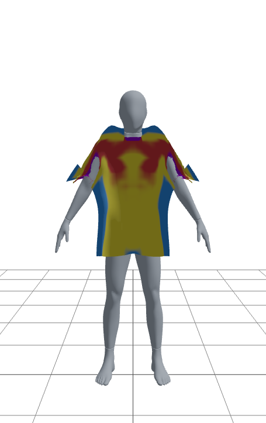
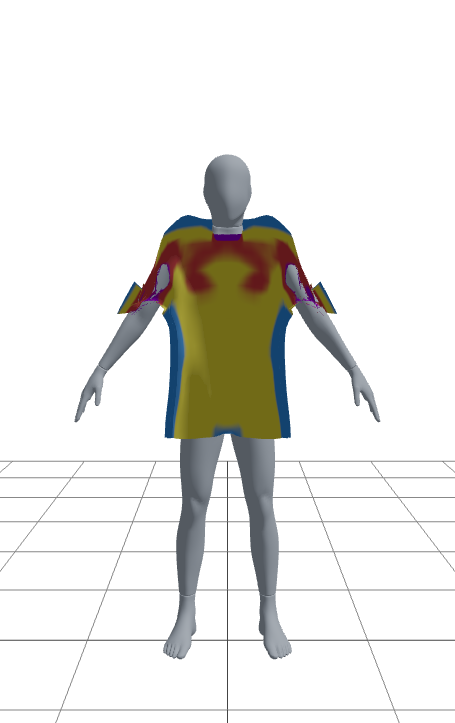
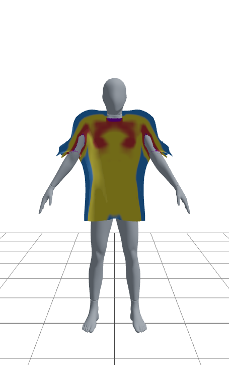
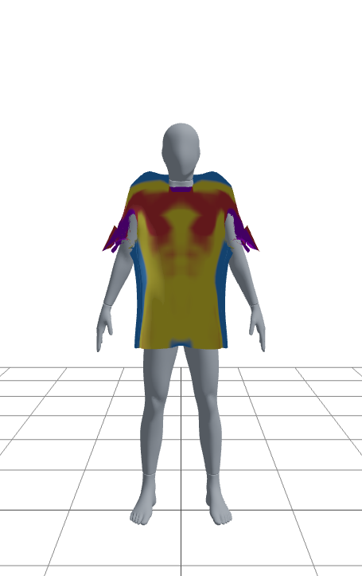
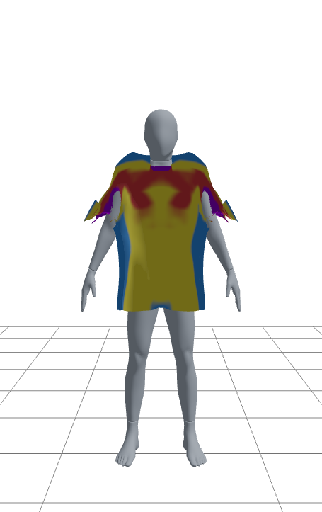
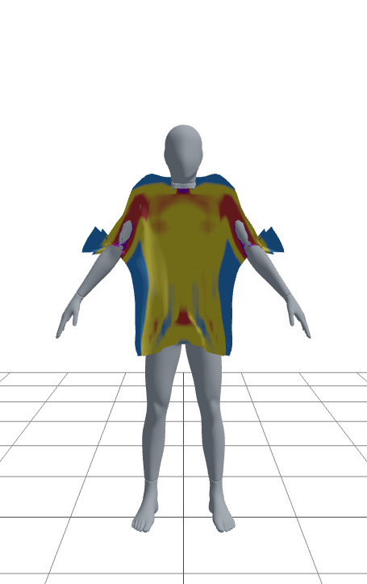

# 핏 맵 슬라이더 검증

핏 맵(정착 후 옷감-몸 표면 여유를 색으로 표시하는 기능, `Garment.tsx`의
`injectFitMapBinding` 참고)이 사이즈 슬라이더에 따라 기대한 방향으로
반응하는지 확인한 스크린샷 기록. 기본 원단색(단색) 텍스처 위에서, 캡슐/
와이어프레임 DEV 토글은 전부 끈 상태로 촬영했다.

색 범례: 보라=관통(디버그) / 빨강=타이트(0~1cm) / 노랑=적정(1~3cm) / 파랑=헐렁(3cm+)

## 세트 1 — 어깨너비만 변경 (품 55cm 고정)

| 40cm | 45cm(기본) | 55cm |
|---|---|---|
|  |  |  |

어깨너비를 줄일수록 어깨~가슴 위쪽의 빨강(타이트) 영역이 넓어지고,
늘릴수록 그 영역이 노랑(적정) 쪽으로 완화된다 — 기대한 방향과 일치.
소맷부리 근처의 보라(관통)는 세 값 모두 소폭 남아있다(별개 이슈, 아래
"알려진 한계" 참고).

## 세트 2 — 품(가슴단면)만 변경 (어깨너비 45cm 고정)

| 50cm | 55cm(기본) | 65cm |
|---|---|---|
|  |  |  |

품을 줄이면(50cm) 소매 쪽 보라(관통)가 커지고, 늘리면(65cm) 옆구리의
파랑(헐렁) 영역이 넓어지면서 소매 관통이 줄어든다 — 역시 기대한 방향과
일치.

## 방법

Playwright로 옷 이미지 업로드 → 핏 맵 체크박스 on → 슬라이더를 네이티브
value setter로 설정 후 `input`/`change` 이벤트 디스패치 → 정착 대기(4초) →
`canvas.toDataURL()`을 두 번의 `requestAnimationFrame` 뒤에 호출해 캡처
(WebGL 컨텍스트가 `preserveDrawingBuffer`를 안 켜두면 스크린샷 도구로는
빈 화면만 잡히는데, 렌더 직후 같은 프레임 안에서 읽으면 버퍼가 아직
살아있어 캡처된다).
