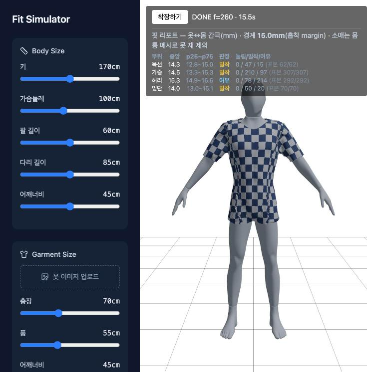

# P8 — 핏 리포트 (부위별 여유량)

**새 물리 0줄.** 캠페인이 쌓은 계기를 화면에 올린 것이고, 값은 정착 «후» 1회 읽는다.

## 결론

`?patterncore=1` + 「핏 맵」 토글에서 **부위별 옷↔몸 간극(mm)** 을 표로 보여준다.
판정 문턱은 **새로 만들지 않았다** — 물리가 흡착 목표로 쓰는 껍질 거리(`COLLISION_MARGIN`)
그 자체이고, 하네스 53계기b의 국면 3분할과 **같은 경계**다.



---

## §1 재료 — 쓴 채널과 출처

### 채택: `signedClearance` (옷 정점 → 몸 표면 부호거리)

| | |
|---|---|
| 출처 | `bvhFromArrays.ts:142` `signedClearance(px,py,pz,detectionRadius)` |
| 이미 쓰는 곳 | `dressPattern.ts:3426` **53계기b `phaseStat`** — 같은 원자료·같은 국면 경계 |
| 단위 | m(리포트는 mm로 환산) · **+가 뜬 것 · −가 파묻힌 것** |
| 정의역 | 몸판 정점(앞판은 `frontMesh`, 뒤판은 `backMesh`에 질의 — `phaseStat`의 `dOf`와 같은 분기) |
| 질의 반경 | `SDF_FAR` 300mm(하네스와 같은 값). null이면 탈락하고 **표본/정의역을 함께 표시**한다(97 §1 결함 A의 처방) |

### 부위 4종 — **대역은 몸에서 뜬다**(새 손 상수 0)

| 부위 | 정의역 | 근거 |
|---|---|---|
| 목선 | `necklineRing` 정점 집합 | 제약이 실제로 순회하는 집합(함정 12) |
| 가슴 | 몸판 정점 중 `body.chestY ± 2.5cm` | 하네스 101 §2-2와 **같은 식**. ±2.5cm의 근거는 `bodyMeasure` 슬라이스 간격 1cm |
| 허리 | 몸판 정점 중 `body.waistY ± 2.5cm` | 같은 형식. 하네스의 「뒤판 중배부 y110~125」는 **절대 y 손 상수**라 쓰지 않았다 — 몸이 바뀌면 대역이 몸을 안 따른다 |
| 밑단 | `hemChain` 앞 + 뒤 | 이미 metrics가 쓰는 사슬 그대로 |

### 채택하지 않은 것

| 후보 | 사유 |
|---|---|
| **소매 간극** | **없으면 없다** — `signedClearance`는 몸통 메시(앞/뒤)만 본다. 팔 대역은 `meshCollision.excludeArms`로 지워져 있어 **잴 수 없다**. 리포트가 「소매는 몸통 메시로 못 재 제외」를 화면에 밝힌다 |
| **cov(피복률)** | P6 부수 사실 — 분모(몸 표본 수)가 몸마다 다르다(1,630~1,783). 몸 간 비교로 쓸 수 없어 리포트에서 뺐다 |
| **완성 폐둘레 vs 몸 둘레** | 이미 P4 경고 배너가 그 계열을 보여준다(`checkGarmentFit`). 중복 표시를 만들지 않았다 |

---

## §2 표현 결정 — **수치 리포트**(색상 오버레이 안 함)

부위 · 중앙 간극 · p25~p75 · 판정 · 국면 3분할 개수 · 표본/정의역.

**색상 오버레이를 하지 않은 이유**: v1에 이미 「핏 맵」 히트맵이 있는데 그 문턱은
`Garment.tsx:204`가 스스로 **「실측 아님, 눈대중 초기값」**이라 적어 둔 0/1/3cm다.
프롬프트 조항(근거 없는 손 상수 금지)에 걸리므로 **그 값을 v2로 옮기지 않았다.**
근거 있는 색 스케일을 새로 세우려면 문턱 도출이 선행돼야 하고, 그건 이 판의 정의역 밖이다.
**수치가 먼저다** — 숫자와 표본 수가 나와 있으면 나중에 색을 입힐 때 스케일 근거가 이미 있다.

### 판정 문턱 — 새로 만들지 않았다

```
d ≤ 0        → 눌림   (관통)
0 < d ≤ 15.0mm → 밀착 (흡착 껍질 안)
d > 15.0mm     → 여유
```

경계 = `COLLISION_MARGIN`(= 워커가 실어 보내는 `fit.marginMm`). 이 값은 **물리가 흡착
목표로 삼는 껍질 거리** 그 자체이고, 하네스 53계기b가 국면1/2/3을 가르는 바로 그 경계다.
**화면이 그 숫자를 스스로 표시한다**(「경계 15.0mm(흡착 margin)」) — 스케일 없는 판정을
남기지 않기 위해서다.

---

## §3 구현

| 파일 | 내용 |
|---|---|
| `src/lib/patternDressCore.ts` | `FitBand` 타입 · `metrics()`에 `fit: { marginMm, bands[] }` 추가(정착 후 1회 읽기 · 물리 0줄) |
| `src/components/DressButton.tsx` | `FitReport` 표 · `showFitMap` 토글로 on/off · **현재 슬라이더 상태의 결과만** 표시 |

- 워커 메시지는 이미 `metrics`를 싣고 있어 **전달 배선 0줄**이다.
- 「핏 맵」은 store에 이미 있던 토글(`showFitMap`)을 그대로 쓴다. 기본 off.
- **착장 전에는 지난 결과를 안 보여준다**: 리포트에 실행 시점의 슬라이더 서명을 함께
  저장하고, 현재 서명과 다르면 감춘다(치수를 바꾸면 즉시 사라진다). 실행 시작 시에도 지운다.

### 실측(기본 슬라이더)

```
경계 15.0mm(흡착 margin) · 소매는 몸통 메시로 못 재 제외
부위   중앙   p25~p75      판정   눌림/밀착/여유   표본
목선   14.3   12.9~15.0    밀착   0 / 47 / 15     62/62
가슴   14.5   13.3~15.3    밀착   0 / 210 / 97    307/307
허리   15.3   14.9~16.6    여유   0 / 78 / 214    292/292
밑단   14.0   13.0~15.1    밀착   0 / 49 / 21     70/70
```

**눌림 0** — 기본 조합에서 몸을 파고드는 정점이 한 곳도 없다.
허리가 유일하게 「여유」인데, 이는 제도가 가슴 기준 직선 몸판이라 허리에서 남는 것과 맞는다.

---

## §4 회귀 — 통과

| | 결과 |
|---|---|
| 기준선 B 9채널 | cov 7.0%(121/1728) · maxStrain 2.662(정점 2146) · maxSeamGap 11.19mm · Δ20 5.17mm · 자기교차 2143 · 관통 49/5244 · DONE f=260 · 밑단 합 114.04cm · 목선 링 61.78cm — **불변** |
| 스크립트 `RINGTOTAL=0` | md5 `14e50b8919a63a7f9799220b86e508a9` **불변** · 로그 938줄 diff **0줄** |
| v1 게이트 | `check:weld` · `check:sleeve` · `check:seambridge` · `check:demo` **4종 PASS** |
| `npx tsc -b` · `npm run build` | 통과 |

**핏 맵 on/off로 9채널이 동일**함을 실측했다 ⟹ 리포트는 물리에 관여하지 않는다.

### §4-1 새로 관측된 사실 — **기준선 B는 「새 로드」 조건에서만 재현된다**

검증 중, **오래 열려 있던 탭**(리로드·HMR·토글·여러 실행이 누적된 세션)에서 9채널이
기준선 B와 미세하게 달랐다:

| | 기준선 B (새 로드) | 누적 세션 |
|---|---|---|
| 자기교차 | 2143 | **2136** |
| Δ20 | 5.17mm | **5.21mm** |
| maxStrain | 2.662 (정점 2146) | 2.661 (**정점 3247**) |
| 관통 | 49/5244 | **50**/5244 |
| 목선 링 · 밑단 합 | 61.78 · 114.04 | 61.77 · 114.02 |

**그 세션 안에서는 결정적이었다**(재실행 3회 동일 · 핏맵 on/off 동일). 그리고 **새 로드에서
다시 재면 기준선 B와 정확히 일치**한다. 즉 P8 코드와 무관하고, **세션 누적 상태가 몸 스냅샷을
미세하게 바꾼다.**

P6 민감도 등재(몸 0.14mm → 자기교차 +13%)와 같은 계열이다. **정착 가드의 문턱
`POSE_SETTLE_EPS = 1e-4`(0.17mm)가 이 변동을 통과시킨다** — 문턱 자체가 그만큼의
자유를 허용하도록 도출됐기 때문이다(P5b §1).

⟹ **기준선 B의 재현 조건에 「새 로드」를 명시해야 한다.** P6이 확인한 3회 일치도 같은 로드
안이었다. 조치(문턱 재도출 여부)는 이 판의 정의역 밖이라 **등재만 한다.**

---

## §5 남은 것

| | 내용 |
|---|---|
| 1 | **기준선 B 재현 조건에 「새 로드」 명시** + `POSE_SETTLE_EPS` 재도출 여부 판단(§4-1) |
| 2 | 색상 오버레이 — 근거 있는 색 스케일 도출이 선행(§2). v1의 0/1/3cm는 재사용 불가 |
| 3 | 소매 간극 — 팔 대역을 재는 채널이 없다. 팔 캡슐 기준 거리(`Garment.tsx:877` `clearanceMm`)가 v1에 있으나 v2 소매에 그대로 쓸 수 있는지 미확인 |
| 4 | 긴팔 마감(커프 · 전완 캡슐 — P7 §2-1) · 어깨너비(옷) 배선 · 옷 타입(P7 판정대로 보류) |
