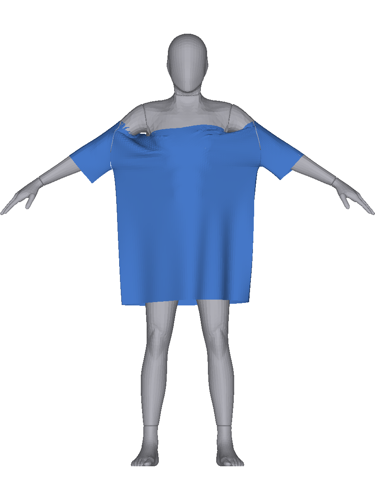
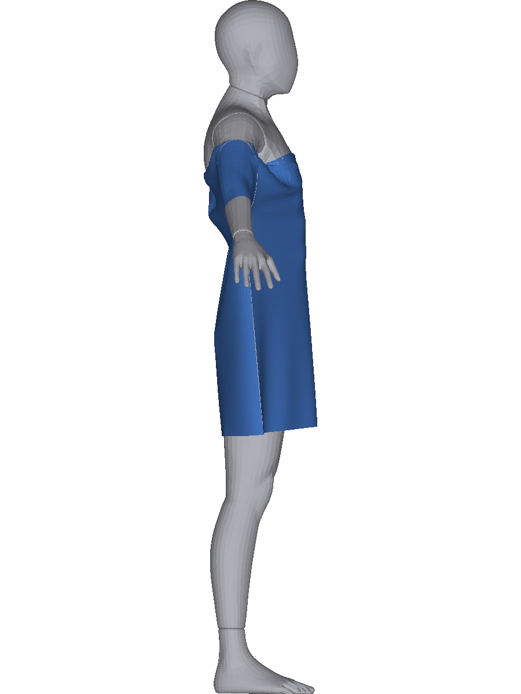
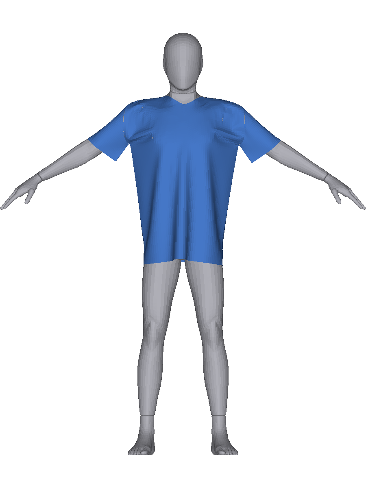
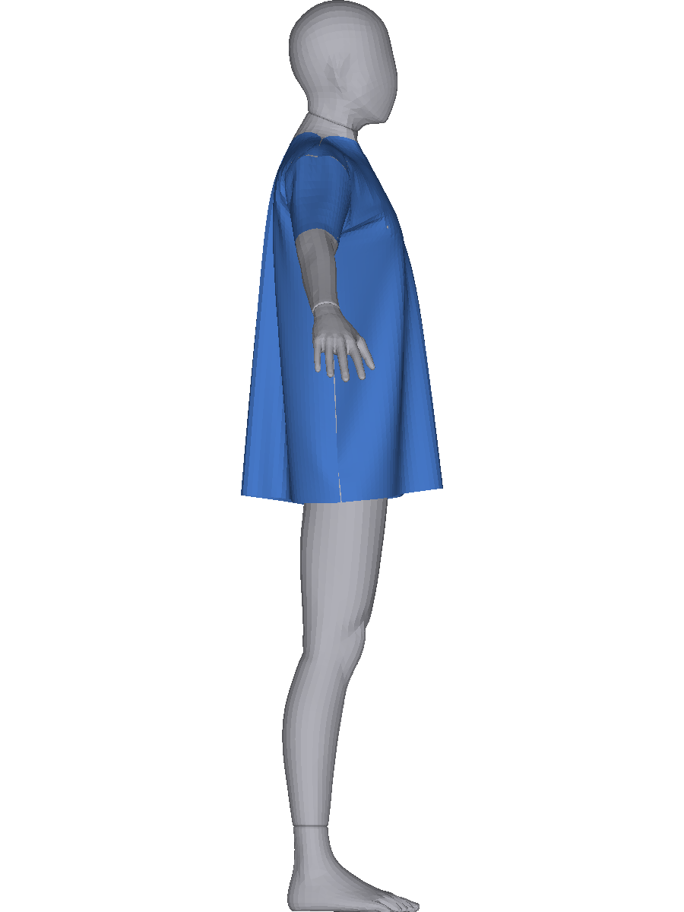

# v5-8 — 목선 «신장» 가설 반증: 링 둘레 궤적 · 당김의 출처 · 목선 비신장 진단 굽기

**정본 물리 0줄 · `src/v3`·`gpu/engine` diff 0 · 진단 ③은 «진단 전용 경로»(env 플래그 · 기본값 불변) · 굽기 ≤ 4칸 · ecc 0 · 처방 0**

| | |
|---|---|
| 브랜치 | `v5-8-neck-strain` |
| 기점 | **`6ce7cd1`**(= v5-7b HEAD) |
| §0 커밋 | (자기 기입 · §0-8) |
| §1~§4 커밋 | (집행 후 기입) |
| 보고 파일 | `docs/v5/보고/8.md` |
| 집행 기계 | **2호기**(DESKTOP-OV72A46 · GTX 1660 Ti · driver 610.88 · Python 3.12.10 · CUDA) |

### ★ 브랜치 전환 인쇄 (집행 «전»)

```
 에어   $ git checkout -b v5-8-neck-strain 6ce7cd1
        → Switched to a new branch 'v5-8-neck-strain' · HEAD 6ce7cd1
        $ git branch --show-current → v5-8-neck-strain
 2호기  도달 확인(집행 «전») — `ssh 2ho hostname` → **DESKTOP-OV72A46**
        (§0 커밋 push 뒤 같은 자리로 — §0-8 에 인쇄)
```

---

## §0 수령·사무 (집행 «전» 선커밋)

### §0-1 판정문 (전략 세션 · v5-7b §4 수령 · 원문)

```
 「갈래 D 수용 · 귀책 15건째: ② 회복 창을 172 한 점으로 설계(함정 30) ·
   마찰 = 부차 변수(단조 개선이나 8.7% · 대가 관통 15.6배) — MU 0.3 유지 ·
   ★★★ 절벽 = SW · 어깨선이 SW 의 함수(−33.65mm · 드롭숄더 기하) · 마찰은 유지만(결정은 f0~f10) ·
   ★ 빈 조각 = 실물은 목둘레(47.5)가 어깨(~107)를 못 넘어 안 흘러내리는데
     시뮬레이터는 링이 92 까지 늘어 넘는다 ·
   가설(반증 대상): 드롭숄더 램프 당김 + 목선 신장 컴플라이언스 → 링이 어깨를 넘음 ·
   예측 ① 링 둘레가 어깨 y 하강과 동시/선행 ② 목선 비신장이면 SW 52 도 걸림」
```

### §0-2 바꾸지 않는 것 (회차 프롬프트 원문)

```
 **정본** 물리 **0줄** · `src/v3` **diff 0** · `gpu/engine` **diff 0** · `gpu/bake/slip_probe.py` **diff 0** ·
 정본 상수(`MU 0.3` · `KMEM` · `SEP` · `THICK`) **불변** · 게이트 문턱 **0** · 제공 목록·제품 **0** ·
 ecc **0** · 화면 판정 **0** · 사후 갈래 신설 **0** · 처방 **0**
 ★ ③의 진단 경로는 **`scripts/` 한 파일** + **env 플래그** 뿐이고 **기본값 off ⟹ 기존 export 바이트 불변**이다.
```

### §0-3 사전 등재 갈래 (회차 프롬프트 원문 · 사후 신설 0 · 단위 명시)

**★ 단위** — 둘레 **cm** · 길이·간극 **mm** · 높이 **m** · 프레임 **1/60 s** · 정점·교차 **개** ·
신장률·컴플라이언스 배율 **무차원** · 굽기 **칸**.

| 항 | 갈래 |
|---|---|
| **①** 링 둘레 궤적 | **(가)** 링 확장이 어깨 y 하강에 **선행·동시** / **(나)** **후행** = 가설 기각 재료 / **(다)** 불가 |
| **②** 당김의 출처 | 어깨·암홀 봉제의 **수직 성분** 궤적(SW 52 에 실재하는지 · supima 대조) + 목선 엣지 신장 |
| **③** 진단 굽기 2칸 | **(가)** SW 52 **걸림 회복**(값 · **정도**) / **(나)** 무변화 = 기각 / **(다)** 발산·던짐 |
| **④** 종합 | ①②③ 사실 목록 · 가설 생존/사망 · 처방 후보를 **측정 가능 형태로**(판단 0) |

**§4** — **A** = ①(가)+③(가) ⟹ 상신(다음 = 목선 바인딩 처방 판 = **2막 개시**) /
**B** = ③(나) 또는 ①(나) ⟹ **가설 사망** · 사실 상신 / **C** = ③(다) ⟹ 값 상신 / **D** = 그 외 ⟹ 정지.
★ **③의 회복은 «정도»로 적는다**(어깨선 위 정점 수 · 옷 최고점 mm) — **172 를 판정선으로 쓰지 않는다**
(회차 프롬프트 조항 · v5-7b 귀책 15건째의 교훈).

### §0-4 ★ ③ 진단 경로 — **diff 초안**(§0 승인 대상 · 값 보기 «전»)

**작용점을 코드에서 찾았다**(읽기만 · 인용):

| 자리 | 사실 |
|---|---|
| `gpu/engine/stretch.py:126` | `at = 1.0 / (area * stiff) / h2` — 주석 그대로 **「α̃ = α/h² · α = 1/(A·k)」** ⟹ **컴플라이언스는 `par[t][4]`(area)와 전역 `k` 로만 정해진다** |
| `gpu/engine/stretch.py:96` · `full.py:80` | `par[t][4]` 를 읽는 자리는 **그 두 곳뿐**이고 쓰임은 **`at` 하나**다(면적으로서의 다른 소비 **0**) |
| `src/v3/garmentScene.ts:883` | 늘어남은 **삼각형 단위**(`makeInplane`)다 — **「목선 엣지」라는 제약이 «없다»** |
| `src/v3/dressRun.ts:153-155` | 링 정점 = `neckF`·`neckB`(각 `N_nk + 1`) · `ringRest = 2 × LEN_NECK` |
| `scripts/v4AsmExport.ts:76-78` | `par[t*5+4] = x.area` — 조립 export 가 그 값을 쓴다 |

**초안(최소 diff · `scripts/v4AsmExport.ts` 한 파일)**

```
 env `NECKRIGID=1`(기본 off) 일 때만:
   링 정점 집합 R = set(P.neckF) ∪ set(P.neckB)
   for 각 inplane 삼각형 t: if (i0∈R || i1∈R || i2∈R) par[t*5+4] = Infinity
   ⟹ 엔진에서 at = 1/(∞·k)/h² = **정확히 0** ⟹ **컴플라이언스 ×0**(= 비신장 극한)
   `dl = (−C − 0·λ)/(denomW + 0) = −C/denomW` — 하드 투영이 된다(`denomW ≥ 1e-20` 가드 유지)
 + **가드 보강**(같은 파일) — `par` 유한성 검사를 «신설»한다:
   플래그 off 면 비유한 값이 하나라도 있으면 **던진다** · on 이면 센티넬 개수를 **인쇄**한다
   ★ 근거 = v4-26 유한성 검사가 `pos`·`uv` 만 보고 **`par` 는 안 본다**(구멍) — 이 판이 그 자리를 메운다
 + 헤더에 `neckRigid: {vertices, tris}` 기록(v5-7b 진입 인자 기록 규약의 연장 · blob 이 자기를 설명한다)
```

**승인 근거**(§0 등재) — 판정문이 ③을 「목선 링 엣지만 **비신장**(또는 **컴플라이언스 ×0** · 진단 플래그 ·
정본 0)」으로 지정했다. 위 초안은 **정본 물리 0줄 · `src/v3` 0 · `engine` 0** 이고 **기본값 off** 라
기존 export 가 바이트 불변이다. ⟹ **승인으로 등재하고 집행한다.**

★★ **대체를 명시한다**(다툼 0) — 「목선 링 **엣지**」라는 제약이 코드에 **없으므로**
**「링 정점을 하나라도 포함하는 삼각형」**의 컴플라이언스를 0 으로 둔다. 이는 엣지보다 **넓은 집합**이고,
그 개수(정점·삼각형)를 §1-③ 에 값으로 적는다. **「엣지만」이라 적지 않는다.**

### §0-5 ★ ②의 채널 — λ 는 덤프에 없다(대체 정의 · 값 보기 «전»)

`slip_probe` 덤프는 **위치뿐**이고 λ 는 없다(v5-7a §1-③ 등재). ⟹ **대체 채널**을 이렇게 정의한다:

```
 봉제쌍 (i,j) · 그 프레임의 rest r_f(램프 식 `dressRun.ts:111-116` 인용 · 새 수 0) ·
 d = pos[j] − pos[i] · gap = |d| − r_f
 **수직 당김 성분** ≡ gap × |d_y| / |d|   [mm]  — 「그 제약이 닫히려고 요구하는 변위의 수직 몫」
 그룹 = `garmentScene.ts:833-841` 의 이름 그대로 — **어깨L·어깨R**(2) · **암홀앞/뒤 L·R**(4) ·
        옆선L·R · 소매밑L·R (참고)
 ★ 이것은 **λ 가 아니다** — 「λ 의 수직 성분」이라 적지 않고 **«봉제 수직 당김 대체 채널»**로 적는다.
```

### §0-6 사전 결정 6건 (값 보기 «전» · CC 집행 설계)

```
 ㄱ **①②는 v5-7b 덤프를 다시 쓴다**(굽기 0) — `dumpEvery` 10 이라 f0·f10·f20·f30 이 있다.
    「f0~f30 촘촘」은 **덤프 간격이 허용하는 최소 = 10프레임**이고 그 사실을 적는다(더 촘촘히 하려면 재굽기다).
 ㄴ **링 둘레는 게이트와 «같은 식»으로 잰다** — `s4Gate.ts:118-123` 의 닫힌 고리
    (`[...neckF, ...neckB.reverse()]`)를 그대로 쓴다. 새 식 0.
 ㄷ **「선행/동시/후행」의 판정을 지금 고정한다** — 어깨 봉제 y 가 **처음 내려가는 창**과
    링 둘레가 **처음 rest 를 넘는 창**을 견준다: 링이 **먼저**면 선행 · **같은 창**이면 동시 ·
    **나중**이면 후행. 창은 덤프 간격(10프레임)이고 그보다 잘게는 말하지 않는다.
 ㄹ **③은 2칸**(mst-over-L × `NECKRIGID` · supima-L × `NECKRIGID` 대조) — 예산 ≤ 4칸 안에서
    필요하면 MU 0.3 정본 대조는 **v5-3·v5-2 산출을 재사용**한다(새로 굽지 않는다).
 ㅁ **발산 판정은 계기가 던지는 것으로**(v5-7b §0-5ㅁ 과 같은 기준) — `degenerate > 0` · NaN ·
    정착 미도달(상한). 「나빠졌다」는 발산이 아니다.
 ㅂ **처방 0** — 목선 바인딩은 «측정 가능한 형태의 문장»으로만 적고 상수·정본을 한 줄도 바꾸지 않는다.
```

### §0-7 사무 4건 (판정문·프롬프트 지정 · 이 판에서 집행)

```
 ㄱ **귀책 15건째 등재** — 「② 회복 창을 172 한 점으로 설계(함정 30)」 =
    v5-기록-정정이 신설한 «v4·v5 전략 세션 귀책 번호 대장»(`전략세션-인수인계.md`)에 15행 추가.
 ㄴ **연대기 ③ 3·4행 대장 정합 + 주석** — v5-기록-정정 §6 ㉡ 가 넘긴 항목의 «승인분» 집행.
    현재 연대기 3 = 「v4-05 봉제 누락」 · 4 = 「v4-06~08」 ↔ 대장 계열 3 = **v4-04 시험계** ·
    4 = **v4-07 층2** (v4-05·v4-06 은 **번호 밖**) ⟹ 표를 대장에 맞추고 **주석으로 그 사실을 적는다**.
 ㄷ **CLAUDE.md 워크트리 분리 규칙 1줄** — 같은 저장소에서 두 세션이 돌 때의 규약(v5-7a 선례).
 ㄹ **`worker.py:172` layer3 `SPEC` env 채움** — v5-7b 사고 4의 처분 «승인분».
    코드 최소 diff · 물리 0 · 기본값(SPEC 없음)에서 **기존 동작 불변**.
    ★ 이것은 `gpu/bake/worker.py` 를 건드린다 ⟹ §0-2 의 「`gpu/engine` diff 0」과 구별해 적는다
      (엔진이 아니라 **굽기 워커**이고, 물리 식은 0줄이다).
```

### §0-8 커밋·전환 인쇄 (집행 «전»)

```
  §0 선커밋 **`0c9484c`** — push 뒤 2호기 전환 인쇄를 §1-⓪ 에 적는다
```

---

## §1-⓪ 2호기 전환 · 사무 4건

### 전환 인쇄

```
 2호기  $ git fetch -q origin   (wincredman 경고는 v4-02 등재대로 **push 만** 막는다)
        ★ 체크아웃이 **v5-7b 캡처 8장**(미추적)에 막혔다 ⟹ blob 해시 대조 **8/8 «동일»** 확인 후
          `C:\Users\banba\fit-7b-backup\docs\v5\캡처\` 로 **이동**(삭제 0) · 체크아웃이 git 에서 **복원**했다(8장 확인)
        $ git branch --show-current → **v5-8-neck-strain** · HEAD **e4a3acd** → **fa72c40**
```

### 사무 ㄱ~ㄹ (전부 집행)

| # | 항 | 결과 |
|---|---|---|
| ㄱ | 귀책 **15건째** 등재 | `전략세션-인수인계.md` 「★ v4·v5 전략 세션 귀책 «번호 대장»」에 15행 추가 — 「② 걸림 회복 창을 «172 한 점»으로 설계」(함정 30) · 마찰 = **부차 변수**(172 의 8.7% · 대가 ③a 15.6배) · `MU 0.3` 유지 |
| ㄴ | 연대기 ③ 3·4행 **대장 정합 + 주석** | 3 = **v4-04 시험계** · 4 = **v4-07 층2** 로 교체 · **번호 밖 2건**(v4-05 봉제 누락 · v4-06 섭동 1e-7)을 `—` 행으로 드러냄 · #15 추가 · 표 아래에 「번호가 «한 계열»이 아니다」 주석 + 정본 대장 포인터 · 머리에 정정 줄 |
| ㄷ | CLAUDE.md 워크트리 규칙 | 1줄 등재 — 「같은 저장소에서 두 세션이 동시에 돌면 «워크트리를 가른다»」(v5-7a 선례 · 본체 브랜치를 빼앗으면 상대 세션이 멈춘다) |
| ㄹ | `worker.py:172` layer3 `SPEC` | `spec` 인자 신설 · `if spec: env["SPEC"] = str(spec)` · 호출부가 `sp.get("spec")` 을 넘긴다 · **`spec=None` 이면 키를 안 넣는다 ⟹ 기존 호출 env 바이트 불변** · `py_compile` OK · 물리 0줄 |

★★ **사무 ㄱㄴ 의 선행 조건이 하나 있었다**(자기신고) — **대장도 연대기도 v5 작업선에 «없었다»**
(`v5-8` 기점 `6ce7cd1` 에서 둘 다 부재 · 대장·연대기는 `v5-chronicle` 계열에만 있었다).
⟹ **`v5-chronicle-index` 를 먼저 병합**했다(v5-기록 §6 ㉢ 이 남긴 「본선 merge 1회」의 집행 · 커밋 `feab346`).
충돌 **2건** — `전략세션-인수인계.md` 는 **자동 병합**(각자 다른 절) · `docs/v5/v5-색인.md` 는 두 줄이
같은 자리에 들어와 **둘 다 남겼다**(7b 줄 위 · 연대기 줄 아래).

## §1-① 링 둘레 궤적 — **(가) 선행** · ★★★ 그런데 **방향이 가설과 반대다**

v5-7b 덤프 4칸에 신설 계기 `scripts/v5NeckStrain.ts`(측정만 · 새 식 0 · 링 고리는 `s4Gate.ts:118-123` 인용).
**덤프 간격이 10프레임**이라 「f0~f30 촘촘」의 실제 해상도는 **f0 · f10 · f20 · f30** 이다(§0-6ㄱ).

| 칸 | `RAMP_N` | 링 정점 | **f0 링 둘레 cm** | `ringRest` cm | `Y_TOP` m | 덤프 없는 프레임 |
|---|---|---|---|---|---|---|
| `supimaL_L`(0.3 · SW 44.5) | 77 | 54 | **91.7762** | **47.0498** | 1.3934801 | **없음** |
| `mstover_XL`(0.3 · SW 52) | 89 | 54 | **97.2594** | **47.0421** | 1.3598263 | **없음** |
| `mstoverDiagMU06_XL`(0.6) | 89 | 54 | 97.2594 | 47.0421 | 1.3598263 | 없음 |
| `mstoverDiagMU10_XL`(1.0) | 89 | 54 | 97.2594 | 47.0421 | 1.3598263 | 없음 |

### 링 둘레 [cm]

| f | 0 | 10 | 20 | 30 | 40 | 50 | 60 | 70 | 80 | 90 | 100 | 200 |
|---|---|---|---|---|---|---|---|---|---|---|---|---|
| **supima**(0.3·SW44.5) | **91.7762** | 85.2808 | 83.6438 | 80.3971 | 74.7804 | 66.8644 | 62.3454 | 57.6904 | 54.2869 | 54.2440 | 54.2407 | **54.2471** |
| **mst-over**(0.3·SW52) | **97.2594** | 90.7900 | 90.5693 | 92.3329 | 93.1384 | 93.0463 | 92.8914 | 92.5146 | 92.1295 | 91.9865 | 91.9864 | **91.9863** |
| **mst-over**(0.6) | 97.2594 | 90.6469 | 89.5199 | 89.9382 | 90.5159 | 91.4726 | 92.5466 | 92.9741 | 92.4897 | 92.3669 | 92.3679 | **92.3682** |
| **mst-over**(1.0) | 97.2594 | 90.5744 | 89.3324 | 89.2400 | 89.2552 | 89.4565 | 89.8245 | 89.7767 | 90.8144 | 91.3281 | 91.2110 | **91.2008** |

### 링 엣지 **최대 신장률**(f0 대비 · rest 대비 아님)

| f | 0 | 10 | 20 | 30 | 40 | 70 | 100 | 200 |
|---|---|---|---|---|---|---|---|---|
| supima | 1.00000 | 1.06340 | 1.18918 | 1.29900 | 1.30929 | 1.20307 | 1.24054 | **1.24054** |
| mst 0.3 | 1.00000 | 1.09574 | 1.20800 | 1.35659 | 1.55217 | 1.98525 | 2.26840 | **2.26840** |
| mst 0.6 | 1.00000 | 1.04841 | 1.07228 | 1.11827 | 1.16488 | 1.37219 | 2.36211 | **2.36211** |
| mst 1.0 | 1.00000 | 1.04231 | 1.03495 | 1.03907 | 1.05539 | 1.14070 | 1.29884 | **1.29852** |

### 어깨 봉제 y중앙 [m] (같은 계기 · 나란히)

| f | 0 | 10 | 20 | 30 | 40 | 70 | 100 | 200 |
|---|---|---|---|---|---|---|---|---|
| supima | 1.39348 | **1.36307**저 | 1.36282 | **1.37439↑** | 1.39483 | 1.42864 | 1.43051 | **1.43051** |
| mst 0.3 | 1.35983 | 1.32667 | 1.31281↓ | 1.30473↓ | 1.28938 | 1.28021 | 1.28242 | **1.28252** |
| mst 0.6 | 1.35983 | 1.32696 | 1.32041↓ | 1.30939↓ | 1.30654 | 1.29940 | 1.28343 | **1.28343** |
| mst 1.0 | 1.35983 | 1.32809 | 1.32360↓ | 1.31925↓ | 1.31826 | 1.30848 | 1.30416 | **1.30417** |

### ★★★ 갈래 판정 — **(가) 선행** · 그리고 **가설의 기전은 반증된다**

```
 §0-6ㄷ 규칙 그대로 — 「링 둘레가 «처음 rest 를 넘는 창»」 ↔ 「어깨 봉제 y 가 «처음 내려가는 창»」
   링 초과는 **f0 에 이미 성립**한다(91.7762 / 97.2594 cm ≫ rest 47.05) — **물리 0프레임**에서다.
   어깨 y 하강은 **f0 → f10** 창에서 시작한다.
 ⟹ 링 초과가 **선행**이다 ⟹ **갈래 (가)**. (사후 갈래 신설 0)

 ★★★ **그런데 그 선행은 «신장 때문에 늘어나서»가 아니다.**
   링은 물리가 돌면 **줄어든다** — supima 91.78 → **54.25 cm**(단조 감소) ·
   mst-over 97.26 → **91.99 cm**(f10 에 90.79 까지 줄었다가 92 근방에서 멈춘다).
   즉 **배치가 링을 rest 의 «약 2배»로 펼쳐 놓고**(f0/rest = supima **1.951** · mst **2.068**),
   **봉제 램프가 그것을 되감는다.** supima 는 되감기가 **완주**하고(최종/rest **1.153**)
   mst-over 는 **멈춘다**(최종/rest **1.955**).
 ⟹ 최종 92 cm 는 「**늘어난 결과**」가 아니라 「**되감기가 끝나지 않은 결과**」다.
   판정문의 가설 문언(「목선 신장 컴플라이언스 → 링이 어깨를 넘음」)은 **인과의 방향이 반대**다.
 ★ 한정(계기) — 「링 엣지 신장률」은 **f0 대비**다(`rest` 대비가 아니다 · 계기가 f0 을 기준으로 잡는다).
   f0 자체가 rest 의 1.95~2.07배이므로 **rest 대비 신장은 이 표의 값보다 크다** — 그 사실을 적는다.
 ★ 부수 사실 — 마찰을 올리면 링 엣지 최대 신장률이 **2.26840 → 1.29852**(MU 0.3 → 1.0)로 «줄어든다».
```

## §1-② 당김의 출처 — ★★★ **암홀이 아니라 「어깨 봉제의 미닫힘」**

§0-5 정의(λ 아님 · **봉제 수직 당김 대체 채널** = `gap × |d_y|/|d|` · rest 는 램프 식 인용).

### 어깨 봉제 수직 당김 **중앙** [mm]

| f | 0 | 10 | 20 | 30 | 40 | 70 | 100 |
|---|---|---|---|---|---|---|---|
| supima 어깨L | 0.0000 | 0.0004 | 0.0137 | **1.2412** | 1.0352 | **0.0097** | **0.0427** |
| supima 어깨R | 0.0000 | 0.0025 | 0.1266 | 0.4440 | 0.1065 | **0.0265** | **0.0410** |
| mst 0.3 어깨L | 0.0000 | 0.0028 | 0.0039 | 0.0020 | 0.0073 | **0.5576** | **1.3272** |
| mst 0.3 어깨R | 0.0000 | 0.0007 | 0.0058 | 0.0172 | 0.0340 | 0.5069 | 1.1563 |
| mst 0.6 어깨L | 0.0000 | −0.0009 | 0.0052 | 1.2880 | 3.7404 | 4.0157 | 1.1248 |
| mst 1.0 어깨L | 0.0000 | 0.0037 | 0.0690 | **4.7919** | **8.9683** | **17.2924** | **21.4708** |

### 어깨(L·R) 수직 당김 **최대** [mm]

| f | 0 | 10 | 20 | 30 | 40 | 70 | 100 |
|---|---|---|---|---|---|---|---|
| supima | 0.0000 | 1.0219 | 1.1432 | 3.1226 | **8.3917** | **0.0738** | **0.3428** |
| mst 0.3 | 0.0000 | 0.0236 | 4.4491 | 3.0413 | 3.9894 | 11.5890 | **16.3959** |
| mst 0.6 | 0.0000 | 0.0200 | 4.9936 | 11.3408 | 17.7038 | **39.5049** | 17.2718 |
| mst 1.0 | 0.0000 | 0.0273 | 7.1458 | 15.2528 | 23.9389 | **53.3789** | **67.8373** |

### 다른 그룹 (같은 채널 · 중앙 mm)

| 그룹 | supima f100 | mst 0.3 f100 | mst 0.6 f100 | mst 1.0 f100 |
|---|---|---|---|---|
| 암홀앞R | 0.0068 | 0.2651 | 0.2604 | 0.7425 |
| 암홀뒤R | 0.0459 | 0.3538 | 0.3541 | 0.5120 |
| 옆선L | 0.0065 | 0.0112 | 0.0185 | 0.0029 |

### ★★★ ②의 답

```
 ㉠ **수직 당김의 자리는 «어깨 봉제»다** — 암홀은 f100 에 **0.0068~0.7425 mm** 로 한 자릿수 작고
    옆선은 **~0.01 mm** 다. 「드롭숄더 암홀이 몸판을 아래로 당긴다」는 이 채널에서 **지지되지 않는다**.
 ㉡ **supima 는 어깨 봉제가 «닫힌다»** — f30 에 1.2412 로 치솟고 **f70~100 에 0.0097~0.0427 mm**
    로 사그라진다(램프가 끝나 rest = SEP 에 도달 · 당김 소멸).
 ㉢ **mst-over(SW 52)는 «끝까지 열려 있다»** — f70 0.5576 → **f100 1.3272 mm**(중앙) ·
    최대 **16.3959 mm**. 즉 **당김이 시간이 가도 사그라지지 않는다**.
 ㉣ **마찰을 올리면 미닫힘이 «커진다»** — MU 1.0 중앙 **21.4708** · 최대 **67.8373 mm**.
    ⟹ v5-7b ④(「마찰은 유지만 한다」)와 **정합**한다 — 마찰이 옷을 붙들면 어깨 봉제가 덜 닫힌다.
 ⟹ 「당김의 출처」는 **외부 힘이 아니라 «자기 봉제 제약의 잔여»**다(닫히지 못한 어깨 이음).
   **기전 귀속 0 · 처방 0.**
```

## §1-③ 진단 굽기 2칸 — 목선 링 컴플라이언스 ×0

### 집행 인쇄

```
 조립   `NECKRIGID=1 npx tsx scripts/v4AsmExport.ts` (2호기) —
        `asm-mstoverNR_XL.bin` **n 12144** · substeps 235 / `asm-supimaNR_L.bin` **n 10356** · substeps 229
        ⟹ **정점 수가 원본과 같다**(v5-3 `mstover_XL` 12,144 · v5-2 `supimaL_L` 10,356) —
           센티넬은 `par[t][4]`(넓이)에만 들어가므로 위상·정점은 불변이다.
 굽기   `py -u -m gpu.bake.worker gpu/bake/jobs/v5-8-{mstoverNR_XL,supimaNR_L}.json`
        (2호기 · f64 · CUDA · 400 상한 · RAMP_N 89 / 77 · **PAUSE 없음** · 칸마다 자식 프로세스)
```

### ★ 사고 5 — 층3 계기가 또 던졌다(**`SPEC` 이 아니라 «몸»이 빠졌다**)

```
 Error: 위치 파일 길이가 다르다 — 291456 ≠ 289008(정점 12042)   ← scripts/v4FitReport.ts:54
 원인 — `worker.py:182 layer3` 의 env 는 `CELL`·`POS`·`TAG`(+§0 사무 ㄹ 의 `SPEC`)뿐이고
        **`BODY_BIN`·`ARM_AXIS_JSON`·`ARM_ORIGIN_JSON` 을 넘기지 않는다.**
        조립 정점 수는 «몸»에 딸려 있다(T포즈 기본 몸 ⟹ 12,042 · A포즈 grid27 몸 ⟹ **12,144**).
        v5-7b 는 그 셋을 **부모 셸 환경**에 두어 우회했는데, 이번 ssh 진입에는 `PYTHONIOENCODING` 만 있었다.
 ★ **CC 귀책** — §0 사무 ㄹ 로 처분한 것은 **`SPEC` 한 키**뿐이고, 사고의 «부류»
   (「layer3 이 조립의 장면 인자를 복원하지 못한다」)를 고치지 않았다. 같은 사고의 두 번째 키다.
 처분(이 판) — 굽기 산출 `.bin` 은 **완주해 남아 있으므로 재굽기 0** · 계기를 **손으로** 붙였다
   (`BODY_BIN`/`ARM_AXIS_JSON`/`ARM_ORIGIN_JSON` = v5-7b §0-5ㄴ 확정분 그대로 · 새로 고르지 않았다).
 ★ **코드는 이 판에서 더 고치지 않는다** — §0 이 승인한 처분은 `SPEC` 한 줄이었다(사후 확대 0).
   남은 부류는 사실로 등재하고 상신한다.
```

### 굽기 완주 인쇄

| 칸 | n | substeps | rampN | 정착 | convFrame | lastNet | degenerate |
|---|---|---|---|---|---|---|---|
| **`mstoverNR_XL`**(SW 52) | 12,144 | 235 | 89 | **converged** | **330** | **5.8075460114798464e-05** | **0** |
| **`supimaNR_L`**(SW 44.5 · 대조) | 10,356 | 229 | 77 | **converged** | **210** | **7.73408444428207e-05** | **0** |

`supimaNR_L` 는 시간도 남았다 — `sec` **528.2585316000041** · `secPerFrame` **2.5155168171428763** ·
`jitSec` 11.351480099998298 · `buildSec` 1.109533900002134 · 쌍/서브스텝 43,415.0 · 해소/서브스텝 422.04366812227073 ·
정본 blob 대비 중앙 95.62575121186345 mm(p99 124.02223051266056 · 최대 131.13167570491723 — **다른 옷이라 대조 아님**).
`mstoverNR_XL` 은 **989.1s**(워커 벽시계 · 층3 실패 포함) · `supimaNR_L` 은 **550.1s**.

### ★★★ 판정 표 — 원본 ↔ 링 컴플라이언스 ×0

원본 열은 **v5-7b §1-③ 표에서 «읽어» 옮겼다**(함정 44 · 새 계산 0).

| 채널 | supima-L **원본** | **`supimaNR_L`** | mst-over-L **원본** | **`mstoverNR_XL`** |
|---|---|---|---|---|
| SW cm | 44.5 | 44.5 | **52** | **52** |
| `Y_TOP` m | 1.3934800624847412 | **1.3934800624847412** | 1.3598263263702393 | **1.3598263263702393** |
| 정점 n | 10,356 | **10,356** | 12,144 | **12,144** |
| 정착 | f250 | **f210** | f200 | **f330** |
| lastNet | 7.73319183299335e-05 | **7.73408444428207e-05** | 7.011527814061712e-05 | **5.8075460114798464e-05** |
| **★ 어깨선 위 정점**(개) | **858** | **925** | **0** | **0** |
| **★ 옷 최고점 − 어깨선 mm** | +55.826346628914834 | **+60.42261861150844** | **−2.2761517652689633** | **−1.463906004152804** |
| 자기관통 교차 | 0 | **0** | 19 | **15** |
| ③a 관통 최대 mm | 0.4957352424735401 | **0.38822903056738656** | 0.345328 | **0.3652745372681752** |
| 관통정점수 | — | **959** | — | **879** |
| 정착 목선 링 cm | 54.247194084357176 | **50.18538981540559** | 91.986332 | **90.87309320096566** |
| 목선 초과비(허용 cm) | 0.9907450186082882(54.75) | **0.9892390593177747**(50.73130639424587) | 0.993501(92.588035) | **0.996323162332192**(91.20845187243268) |
| 최소 쌍거리 mm | 1.996796052098888 | **1.997016817105041** | 0.203143 | **0.07674433841981679** |
| 봉제 간극 중앙 mm | — | **2.055772177334701** | — | **2.2872109833635412** |
| 봉제 간극 최대 mm | 5.505096725541386 | **9.89271781081954** | 104.22 | **104.39128218009323** |
| λ 최대 | 1.4240117713935603 | **1.2948314307857773** | 3.910113 | **3.5258367935106616** |
| 게이트 | **pass** | **pass** | fail(교차 19) | **fail**(자기관통 교차 15 ≠ 0) |

**층3 5행**(중앙 mm · 표본 · 눌림 전부 0) —
`supimaNR_L` 목선 1.1669924802096843(54) · 가슴 2.2822660956081533(259) · 허리 52.57517767509872(233) ·
밑단 22.529421906472614(114) · 소매 8.407597521940737(1,122) ·
`mstoverNR_XL` 목선 1.0003900907262613(54) · 가슴 3.266181632035835(287) · 허리 41.170116932645115(271) ·
밑단 34.265697835632174(130) · 소매 5.356244363227272(1,224).

### ★★★ 갈래 판정 — **(나) 무변화 = 가설 기각**

```
 §0-3 갈래 문언 — 「(가) SW 52 걸림 회복(값 · 정도) / (나) 무변화 = 기각 / (다) 발산·던짐」
 회복은 «정도»로 적는다(회차 프롬프트 · **172 는 판정선으로 쓰지 않는다**).

 ㉠ **걸림의 «정도»가 움직이지 않았다** — mst-over(SW 52)에서
    어깨선 위 정점 **0 → 0**(변화 0) · 옷 최고점 **−2.2761517652689633 → −1.463906004152804 mm**.
    최고점이 **0.8122457611161593 mm 올랐지만 부호가 여전히 음(−)** 이다 ⟹ 옷의 가장 높은 점이
    **어깨선 아래**에 있다. 「어깨에 걸린다」의 «정도»는 **0** 이다.
 ㉡ **(다) 가 아니다** — `degenerate 0` · `converged true`(f330) · NaN 0 · 발산 false ⟹ 던지지 않았다.
 ⟹ **갈래 (나)**. 「목선 신장 컴플라이언스가 링이 어깨를 넘게 한다」는 **기각**된다.
    링을 «아예 못 늘어나게» 묶어도(컴플라이언스 ×0 · 링 인접 삼각형 110개 넓이 = ∞) 걸림은 생기지 않는다.

 ★ 그 이유는 ①이 이미 값으로 말했다 — **링은 늘어나서 92 인 게 아니라 «되감기가 멈춰서» 92 다.**
   NR 이 링을 91.986332 → **90.87309320096566 cm** 로 **1.11 cm** 밖에 못 줄인 것이 그 증거다.
   f0 링이 이미 **97.2594 cm**(rest 47.0421 의 **2.068배**)인데 이 제약은 **f0 «이후»의 늘어남**만 막는다.
 ★ 대조칸은 오히려 **좋아졌다** — supima(SW 44.5)는 어깨위 858 → **925**(+67) · 최고점 +55.83 → **+60.42 mm** ·
   링 54.25 → **50.19 cm** · λ 최대 1.4240 → **1.2948** · 게이트 **pass 유지**.
   ⟹ 진단 경로 자체는 **의도대로 작동한다**(링을 굳히면 링이 덜 벌어진다). 그런데 **SW 52 에서는 안 먹는다.**
 ★ 한정 — 대체 집합은 「목선 링 엣지」가 아니라 **「링 정점을 하나라도 포함하는 삼각형 110개」**다
   (§0-4 · 엣지 단위 신장 제약이 이 엔진에 없다) ⟹ 이 판정은 **「링 주변 면의 컴플라이언스 ×0」**에 대한 것이다.
   엣지 단위 제약을 새로 «만들면» 결과가 달라질 수 있다 — 그것은 물리 신설이고 이 판의 정의역 밖이다.
```

## §1-④ 종합 (판단 0 · 사실만)

```
 1 **f0 에 링은 이미 rest 의 두 배로 펼쳐져 있다** — supima 91.7762 / mst 97.2594 cm vs rest 47.0498 / 47.0421
   (비 1.951 / 2.068) · **물리 0프레임**의 배치 산출이다(①).
 2 **물리는 링을 «줄인다»** — supima 91.7762 → 54.2471 cm(되감기 완주) · mst 97.2594 → 91.9863 cm(멈춘다)(①).
 3 **최종 92 cm 는 늘어남이 아니라 «미완의 되감기»다** — 링 컴플라이언스를 ×0 해도 90.8731 cm 에 머문다(①③).
 4 **당김의 자리는 어깨 봉제의 «미닫힘»이다** — supima 는 f70~100 에 0.0097~0.0427 mm 로 닫히고,
   mst-over 는 f100 에 중앙 1.3272 · 최대 16.3959 mm 로 **열려 있다**. 암홀 0.0068~0.7425 · 옆선 ~0.01(②).
 5 **마찰은 미닫힘을 «키운다»** — MU 1.0 어깨 중앙 21.4708 · 최대 67.8373 mm(②) ⟹ v5-7b ④(「유지만 한다」)와 정합.
 6 **걸림은 링의 신장이 아니라 SW 의 함수다** — `Y_TOP` 이 SW 로 −33.65 mm 내려가고(v5-7b ③),
   링을 굳혀도 SW 52 에서 어깨위 정점 0 → 0(③). SW 44.5 에서는 같은 처방이 858 → 925 로 **먹는다**(③).
 7 **진단 경로는 정본에 흔적 0** — 플래그 off 재-export 본문 **1,316,448 B 바이트 동일**(§0-4 회귀) ·
   `src/v3`·`gpu/engine`·`gpu/bake/worker.py` 의 물리 diff **0줄**.

 ★ 다음 판 설계에 쓰일 «측정 가능» 후보(제안 아님 · 사실의 형태로만 적는다) —
   ㉠ **f0 배치가 링을 2배로 펼치는 자리**가 무엇인지는 이 판이 재지 않았다(배치 코드 · 물리 0프레임).
      링/rest 비는 **정착 전에 이미 결정**돼 있다 ⟹ 「배치」는 측정 가능한 채널이다.
   ㉡ **되감기가 멈추는 조건** — supima 는 완주하고 mst-over 는 f10 의 90.79 cm 에서 돌아서 92 로 «되올라간다»
      (①표 mst 0.3 열: 90.7900 → 90.5693 → 92.3329 → …). 그 «되올라감»의 시점은 f20~f30 이다.
   ㉢ **어깨 봉제 rest 가 SEP 에 도달하는 프레임**(RAMP_N 89)과 미닫힘이 남는 것의 관계(②).
```

## §1-⑤ 캡처 — 진단칸 정착 앞·옆 (화면 판정 0)

계기 = `scripts/v4AposeRender.ts`(오프스크린 정사영 · 900×1200 · `front` / `sideXplus`) ·
몸·축·원점 = v5-7b §0-5ㄴ 확정분 · 위치 = 굽기 산출 `.bin`.

| # | 칸 | 앞 | 옆 |
|---|---|---|---|
| 1 | `mstoverNR_XL`(SW 52 · 링 ×0) |  |  |
| 2 | `supimaNR_L`(SW 44.5 · 링 ×0) |  |  |

★ **사고 6**(자기신고) — 첫 렌더에서 `OUT` 을 **폴더**로 줬다. 이 계기의 `OUT` 은 **접두**다
(`v4AposeRender.ts:61` `${OUT}-${file}.png`) ⟹ 두 칸이 같은 파일 2장으로 **덮였고**, 한글 경로가
cmd 에서 cp949 로 깨져 `docs/v5/ĸó-*.png` 로 나갔다. **ASCII 접두로 다시 냈고**(`cap8/8-…`),
깨진 2장은 **삭제하지 않고** `C:\Users\banba\fit-7b-backup\` 로 이동했다(보존 2장 확인).

## §2 자기검사

| 항 | 약정 | 실측 |
|---|---|---|
| 기점 | `6ce7cd1`(v5-7b HEAD) | ✅ 그 위에서 시작 |
| **물리 0줄(정본)** | `src/` · `gpu/engine` diff 0 | ✅ **`git diff --stat 6ce7cd1 HEAD -- src/ gpu/engine/` = 빈 출력** |
| 진단 경로 | env/잡 플래그 · 기본값 불변 · §0 승인 후 | ✅ `NECKRIGID` 기본 off · **플래그 off 재-export 본문 1,316,448 B 바이트 동일** |
| 굽기 | ≤ 4칸 | ✅ **2칸**(`mstoverNR_XL` · `supimaNR_L`) |
| ecc | 에이전트·스킬 | **0 · 0** |
| §0 선커밋 | 집행 «전» 별도 커밋 | ✅ `0c9484c`(diff 초안 포함) |
| 브랜치 인쇄 | | ✅ `v5-8-neck-strain` |
| 갈래 | 사후 신설 0 | ✅ ① (가) · ③ (나) — 등재된 이름으로만 답했다 |
| 172 | 판정선으로 쓰지 않는다 | ✅ ③은 **정도**(어깨위 정점 수 · 최고점 mm)로만 판정 — `v5ShoulderOne.ts` 가 `문턱:172 · 통과:false` 를 인쇄하지만 **그 비트를 판정에 쓰지 않았다**(사실로만 병기) |
| 이 판의 코드 diff | | `CLAUDE.md` +1 · `worker.py` +12/−3 · `v4AsmExport.ts` +40 · `v5NeckStrain.ts` +123 = **176/−3** |

**자기신고 — 사고 6건**

```
 1 **대장·연대기가 v5 작업선에 없었다** ⟹ `v5-chronicle-index` 병합(`feab346`) 선행. 충돌 2건 처분은 §1-⓪.
 2 **2호기 체크아웃이 v5-7b 캡처 8장에 막혔다** ⟹ blob 해시 **8/8 동일** 확인 후 백업 이동(삭제 0) · git 이 복원.
 3 **링 엣지 신장률의 기준이 `rest` 가 아니라 `f0`** 다(계기 정의) ⟹ 표에 그 사실을 적었다(①).
   f0 자체가 rest 의 1.95~2.07배이므로 **rest 대비 신장은 표의 값보다 크다.**
 4 **②는 λ 가 아니라 «봉제 수직 당김» 대체 채널**이다(§0-5) — 이 엔진에 엣지 단위 신장 λ 가 없다.
 5 ★ **층3 계기가 또 던졌다 — 내가 고친 것은 `SPEC` 한 키뿐이었다**(§1-③ 사고 5 · **CC 귀책**).
   사고의 부류는 「`layer3` 이 조립의 장면 인자(`BODY_BIN`·`ARM_AXIS_JSON`·`ARM_ORIGIN_JSON`)를 복원하지
   못한다」이고, §0 승인 처분은 `SPEC` 한 줄이었다. **사후 확대 0** ⟹ 코드는 더 고치지 않고 계기를 손으로 붙였다.
 6 **렌더 `OUT` 을 폴더로 줘서 캡처 2장이 덮였다**(§1-⑤) ⟹ 다시 냈다. 깨진 2장 보존.

 미집행 0. 문턱 이동 0. 사후 갈래 신설 0.
```

## §4 갈래 판정 — **B**

```
 §0 등재 문언 — 「A = ①(가)+③(가) ⟹ 상신(다음 = 목선 바인딩 처방 판 = 2막 개시) /
 **B = ③(나) 또는 ①(나) ⟹ 가설 사망 · 사실 상신** / C = ③(다) ⟹ 값 상신 / D = 그 외 ⟹ 정지」

 ① = **(가)**(링 초과가 어깨 y 하강에 «선행» — f0 에 이미 성립)
 ③ = **(나)**(무변화 — 어깨위 정점 0 → 0 · 최고점이 여전히 어깨선 아래)
 ⟹ **B**. **가설 사망.** 「드롭숄더 램프 당김 + 목선 신장 컴플라이언스 → 링이 어깨를 넘음」은 기각된다.

 ★ 예측 대조 — §0 판정문이 등재한 예측 둘 중
   ① 「링 둘레가 어깨 y 하강과 동시/선행」 = **성립**(그러나 방향이 «증가»가 아니라 «감소»다)
   ② 「목선 비신장이면 SW 52 도 걸림」 = **불성립**(어깨위 0 → 0)
 ★ 대신 값으로 선 것 — **① 배치가 링을 rest 의 2배로 펼쳐 놓는다**(f0) ·
   **② 당김의 자리는 어깨 봉제의 미닫힘**(암홀 아님) · **③ 걸림은 SW 의 함수**(SW 44.5 에서는 같은 처방이 먹는다).
```
