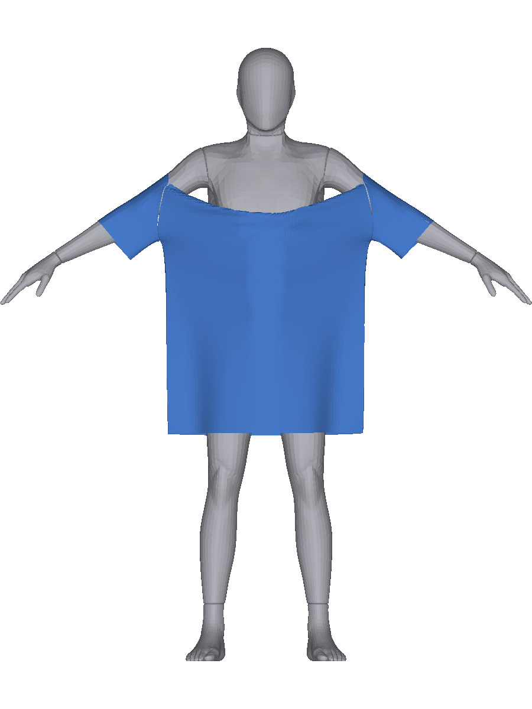
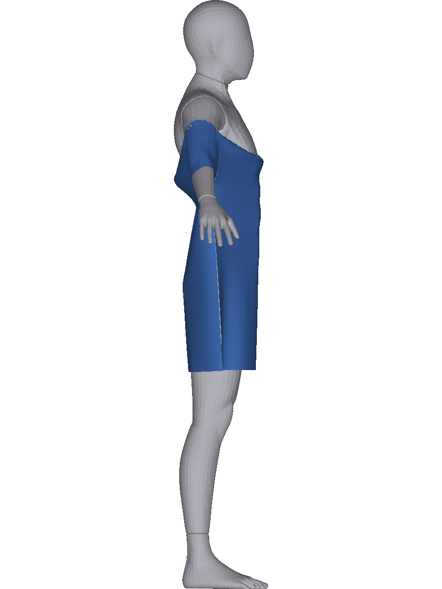
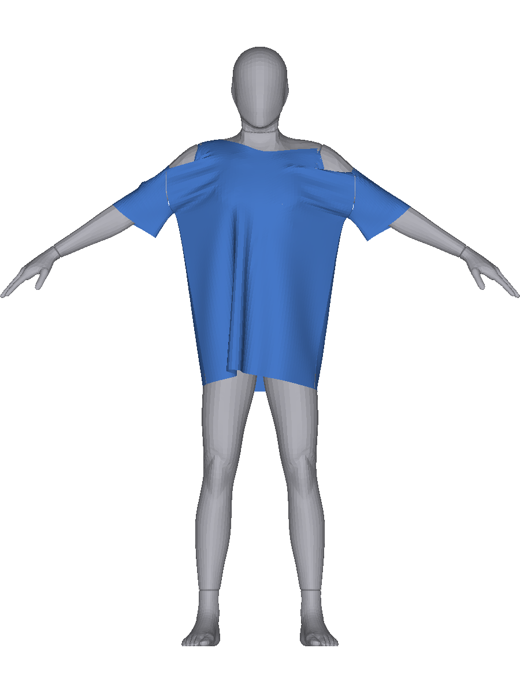
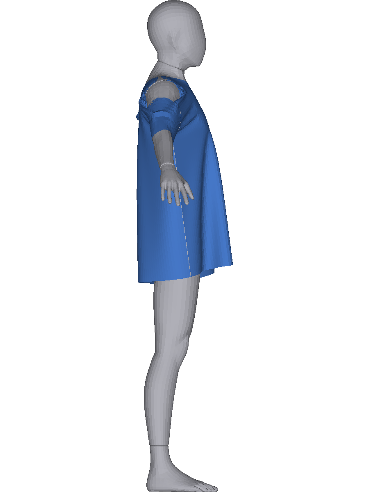

# v5-9 — 어깨 봉제 미닫힘의 기하 · 조립 «시작 자세» 사실 · 봉제 램프 «순서» 진단

```
집행 기계  2호기 DESKTOP-OV72A46(win32-x64 · GTX 1660 Ti 6144MiB · driver 610.88 · CUDA · Python 3.12.10)
브랜치     v5-9-shoulder-seam   기점 f1941b6(v5-8 HEAD · 확인 = git log -1 이 f1941b6)
약정       물리 0줄(정본) · 굽기 ≤ 3칸 · ecc 0 · §0 선커밋 · 브랜치 인쇄 · 캡처 진단칸 · 콘솔 4줄
보고       docs/v5/보고/9.md            노트(이 파일) docs/v5/9-어깨봉제.md
```

## §0-1 판정문 (전략 세션 · v5-8 §4 수령 · **원문**)

```
갈래 B 수용 · 목선 신장 가설 사망(사전 등재 반증 · 귀책 아님) ·
★★★ 뒤집힌 그림: 조립은 목선을 몸통 둘레에 ~2배로 벌려 «낮게» 놓고 램프가 어깨 봉제 폐합으로
«끌어올려» 목에 앉힌다 — supima 완주(링 54) · mst-over 정지(92) · 흘러내림 = 못 올라감 ·
당김의 출처 = 어깨 봉제 미닫힘(mst 최대 16.4mm) ·
★ 질문 = SW 52 의 어깨 봉제는 왜 안 닫히는가(기하 후보: 봉제 끝이 팔 경사면 아래 ·
앞뒤 패널 어깨 끝 사이에 팔+소매 관이 끼어 폐합 경로 차단 — 단정 0) ·
상위 질문 = «올려 입히기» 조립이 드롭숄더에서 원리적으로 성립하는가(실물은 «내려» 입는다) ·
사고 5 수용 · env 전량 수정
```

## §0-2 수령 — 집행 «전»에 읽은 코드 사실 4건

```
 ㄱ ★ **봉제 램프에 «순서·가중» 옵션이 없다.**
    `gpu/bake/worker.py:136` — `tt = min(1.0, (frame + 1) / rampN)` **한 값**을 전 봉제쌍에 그대로 쓴다
    (`fu.sm_rest.from_numpy(rest0 + (SEP − rest0) * tt)`) · v3 쪽도 같은 형태(`dressRun.ts:118-121`).
    커널은 `sm_rest` 를 **읽기만** 한다(`worker.py:118` 주석) ⟹ **순서는 «호출부»에서만 만들 수 있다.**
 ㄴ ★ **어깨 봉제는 봉제 배열의 «맨 앞 연속 구간»이다.**
    `garmentScene.ts:833-844` 가 그룹을 「어깨L · 어깨R · 옆선L · 옆선R · 암홀앞R · 암홀뒤R ·
    암홀앞L · 암홀뒤L · 소매밑R · 소매밑L」 순으로 만들고 `:878-881` 이 그 순서대로 `seamCons` 에 밀어 넣는다 ·
    `v4AsmExport.ts:67` 의 `seam = all.filter(kind==='dist')` 도 그 순서를 보존한다
    ⟹ 구간 경계만 알면 그룹을 가를 수 있다. **그런데 `scene-seam-*.bin` 헤더에 그룹 정보가 없다**
    (`v4AsmExport.ts:136-138` 은 `ms` · `i,j` · `rest` 만 적는다 · `engine/seam.py:37-45` 도 그 셋만 읽는다).
 ㄷ ★ **「몸의 어느 부위인가」를 말해 주는 라벨이 이 저장소에 없다.**
    `bodySkeleton.ts` 계열은 `src/lib/`(v1·v2) 에 있고 v3·v4 경로는 부르지 않는다 ⟹
    팔/몸통 분류는 **손 문턱 없이** 할 수 있는 형태로만 낸다(§0-5ㄷ).
 ㄹ 팔 축·피벗은 자산에 **뼈에서 읽은 값**으로 있다 — `l3ap-origin-c100-h170-s45-a35.json`
    `left.피벗 [0.17996481845479248, 1.375369823668631, −0.028705926609673076]` ·
    `left.방향 [0.8374554839235931, −0.5453251453763944, 0.035899836580615]`(우측 대칭) ⟹ **손 상수 0**.
```

## §0-3 사전 등재 갈래 (회차 프롬프트 그대로 · 사후 신설 0)

| 항 | 집행 | 갈래 |
|---|---|---|
| **①** 어깨 봉제 기하(f0 · 램프 중) | supima ↔ mst-over — 봉제쌍 거리 · 중점 y · **그 사이에 있는 것** · 램프 중 거리 궤적(f0~f30)과 λ · 「닫히지 못하는 쌍」의 위치 분포 | **(가)** 차단 기하 특정(값·부위) / **(나)** 차단 없음 = 다른 원인 / **(다)** 불가 |
| **②** 조립 시작 자세 사실 | 목선 링이 f0 에 2배인 **자리**(어느 단계 · 배치 규칙 · 목선 구멍이 튜브 폭을 따르는 식) · 「올려 입히기」가 설계 의도인지 **사실만** | (갈래 없음 · 사실) |
| **③** 램프 순서 진단(1~2칸 · 물리 0) | 순서/가중 옵션이 있으면 그것으로, 없으면 **진단 플래그 diff 초안 · 승인 후** → 어깨 폐합 여부 · 어깨위 정점 · 링 · 게이트 | **(가)** 폐합·회복(정도) / **(나)** 무변화 / **(다)** 옵션 부재(초안 상신) |
| **④** 종합 | ①②③ 사실 + 처방 후보 **(A)** 조립 «내려 입히기» / **(B)** 램프 순서·차단 해소 — **규모를 사실로** | 판단 0 |

**§4** — **A** = ①(가)+②(사실)+③ ⟹ 상신(다음 = 처방 판) / **B** = ③(다) ⟹ 초안 상신 /
**C** = ①(다) ⟹ 정지 / **D** = 그 외 ⟹ 정지. **회복은 «정도»로.**

## §0-4 ③ 진단 플래그 — diff 초안과 **승인문** (값 보기 «전»)

§0-2ㄱ 이 「옵션 부재」를 확정했으므로 회차 머리의 두 번째 경로(「없으면 진단 플래그 diff 초안 후
§0 승인」)를 탄다. **초안은 아래 두 조각뿐이고, 물리 커널은 0줄이다.**

```
 ㉠ `scripts/v4AsmExport.ts` — 봉제 장면 헤더에 **`seamGroups` 한 키**를 더한다(데이터만).
    `seamGroups = sc.seams` 의 이름과 **누적 구간** [from, to) — 근거는 §0-2ㄴ 의 순서 보존.
    ★ 바이너리 payload 는 **한 바이트도 바뀌지 않는다**(idx·rest 그대로) · 읽는 쪽은 `4+hlen` 오프셋을
      헤더 길이에서 «계산»하므로(`engine/seam.py:43-44`) 기존 로더가 **그대로 돈다**.
 ㉡ `gpu/bake/worker.py` — 칸 키 **`rampOrder`**(기본 없음 ⟹ 종전 경로 **바이트 불변**).
    켜지면 프레임마다 쓰는 `sm_rest` 를 **두 구간으로 나눠** 만든다:
      · 어깨 구간(`seamGroups` 의 `어깨L`+`어깨R`) — `t_sh = min(1, (f+1)/N_sh)`,
        `N_sh = ceil((어깨 rest0 최대 − SEP)/(G·DT²))`   ← **같은 식 · 같은 자리**(worker.py:125)
      · 나머지 — `t_ot = clamp(((f+1) − N_sh)/N_ot, 0, 1)`,
        `N_ot = ceil((나머지 rest0 최대 − SEP)/(G·DT²))`  ⟹ **어깨가 닫힌 «뒤»에 나머지가 시작한다**
      · `rampN`(프레임 예산)은 `N_sh + N_ot` 로 적고 meta 에 셋을 전부 남긴다.
    ★ 새 식 0 — 램프 식은 `worker.py:136-138` 원형 그대로이고 **t 를 구간별로 주는 것만** 다르다.
    ★ 문턱 0 · 상수 0 — `N_sh`·`N_ot` 는 그 구간의 `rest0` 에서 «유도»한다(손 상수 없음).

 **승인** — 위 두 조각을 이 판에서 집행한다. 근거 = 회차 머리 「없으면 진단 플래그 diff 초안 후 §0 승인」 ·
 정본 불변 조건 2개를 **집행 전에** 검사에 넣는다:
   ⓐ `seamGroups` 를 넣은 뒤 **봉제 payload 바이트 동일**(idx·rest 재-export 대조)
   ⓑ `rampOrder` 없는 잡은 **`sm_rest` 궤적이 바이트 동일**(같은 식·같은 배열)
```

### ★ ③ 갈래 (다) 와 머리 문언이 겹친다 — **값 보기 «전»에 처분을 정한다**

```
 겹침 — 갈래 (다) = 「옵션 부재(초안 상신)」 ↔ 회차 머리 = 「없으면 초안 후 §0 승인」.
 처분(사전 등재) — **초안을 §0-4 에 적고 승인·집행한다.**
   · 집행이 **되면** ③은 값으로 (가)/(나) 로 답하고, 「램프에 순서 옵션이 «없었다»」는 §0-2ㄱ 의
     코드 사실로 ③ 머리에 둔다(그 사실 자체가 (다) 의 조건임을 **명시**한다).
   · 집행이 **안 되면**(초안이 물리 커널을 건드려야 하거나 굽기가 던지면) ③ = **(다)** 로 답한다.
 ⟹ **사후 갈래 신설 0.** 두 읽기 중 어느 쪽을 택했는지 보고에 적고, §4 가 A 인지 B 인지는
    전략 세션이 다시 가를 수 있게 **두 값을 나란히** 낸다.
```

## §0-5 사전 결정 5건 (값 보기 «전» · CC 집행 설계)

```
 ㄱ **진입 인자는 v5-7b §0-5ㄴ 확정분 그대로**(새로 고르지 않는다) —
    `BODY_BIN`/`ARM_AXIS_JSON`/`ARM_ORIGIN_JSON` = `gpu/oracle/export/grid27/l3ap-{body,body,origin}-c100-h170-s45-a35.{bin,json,json}` ·
    모든 계기 산출 json 에 `_args` 를 적는다(v5-7b §0-5ㄱ 규약).
 ㄴ **①의 「봉제쌍 거리」는 v5-8 §0-5 채널을 그대로 쓴다** — `gap = |p_i − p_j| − rest(f)` ·
    `rest(f)` 는 램프 식 인용(`dressRun.ts:111-116`) · **λ 가 아니다**(엣지 단위 신장 제약이 없다).
    v5-8 은 그 위에 수직 성분을 곱했다 — 이 판은 **거리 자체**와 **중점 y** 를 따로 낸다.
 ㄷ **「그 사이에 있는 것」의 정의**(문턱 0 · 판정 0) — 어깨 봉제쌍 (i, j) 의 **선분** 위에서
    ㉠ **몸 SDF 부호** — 중점과 선분 11등분 표본의 `sampleSdf(bodyG,·)` 부호(음 = 몸 «안») ·
    ㉡ **소매 관 정점** — 선분까지 거리가 `SEP` 이하인 **소매 패널 정점 수**(패널 범위는 `v4Armpit.ts:50` 식) ·
    ㉢ **최근접 몸 정점의 «팔 축 투영»** — `s = (p − 피벗)·방향`, `r = |(p − 피벗) − s·방향|`
       (피벗·방향은 §0-2ㄹ 자산 값 · **손 문턱 0**) ⟹ 「팔/몸통」은 **`s` 의 부호로만** 적고
       (`s > 0` = 피벗보다 팔 쪽) 부위 이름을 단정하지 않는다(§0-2ㄷ).
 ㄹ **「닫히지 못하는 쌍」의 위치는 봉제쌍 «순번»으로 적는다** — 어깨 봉제는 `row(front, nvB, 0, N_sh)` 로
    만들어져 순번 0 이 **목 쪽**, 마지막이 **어깨 끝 쪽**이다(`garmentScene.ts:834` · `col/row` 정의 `:831-832`).
    따라서 분포는 **순번 · 그 쌍의 x(좌우)** 로 낸다 — 새 이름 0.
 ㅁ **발산 판정((다))은 계기가 던지는 것으로** — `degenerate > 0` · NaN · 굽기 예외.
    「나빠졌다」는 발산이 아니다(v5-7b §0-5ㅁ 과 같은 규칙).
```

## §0-6 §0 사무 3건 (집행 «전» 등재 · 집행은 선커밋 «뒤»)

```
 ㄱ ★ **`worker.py` `layer3` env 전량 전달** — `BODY_BIN`·`ARM_AXIS_JSON`·`ARM_ORIGIN_JSON`·`SPEC`.
    v5-8 사고 5 의 **부류**를 고치는 처분이다(판정문 「env 전량 수정」 승인). 코드 최소 · 물리 0 ·
    없는 키는 **넣지 않는다** ⟹ 기존 호출 env 바이트 불변.
 ㄴ **7b stash 정리**(2호기) — v5-7b 가 체크아웃을 위해 만든 stash 를 확인하고 처분한다.
    **삭제 전에 내용을 인쇄**하고, 브랜치 내용과 동일한 것만 떨군다(상이분은 남긴다).
 ㄷ **귀책 대장에 CC 사고 5 등재** — 「§0 사무가 `SPEC` 한 키만 고쳐 사고의 부류를 남겼다」.
    대장은 지금까지 **전략 세션 귀책 번호 대장**뿐이므로 **CC 귀책 절을 새로 만든다**(번호 계열을 섞지 않는다).
```

---

## §1-⓪ 집행 인쇄 · 사무 3건 결과

```
 브랜치  v5-9-shoulder-seam · §0 선커밋 **7bf62c5**(집행 «전») · 사무+③ 구현 7d018ed(→ 정정 2건) ·
         잡 f39baef · 계기 091ecc6 · **맥 ↔ 2호기 HEAD 일치 확인**(둘 다 같은 커밋 · 2호기 작업트리 청결)
```

| 사무 | 결과 |
|---|---|
| **ㄱ** `layer3` env 전량 | `v4AsmExport.ts` 가 **조립 헤더에 장면 인자를 스스로 적고**(`body`·`armAxisJson`·`armOriginJson`·`spec` · 없는 키는 넣지 않는다) `worker.py` 가 그것을 `meta["scene"]` 으로 실어 `layer3` 에서 `env.update` 한다 ⟹ v5-8 사고 5(**부류**)의 처분. `py_compile` OK · `npx tsc -b` 통과 |
| **ㄴ** 7b stash 정리 | stash **1건**(「v5-7b 집행 전 2호기 이월분」 · 20파일). 추적 스크립트 **5/6 은 blob 해시가 브랜치와 동일**, `v4AsmExport.ts` 만 다른데 차이가 **+40/−0**(v5-8 `NECKRIGID` 블록) ⟹ stash 쪽이 **브랜치 판의 진부분집합** = 코드로 새로운 것 **0**. 그래도 **두 겹으로 남기고** 떨궜다 — 태그 `v5-7b-stash-0` → `fc09e75`(commit · 도달 가능) + `C:\Users\banba\fit-7b-backup\v5-7b-stash.patch` **293,416 B**(`--binary`). `git stash list` **비었다** · **삭제분 0** |
| **ㄷ** CC 귀책 대장 | `전략세션-인수인계.md` 에 **「★ v4·v5 CC 귀책 대장」 절 신설** — **`C1` = v5-8**(「층3 계기 사고의 부류를 고치지 않고 키 하나만 고쳤다」). **번호 계열을 전략 세션 대장과 섞지 않는다**(접두 `C`) · 소급 등재 0 |

### ⓐ 정본 불변 검사 (§0-4 승인 조건 · 집행 «전»에 걸었다)

```
 ⓐ **봉제 payload 바이트 동일** — `seamGroups` 를 넣고 다시 내보낸 뒤 헤더 뒤 payload 를 대조:
      scene-seam-mstover_XL.bin   payload 4,576 B  sha256 0e783d22888c787a
      scene-seam-mstoverRO_XL.bin payload 4,576 B  sha256 0e783d22888c787a   ← **동일**
      scene-seam-supimaL_L.bin    payload 4,320 B  sha256 85d413aeb30c0552
      scene-seam-supimaRO_L.bin   payload 4,320 B  sha256 85d413aeb30c0552   ← **동일**
    헤더 키는 **`seamGroups` 하나만** 늘었다(나머지 15키 그대로).
 ⓑ `rampOrder` 없는 잡은 `sh_mask is None` 분기를 타고 **원형 식 그대로**다(`worker.py` 램프 블록 ·
    같은 배열 · 같은 식) ⟹ 종전 경로 불변.
```

### ★ 봉제 그룹 구간 — §0-2ㄴ 예측이 **값으로 맞았다**

| 그룹 | mst-over `[from,to)` 쌍 | rest0 최소~최대 mm | supima `[from,to)` 쌍 | rest0 최소~최대 mm |
|---|---|---|---|---|
| 어깨L | [0,20) **20** | **124.996 ~ 243.948** | [0,16) **16** | **135.666 ~ 211.172** |
| 어깨R | [20,40) **20** | **125.061 ~ 243.960** | [16,32) **16** | **136.073 ~ 211.166** |
| 옆선L | [40,99) 59 | 2.953 ~ 3.006 | [32,88) 56 | 2.968 ~ 3.002 |
| 옆선R | [99,158) 59 | 2.954 ~ 3.002 | [88,144) 56 | 2.968 ~ 3.001 |
| 암홀앞R | [158,184) 26 | 68.836 ~ 143.119 | [144,170) 26 | 56.282 ~ 113.831 |
| 암홀뒤R | [184,210) 26 | 60.345 ~ 142.330 | [170,196) 26 | 46.002 ~ 114.740 |
| 암홀앞L | [210,236) 26 | 68.851 ~ 143.122 | [196,222) 26 | 56.290 ~ 113.836 |
| 암홀뒤L | [236,262) 26 | 60.358 ~ 142.332 | [222,248) 26 | 45.982 ~ 114.750 |
| 소매밑R | [262,274) 12 | **2.0 ~ 2.0** | [248,259) 11 | **2.0 ~ 2.0** |
| 소매밑L | [274,286) 12 | **2.0 ~ 2.0** | [259,270) 11 | **2.0 ~ 2.0** |
| 합 | **286** | | **270** | |

★ **어깨가 «가장 벌어진» 봉제다** — rest0 최대 **243.96 mm**(mst) / **211.17 mm**(supima)가 전 그룹 최대이고,
옆선은 **3 mm**(사실상 닫힌 채 시작) · 소매밑은 **2.0 = SEP**(이미 닫혀 있다) · 암홀은 46~143 mm.
⟹ 램프가 **끌어올려야 하는 거리**의 대부분이 어깨에 있다(판정문의 「어깨 봉제 폐합으로 끌어올린다」와 정합).
★ **어깨 봉제쌍 수가 SW 의 함수다** — SW 52 는 **20+20**, SW 44.5 는 **16+16**.

## §1-① 어깨 봉제 기하 — **갈래 (가) 차단 기하 특정**

계기 = 신설 `scripts/v5ShoulderSeam.ts`(측정만 · `src/` 0줄 · §0-5ㄷㄹ 정의 그대로 · `_args` 기록).
재료 = v5-7b 궤적 덤프(간격 10프레임 ⟹ f0·10·20·30·40·70·100·200).

### ★ 먼저 정정 1건 — **순번의 «방향»이 §0-5ㄹ 과 다르다**(값에서 읽음)

```
 §0-5ㄹ 은 「순번 0 이 목 쪽」이라 적었다. `x_i` 실측이 그것을 **어깨L 에서 뒤집는다**:
   어깨L 순번 0 → x −0.2438 m(**어깨 끝**) · 순번 19 → x −0.0843 m(목 쪽)
   어깨R 순번 0 → x +0.0843 m(**목 쪽**)   · 순번 19 → x +0.2438 m(어깨 끝)
 근거 — `garmentScene.ts:834` 어깨L = `row(front, nvB, 0, N_sh)` 이고 앞판의 `i=0` 은 **왼쪽 끝**이다
 (`옆선L = col(front, 0, …)` 이 같은 `i=0` 을 쓴다) ⟹ 어깨L 은 **끝 → 목**, 어깨R 은 **목 → 끝** 순이다.
 ⟹ 이 절의 모든 순번은 **이 정정된 방향**으로 읽는다. 문턱·갈래는 건드리지 않았다(방향 표기만).
```

### 어깨 봉제 거리·간극 궤적 (그룹 집계 · mm)

`간극 = |p_i − p_j| − rest(f)` · `rest(f)` 는 램프 식 인용 · **λ 가 아니다**(§0-5ㄴ).

| f | rest(f) 최대 | mst 어깨L 거리중앙 | 거리최대 | **간극중앙** | **간극최대** | @순번 | supima 어깨L 거리중앙 | 거리최대 | **간극중앙** | **간극최대** | @순번 |
|---|---|---|---|---|---|---|---|---|---|---|---|
| 0 | 243.948 / 211.172 | 194.3379 | 243.9477 | 0 | 0 | 0 | 183.0758 | 211.1720 | 0 | 0 | 0 |
| 10 | 216.763 / 184.007 | 172.6526 | 216.7854 | 0.0083 | 0.0698 | 9 | 159.5586 | 188.6880 | 0.0023 | 4.6811 | 15 |
| 20 | 189.577 / 156.842 | 151.1286 | 194.8534 | 0.0237 | 5.2760 | 19 | 136.1447 | 164.1427 | 0.1016 | 7.3011 | 15 |
| 30 | 162.392 / 129.676 | 129.4926 | 171.6133 | 0.0524 | 11.4289 | 1 | 123.0973 | 136.2425 | 9.0297 | 12.6197 | 11 |
| 40 | 135.207 / 102.511 | 107.9007 | 146.3883 | 0.0346 | 24.9762 | 1 | 107.1350 | 124.2638 | 15.4355 | 33.1733 | 9 |
| 70 | 53.652 / 21.016 | 50.9287 | 104.0851 | 2.1366 | 72.0671 | 2 | 18.7554 | 23.3167 | 0.2940 | 2.3010 | 15 |
| 100 | 2 / 2 | 7.4239 | 103.7928 | 5.4239 | **101.7928** | **2** | 2.2087 | 4.0797 | 0.2087 | **2.0797** | 15 |
| 200 | 2 / 2 | 7.4201 | 103.7928 | 5.4201 | **101.7928** | **2** | 2.2096 | 4.0797 | 0.2096 | **2.0797** | 15 |

어깨R 도 같다 — mst f200 간극 중앙 **5.4598** · 최대 **102.2244**(순번 **17**) ↔
supima f200 중앙 **0.2508** · 최대 **3.5051**(순번 0).
⟹ **supima 는 닫힌다**(최대 2.08~3.51 mm) · **mst-over 는 얼어 있다**(최대 101.79~102.22 mm · **≈ 29~49배**).

### ★★★ 「닫히지 못하는 쌍」의 자리 — **좌우 대칭으로 «어깨 끝»** (f100 · mm)

| 어깨L 순번 | 0 | 1 | **2** | 3 | 4 | 5 | 6 | … | 19 |
|---|---|---|---|---|---|---|---|---|---|
| 간극 | 42.2636 | 81.8328 | **101.7928** | 73.1741 | 38.5125 | 16.6782 | 5.4239 | … | 26.6738 |
| **몸안 표본**/11 | **9** | **9** | **9** | **9** | **8** | 0 | 0 | … | 0 |
| 팔축 `s` mm | +78.247 | +76.041 | **+64.202** | +71.311 | +70.710 | +80.428 | +80.428 | … | +35.043 |
| 팔축 `r` mm | 31.723 | 47.306 | 60.051 | 46.876 | 46.476 | 51.000 | 51.000 | … | 102.320 |
| 중점 y m | 1.35551 | 1.34607 | 1.32475 | 1.30392 | 1.29553 | 1.29194 | 1.29093 | … | 1.27445 |

| 어깨R 순번 | 19 | 18 | **17** | 16 | 15 | 14 | 13 | … | 0 |
|---|---|---|---|---|---|---|---|---|---|
| 간극 | 40.9525 | 84.5863 | **102.2244** | 71.7179 | 37.8148 | 15.8998 | 5.4605 | … | 27.2326 |
| **몸안 표본**/11 | **9** | **9** | **9** | **9** | **7** | 0 | 0 | … | 0 |
| 팔축 `s` mm | +75.939 | +78.833 | **+69.413** | +71.420 | +70.767 | +69.262 | +59.237 | … | +35.185 |

**supima 대조**(f100) — **16/16 쌍 전부 «몸안 표본 0»** · 최근접 `s` 범위 **−100.8 ~ +28.5 mm**(어깨L) ·
**−123.0 ~ +12.6**(어깨R) · 간극 최대 **2.0797 / 3.5051 mm**.

### ★★★ ①의 답 — **갈래 (가)** · 다만 판정문의 기하 후보 «절반»은 기각된다

```
 ㉠ **차단은 «어깨 끝 5쌍»에만 있다** — mst-over 어깨L 순번 0~4 · 어깨R 순번 15~19(**좌우 대칭** ·
    최대는 양쪽 다 «끝에서 세 번째») 가 f70 부터 갈라져 f100~f200 에 **101.79 / 102.22 mm 로 얼어붙는다**.
    나머지 15쌍은 0.68~27 mm 로 닫힌다. supima 는 그런 쌍이 **하나도 없다**.
 ㉡ **그 5쌍의 선분은 «몸 안»을 지난다** — 11표본 중 **8~9개**가 `sampleSdf < 0` 이다.
    닫힌 쌍은 예외 없이 **0** 이다(mst 15/20 · supima 16/16). ⟹ 앞판 어깨 끝과 뒤판 어깨 끝을 이으려면
    **몸을 통과해야 한다** — 몸 충돌 제약과 봉제 제약이 **서로 반대 방향으로** 당긴다.
 ㉢ **그 몸은 «팔»이다** — 최근접 몸 정점의 팔 축 투영 `s = +64.202 ~ +80.428 mm`(전부 **양수** =
    어깨 피벗보다 **팔 쪽**) · `r = 31.723 ~ 60.051 mm`. supima 의 같은 채널은 최대 **+28.5 mm** 다.
    ⟹ 「봉제 끝이 팔 경사면 아래」라는 판정문 후보가 **값으로 선다**.
 ㉣ ★ **「팔 + 소매 관이 끼어 폐합 경로를 막는다」의 «소매 관»은 기각된다** —
    선분 표본에 `SEP` 이내로 들어온 **소매 패널 정점은 전 쌍 0개**다(mst f0·f100 전부).
    오히려 **supima** 의 f100 닫힌 쌍에서 소매 근접 표본이 **최대 7개** 나온다(닫힌 뒤 어깨에 얹혀서다).
    ⟹ 막는 것은 **옷의 소매가 아니라 몸의 팔**이다. **기전 단정은 하지 않는다 — 부위와 값만 적었다.**
 ㉤ 부수 사실 — 차단 쌍의 중점 y 는 **1.32475~1.35551 m**(`Y_TOP` 1.3598263 에 가깝다) ·
    닫힌 쌍은 **1.24~1.29 m** 다. 즉 **높이 남은 쪽이 못 닫힌 쪽**이다.
```

## §1-② 조립 «시작 자세» — 사실 (판정 0 · 처방 0)

계기 = `scripts/v5PlaceProbe.ts`(신설 · **수신기일 뿐이다**) — v3-90 §1-① 이 `garmentScene.ts:559` 에
박아 둔 **인쇄 «전용» 계기** `globalThis.__v3clampProbe` 를 받는다. 배치 코드는 **0줄** 건드리지 않았다.

### ㉠ 목선 링이 f0 에 2배인 «자리» = `scalesFor` 의 클램프

```
 식(`garmentScene.ts:552-563` 원문) —
   need = 4 · panelHalfWidth(py) + 2 · GAP_SIDE           ← 그 높이에서 «패널이 요구하는» 둘레
   base = perimOf(boundaryOf(HSUP_Y[k], δ, 1))            ← 그 높이 «몸» 단면 볼록 껍질(δ 부풀림) 둘레
   SCALES[k] = Math.max(1, need / base)                   ← **클램프**
 ⟹ `need < base` 인 높이에서는 배율이 **1 로 잘리고**, 패널이 «자기 둘레»가 아니라
    **«몸 실루엣 둘레»** 에 놓인다. `HSUP_Y[k] = supportAt(yOf(k), SLAB)` 는 그 높이 «슬랩»의
    몸 정점을 (x,z)로 투영한 볼록 껍질이므로 — **A포즈(35°)에서는 팔이 그 슬랩에 들어온다.**
```

| 칸 | `Y_TOP` m | 발화 높이 수 / 61 | 맨 윗줄 `need` cm | 맨 윗줄 `base` cm | ratio | **초과 cm** | δ mm |
|---|---|---|---|---|---|---|---|
| **mst-over-L**(SW 52) | 1.3598263 | **9** (k52~k60 · y 1.2612~1.3598) | **104.600** | **133.492** | 0.78356 | **+28.892** | 27.2392 |
| **supima-L**(SW 44.5) | 1.3934801 | **13** (k48~k60 · y 1.2633~1.3935) | **89.600** | **121.199** | 0.73928 | **+31.599** | 29.1777 |

★ **팔이 들어오는 «계단»이 값으로 보인다** — mst-over 는 `base` 가 k51 **107.863** → k52 **135.947 cm** 로
**한 칸(1.23 cm 높이)에 +28.08 cm** 뛴다. supima 는 k50 **111.840** → k51 **127.067 cm**(+15.23) ·
그 위로 계속 120~131 cm 대다.

★ 목선 링 f0 = **97.2594 cm**(mst) / **91.7762 cm**(supima) — v5-8 §1-① 값과 **소수 전량 일치**(재현).
`ringRest` 는 47.0421 / 47.0498 cm ⟹ 비 **2.068 / 1.951**.
⟹ 링이 2배인 이유는 「목선 구멍이 튜브 폭을 따른다」는 별도 규칙이 아니라 **맨 윗줄 전체가
그 높이의 몸 실루엣 둘레에 놓이기 때문**이다(목선은 맨 윗줄의 «어깨L─목선─어깨R» 중 가운데 토막이다 ·
`garmentScene.ts:412` `nuB = 2·N_sh + N_nk`).

### ㉡ 「올려 입히기」는 **설계 의도**다 — 코드 주석 원문

```
 `garmentScene.ts:452-464`(v3-21 배치) 원문 —
   「v3-18~20의 배치는 옷 높이대 «전체»의 볼록 껍질 하나를 모든 높이에 썼다. 그 껍질은
     가장 넓은 곳(어깨)이 정하므로 둘레가 128.84cm가 되고, 패널 110cm는 거기 못 미쳐
     **옆선이 9.24cm · 어깨가 22.88cm 벌어진 채** 시작했다(v3-18 §3 표). …
     여기서는 **높이마다** 몸 단면의 볼록 껍질을 잡고 … 큰 쪽으로 맞춘다:
       P(y) = max( P_body(y) + 여유, 4 × 그 높이의 패널 반폭 )
     ⟹ 옷이 몸보다 큰 대역(몸통)에서는 **옆선이 정확히 만나고**, 몸이 더 큰 대역(어깨)에서는
       몸을 비우되 **필요한 만큼만** 벌어진다.」
 ⟹ **v3-21 이 고친 것은 «옆선»이다**(값으로 확인 — 옆선 rest0 가 이제 **2.953~3.006 mm** 다).
    **«어깨»는 고치지 않았고, 고치지 않는 것이 의도다**(「몸을 비우되 필요한 만큼만」).
 ★ 그런데 **어깨의 초기 벌어짐은 v3-18 보다 «커졌다»** — v3-18 주석의 **22.88 cm** ↔
   이 판 실측 어깨 rest0 최대 **24.3948 cm**(mst) / **21.1172 cm**(supima).
   (v3-18 은 다른 옷·다른 몸이므로 **직접 대조가 아니다** — 값만 병기한다 · 단정 0.)
 ★ v3-90 §1-① 이 이 자리에 **「클램프 발화 = need < base」 인쇄 계기를 일부러 박아 뒀다**
   ⟹ 발화 자체는 **알려진 사실**이고 이 판이 새로 발견한 것이 아니다. 이 판이 더한 것은
   **발화 높이대(9 / 13개)와 초과 둘레(+28.892 / +31.599 cm)라는 «값»**이다.
```

### ㉢ ★ ②는 **판별자가 아니다**

```
 supima(닫히는 칸)도 클램프가 **13개 높이**에서 발화하고 초과 둘레가 **+31.599 cm** 로
 mst-over(**+28.892**)보다 **오히려 크다**. 그런데 supima 는 어깨가 **닫힌다**(간극 최대 2.08~3.51 mm).
 ⟹ 「배치가 링을 2배로 펼친다」는 **두 칸이 공유하는 조건**이고, 갈리는 자리는 ①이다.
 ★ ①과 ②를 잇는 값 — 어깨 봉제 «끝»이 팔 위에 있는가:
     f0 최근접 몸 정점의 팔 축 투영 `s` 최대 — **mst-over +62.475 mm** ↔ **supima +27.3 mm**
     f100 같은 채널        — **mst-over +80.428 mm** ↔ **supima +28.5 mm**
   `Y_TOP` 이 SW 로 **33.65 mm 내려가면**(1.3935 → 1.3598) 그 높이에서 팔이 더 벌어져 있고,
   어깨 봉제쌍 수도 16 → 20 으로 늘어 **봉제 끝이 팔 위로 나간다**. **기전 단정 0 · 값만.**
```

## §1-③ 램프 «순서» 진단 굽기 2칸 — **어깨 우선 스케줄**

### 집행 인쇄 — 순서가 섰다

```
 mstoverRO_XL  램프 순서 — 어깨 **40쌍** N_sh **89** · 나머지 **246쌍** N_ot **52** · RAMP_N **141**
               어깨그룹 어깨L[0:20),어깨R[20:40) · 어깨rest0Max **0.24395957464414686** ·
               나머지rest0Max **0.14312152709158157**
 supimaRO_L    램프 순서 — 어깨 **32쌍** N_sh **77** · 나머지 **238쌍** N_ot **42** · RAMP_N **119**
               어깨그룹 어깨L[0:16),어깨R[16:32) · 어깨rest0Max **0.2111720470412277** ·
               나머지rest0Max **0.11474977481194604**
 ★ **N_sh 가 원래 전체 rampN 과 «같다»**(89 / 77) ⟹ rest0 최대를 가진 봉제가 **어깨**다.
   나머지는 52 / 42 프레임이면 닫힌다 ⟹ 순서를 주면 총 램프가 89 → **141**, 77 → **119** 로 늘어난다.
 ★ **사무 ㄱ 이 값으로 확인됐다** — 두 칸 모두 `meta.scene` 에
   `BODY_BIN`·`ARM_AXIS_JSON`·`ARM_ORIGIN_JSON` 이 실려 **층3(핏 리포트·게이트)이 완주**했다.
   v5-8 은 같은 자리에서 **두 칸 모두 던졌다** ⟹ 사고 5의 «부류»가 닫혔다.
```

| 칸 | n | substeps | RAMP_N | 정착 | convFrame | lastNet | deg | sec | s/프레임 | 벽시계 |
|---|---|---|---|---|---|---|---|---|---|---|
| `mstoverRO_XL` | 12,144 | 235 | 141 | **converged** | **270** | 6.642206254264018e-05 | **0** | 766.4186 | 2.8386 | **799.1 s** |
| `supimaRO_L` | 10,356 | 229 | 119 | **converged** | **260** | 5.372226030417524e-05 | **0** | 664.4058 | 2.5554 | **697.2 s** |

### ★★★ 판정 표 — 균일 램프 ↔ 어깨 우선 (원본 열은 v5-7b·v5-9 §1-① 에서 «읽어» 옮김)

| 채널 | mst-over **균일** | **`mstoverRO_XL`** | supima **균일** | **`supimaRO_L`** |
|---|---|---|---|---|
| **어깨 간극 최대 mm**(어깨L / 어깨R) | **101.7928** / 102.2244 | **18.1527** / 19.6598 | **2.0797** / 3.5051 | **117.7433** / 114.5702 |
| 어깨 간극 중앙 mm(L / R) | 5.4239 / 5.4598 | **1.0507** / 0.7105 | 0.2087 / 0.2508 | **9.7219** / 27.9868 |
| 최대 간극의 순번(L / R) | **2 / 17**(어깨 끝) | **19 / 0**(**목 쪽**) | 15 / 0 | **13 / 8**(**목 쪽**) |
| 「몸안 표본 > 0」 쌍 수(L) | **5 / 20** | **0 / 20** | 0 / 16 | **6 / 16** |
| **어깨선 위 정점** | **0** | **0** | **858** | **237** |
| **옷 최고점 − 어깨선 mm** | −2.2761517652689633 | **−5.168972163419827** | +55.826346628914834 | **+43.33445518547108** |
| 정착 목선 링 cm | 91.986332 | **85.55838818594347** | 54.247194084357176 | **79.43165698209901** |
| 목선 초과비(허용 cm) | 0.993501(92.588035) | 0.996121588360682(85.89151082123114) | 0.9907450186082882(54.75) | 0.9947847214221959(79.84808699970723) |
| 자기관통 교차 | 19 | **11** | **0** | **8** |
| ③a 관통 최대 mm | 0.345328 | **3.1640632440805705** | 0.4957352424735401 | **34.15533221559536** |
| 관통정점수 | — | 780 | — | 902 |
| 최소 쌍거리 mm | 0.203143 | 0.024585228037228193 | 1.996796052098888 | 0.09634912142739943 |
| 봉제 간극 최대 mm(게이트 채널) | 104.22 | **81.18472396073474** | 5.505096725541386 | **119.74332755045447** |
| λ 최대 | 3.910113 | **2.9179030441833795** | 1.4240117713935603 | **6.608357358707904** |
| 정착 창 순변위 mm | — | 0.06642206254264019(통과) | — | 0.05372226030417524(통과) |
| **게이트** | fail(교차 19) | **fail**(③a 3.1641 · 교차 11) | **pass** | **fail**(③a 34.1553 · 교차 8) |

**어깨 간극 순번별**(정착 · mm · 방향은 §1-① 정정대로)

```
 mstoverRO 어깨L(순번 0 = 어깨 끝 → 19 = 목):
   4.97 8.63 4.36 2.19 1.05 0.71 0.67 0.64 0.63 0.61 0.60 0.59 0.57 0.55 0.73 1.17 2.11 3.86 8.14 **18.15**
   몸안 표본 — **20쌍 전부 0** (균일 램프는 순번 0~4 가 9/9/9/9/8 이었다)
 mstoverRO 어깨R(순번 0 = 목 → 19 = 어깨 끝):
   **19.66** 8.49 4.41 2.25 1.21 0.71 0.48 0.45 0.48 0.50 0.51 0.52 0.53 0.54 0.55 0.64 2.37 6.36 9.66 9.20
   몸안 — 순번 19 만 **11**(간극 9.20) · 나머지 0
 supimaRO 어깨L(순번 0 = 어깨 끝 → 15 = 목):
   8.16 9.72 4.89 2.52 1.65 1.41 1.54 2.50 5.39 13.44 30.98 63.09 99.55 **117.74** 108.03 100.14
   몸안 — 0 0 0 0 0 0 0 0 0 0 **2 9 9 11 10 10** ⟹ **목 쪽에서 몸을 통과한다**
 supimaRO 어깨R(순번 0 = 목 → 15 = 어깨 끝):
   10.15 9.19 11.66 18.11 30.49 53.19 88.22 111.99 **114.57** 88.15 55.60 27.99 13.41 10.00 12.17 14.14
   몸안 — 0 0 0 0 7 9 11 10 10 9 9 4 0 0 0 11
 소매 근접 표본 — 네 칸 전부 **0**(모든 쌍 · ①의 ㉣와 같다)
```

### ★★★ ③의 답 — **(가) 폐합** · 그런데 **회복의 «정도» = 0** 이고 **대조칸이 깨진다**

```
 ㉠ **폐합은 «일어난다»** — mst-over 어깨 간극 최대 **101.7928 → 18.1527 mm**(−83.64 mm · **5.6배**) ·
    중앙 5.4239 → **1.0507 mm** · ①이 특정한 「몸안을 지나는 쌍」이 어깨L 에서 **5 → 0** 으로 사라진다.
    ⟹ 「어깨를 먼저 닫으면 팔이 막던 자리가 닫힌다」는 **값으로 성립한다**.
 ㉡ ★ **그런데 걸림은 회복되지 않는다** — 어깨선 위 정점 **0 → 0**(변화 0) ·
    옷 최고점 **−2.2761517652689633 → −5.168972163419827 mm**(**2.89 mm 더 내려갔다**).
    회복의 **«정도» = 0** 이다(회차 프롬프트 「회복은 «정도»로」 · **172 는 판정선으로 쓰지 않았다**).
    링은 91.986332 → **85.55838818594347 cm**(−6.43 cm) 로 줄지만 rest 47.04 의 **1.819배**에 머문다.
 ㉢ ★★ **대조칸이 깨진다** — supima 는 게이트 **pass → fail** 이다:
    ③a 관통 0.4957352424735401 → **34.15533221559536 mm**(**68.9배**) · 교차 0 → **8** ·
    어깨위 858 → **237** · 최고점 +55.83 → **+43.33 mm** · 링 54.2472 → **79.4317 cm** ·
    λ 1.4240 → **6.6084** · 어깨 간극 최대 2.0797 → **117.7433 mm**.
 ㉣ **차단은 «해소»가 아니라 «이동»이다** — 최대 간극의 자리가 두 칸 모두 **어깨 끝 → 목 쪽**으로 옮기고
    (mst 순번 2 → 19 · supima 15 → 13), supima 에서는 그 목 쪽 쌍들이 **몸을 통과한다**(몸안 2~11).
    ⟹ 어깨를 먼저 닫으면 그 봉제가 **아직 자리를 못 잡은 목·머리 쪽 몸**을 가로지른다. **기전 단정 0.**
 ㉤ 총 램프가 길어진다 — RAMP_N 89 → **141**(mst) · 77 → **119**(supima) ⟹ N_sh 가 곧 전체였다(㉠ 인쇄).

 ★★ **갈래 읽기 두 가지를 나란히 둔다**(사후 갈래 신설 0):
   ㉥ 회차 프롬프트의 「**회복은 «정도»로**」를 따르면 — 폐합이 일어났고 회복의 정도가 **0** 이므로
      ③ = **(가)** 이고 그 «정도»가 0 이라고 적는다. (이 노트가 택한 읽기다.)
   ㉦ (가) 를 「폐합 **그리고** 회복 > 0」의 **연언**으로 읽으면 — 이 결과는 (가) 밖이고,
      (나)「무변화」도 아니며((간극 101.79 → 18.15 · supima 2.08 → 117.74) 변화가 크다)
      (다)「옵션 부재」도 아니다(집행됐다) ⟹ 그 읽기에서는 **판정 불가**다.
   ⟹ 어느 읽기를 택할지는 **전략 세션 몫**이고, 이 노트는 **양쪽 다 적고 값 전량을 낸다**.
      §4 의 A 문언(「①(가)+②(사실)+③」)은 ③의 «하위 갈래»를 요구하지 않는다.
```

## §1-④ 종합 (판단 0 · 사실만)

```
 1 **어깨 봉제가 램프가 감아야 하는 거리의 «거의 전부»다** — 어깨 rest0 최대 **243.96 / 211.17 mm** 이
   전 그룹 최대이고 옆선은 **2.95~3.01 mm**, 소매밑은 **2.0 = SEP**(이미 닫힘), 암홀은 46~143 mm.
   `N_sh` 가 전체 `rampN` 과 같다(89 / 77) — 즉 **램프 길이를 정하는 것이 어깨다**.
 2 **어깨 봉제쌍 수와 위치가 SW 의 함수다** — SW 52 는 **20+20쌍**, SW 44.5 는 **16+16쌍** ·
   봉제 끝의 최근접 몸 팔축 투영 `s` 최대 f0 **+62.475**(mst) ↔ **+27.3 mm**(supima).
 3 ★★★ **막는 것은 «몸의 팔»이다** — 안 닫히는 5쌍의 선분이 11표본 중 **8~9개가 몸 안**이고
   최근접 몸이 팔(`s` +64~+80 mm)이다. 닫힌 쌍은 예외 없이 **몸안 0**.
   **소매 패널 정점은 전 쌍·전 칸 0개** ⟹ 「옷의 소매 관이 끼어 막는다」는 **기각**된다.
 4 **배치가 링을 2배로 펼치는 자리는 `scalesFor` 의 `max(1, need/base)` 클램프**이고
   맨 윗줄에서 `need` 104.600 ↔ `base` **133.492 cm**(초과 **+28.892**) / supima 89.600 ↔ **121.199**(**+31.599**).
   팔이 슬랩에 드는 k51→k52 에서 `base` 가 **+28.08 cm** 계단으로 뛴다.
 5 **「올려 입히기」는 v3-21 의 «설계 의도»다**(주석 원문) — v3-21 이 고친 것은 **옆선**이고 어깨는 남겼다.
 6 **②는 판별자가 아니다** — supima 도 클램프가 13개 높이에서 발화하고 초과가 더 크다(+31.60).
 7 **어깨 우선 램프는 폐합을 «만든다»**(간극 101.79 → 18.15) **그런데 걸림을 못 만든다**(어깨위 0 → 0)
   **그리고 통과하던 칸을 깬다**(supima ③a 68.9배 · 게이트 pass → fail).
 8 **차단은 이동한다** — 최대 간극 자리가 어깨 끝 → **목 쪽**으로 옮기고 거기서 몸을 통과한다.

 ★ 처방 후보의 **규모**(사실만 · 제안·선택 0):
   **(A) 조립 «내려 입히기»** — 목선을 rest 로 목에 앉히고 패널을 어깨에서 드레이프.
     · 건드릴 자리 = `garmentScene.ts`(968줄)의 배치 블록 — `scalesFor`(`:549-564`) ·
       `rebuildSurface`(`:589-596`) · `bodyPoint`(`:597-603`) · `HSUP_Y`/`supportAt`/`boundaryOf`.
     · **저장소 밖 소비자는 «계기뿐»이다** — `scripts/v3S4.ts`(`:143`,`:232`) · `v3ArcMono.ts`(`:29`) ·
       `v3ClampBb.ts`(`:23`) · 이 판의 `v5PlaceProbe.ts`. **제품 모듈은 `garmentScene.ts` 안에서만 쓴다.**
     · 대가 = **조립이 바뀌면 굽기 산출 전량이 바뀐다** — v4-52 제공 **29칸** + 보류 67 + 착용불가 12
       (= 108칸 계정)과 v5 의 모든 칸이 **재굽기 대상**이고 v3 정답지와의 대조 기준도 다시 세워야 한다.
     · v3 는 **동결**이다 ⟹ 이 변경은 「v3 동결 예외」 대장에 올라가야 하는 규모다.
   **(B) 램프 순서·차단 해소** — 이 판이 «호출부»에서 이미 만들어 봤다.
     · 구현 규모 = `worker.py` 호출부 **+35/−4줄**(커널 0줄) + `v4AsmExport.ts` **+7줄**(`seamGroups` 헤더).
     · **그러나 TS 쪽에 램프 사본이 3개 더 있다** — `src/v3/dressRun.ts:119-121`(정본) ·
       `scripts/v3S4.ts:755` · `:1175` · `src/lib/dressingMachine.ts:149`. 정본화하면 **네 자리**를 맞춰야 한다.
     · 대가 = **이 판의 실측 그대로** — ③a 관통 mst **9.2배**(0.345 → 3.164) · supima **68.9배**(0.496 → 34.155) ·
       supima 게이트 **pass → fail** · 총 램프 프레임 +58% / +55%(89 → 141 · 77 → 119).
     · 남은 미측정 — 「어깨를 «나중에»」 · 「어깨 끝 5쌍만 늦게」 · 「팔을 T포즈로 두고 감은 뒤 A포즈로」 등
       **스케줄 변주는 이 판이 재지 않았다**(예산 ≤ 3칸 중 2칸 사용).
```

## §1-⑤ 캡처 — 진단칸 정착 앞·옆 (화면 판정 0)

| # | 칸 | 앞 | 옆 |
|---|---|---|---|
| 1 | `mstoverRO_XL`(SW 52 · 어깨 우선) |  |  |
| 2 | `supimaRO_L`(SW 44.5 · 어깨 우선 · 대조) |  |  |

## §2 자기검사

| 항 | 약정 | 실측 |
|---|---|---|
| 기점 | `f1941b6`(v5-8 HEAD) | ✅ |
| **물리 0줄(정본)** | `src/` · `gpu/engine` diff 0 | ✅ **`git diff --stat f1941b6 HEAD -- src/ gpu/engine/` = 빈 출력** |
| 진단 | 잡/램프 옵션 있으면 그것 · 없으면 초안 후 §0 승인 | ✅ **옵션 부재 확정**(§0-2ㄱ) ⟹ §0-4 에 초안·승인문을 적고 집행 · 커널 0줄(호출부만) |
| 정본 불변 | — | ✅ ⓐ 봉제 payload **바이트 동일**(sha 대조) · ⓑ `rampOrder` 없으면 원형 분기 |
| 굽기 | ≤ 3칸 | ✅ **2칸**(1,496.3 s) |
| ecc | 에이전트·스킬 | **0 · 0** |
| §0 선커밋 | 집행 «전» | ✅ `7bf62c5` |
| 브랜치 인쇄 | | ✅ `v5-9-shoulder-seam` |
| 캡처 | 진단칸 | ✅ **4장**(2칸 × 앞·옆 · 900×1200) |
| 갈래 | 사후 신설 0 | ✅ ① (가) · ② 사실 · ③ (가)+«두 읽기 병기» — 이름을 새로 만들지 않았다 |
| 172 | 판정선 아님 | ✅ 회복은 정점 수·최고점 mm 로만 |

**자기신고 — 사고·정정 4건**

```
 1 ★ **`git add -A` 가 «의도적 추적 밖» 14파일을 커밋에 담았다**(`7d018ed`) — 잡 6 + export json 8.
   v5-7b 는 «담기 전에» 잡았는데 이번엔 **커밋까지 갔다**. 정정 2커밋으로 `git rm --cached`
   (파일 삭제 0 · 디스크 보존 확인) ⟹ 이 판의 추적 diff 는 다시 **4파일**이 됐다. **CC 귀책.**
 2 ★ **그 정정에서 내가 과했다** — `gpu/oracle/export/*.json` 글롭이 **원래부터 추적되던 json 480개**를
   인덱스에서 빼 버렸다. `git reset` 으로 즉시 되돌리고(추적 480 복구 확인) 한글 이름 3건만 다시 뺐다.
   **커밋되지 않았다** · 파일 삭제 0. **CC 귀책.**
 3 **§0-5ㄹ 의 순번 방향이 틀렸다** — 「순번 0 이 목 쪽」은 **어깨L 에서 반대**다(§1-① 정정 · `x_i` 실측 ·
   `garmentScene.ts:831-834` 근거). 방향 표기만 고쳤고 문턱·갈래는 건드리지 않았다.
 4 **③의 계기에 `POS` 진입을 추가했다**(굽기 산출에 덤프가 없다) — 추가 인자 · 기본값 불변 ·
   측정 로직 0줄. `OUTTAG` 도 같이 열었다(산출 파일 이름 충돌 방지).

 미집행 0 · 문턱 이동 0 · 사후 갈래 신설 0 · 화면 판정 0.
 이 판 코드 diff — `gpu/bake/worker.py` **+41/−5** · `scripts/v4AsmExport.ts` **+21/−2** ·
 `scripts/v5ShoulderSeam.ts` **신설 +200** · `scripts/v5PlaceProbe.ts` **신설 +66** ·
 `.obsidian-log/전략세션-인수인계.md` **+13**(CC 대장) · 잡 2 · **물리 0줄**.
```

## §4 갈래 판정 — **A**

```
 §0 등재 문언 — 「**A = ①(가)+②(사실)+③** ⟹ 상신(다음 = 처방 판) / B = ③(다) ⟹ 초안 상신 /
 C = ①(다) ⟹ 정지 / D = 그 외 ⟹ 정지」

 ① = **(가)** 차단 기하 특정 — **몸의 «팔»**(몸안 표본 8~9/11 · 팔축 s +64~+80 mm · 어깨 끝 5쌍) ·
      「소매 관」은 **기각**(소매 근접 표본 전 쌍 0)
 ② = **사실 확보** — 클램프 `max(1, need/base)` 자리 · 초과 **+28.892 / +31.599 cm** ·
      「올려 입히기」는 **v3-21 설계 의도**(주석 원문) · **판별자는 아니다**
 ③ = **집행됨**(옵션 부재 ⟹ 초안·승인·집행) — **(가) 폐합**(간극 101.79 → 18.15 mm) ·
      **회복 정도 0**(어깨위 0 → 0) · **대조칸 파괴**(supima 게이트 pass → fail · ③a 68.9배)
 ⟹ **A**. (B 는 ③(다)=옵션 부재로 «초안만» 상신하는 갈래인데, 초안을 집행까지 했으므로 B 가 아니다.)
 ★ 한정 — ③의 갈래를 「폐합 ∧ 회복>0」의 연언으로 읽으면 ③은 세 갈래 밖이다(§1-③ ㉦).
   그 읽기를 택하면 §4 는 **D(정지)** 가 된다. **판단은 전략 세션 몫**이고 값은 전량 냈다.
```
