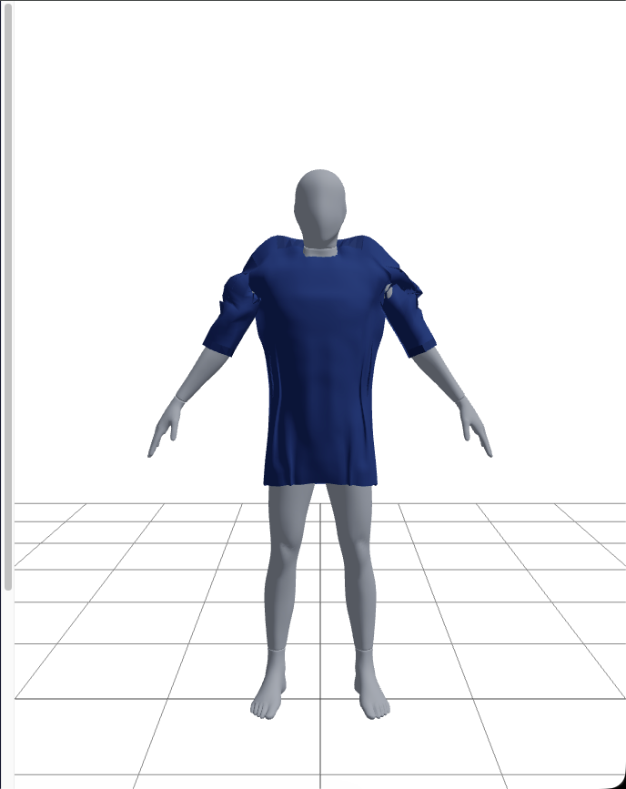
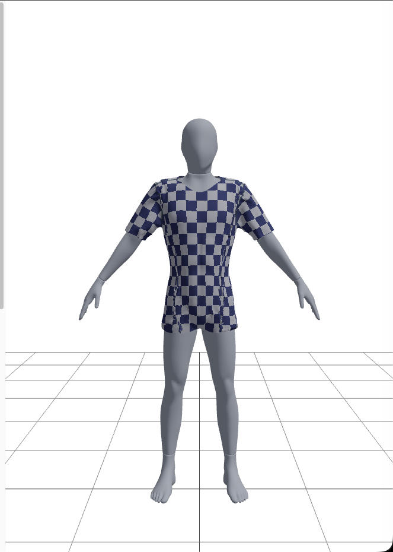
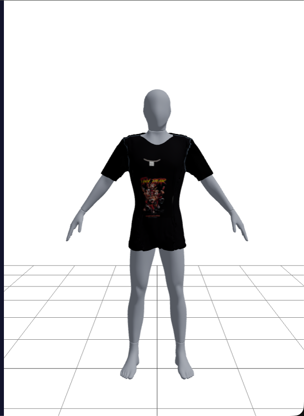
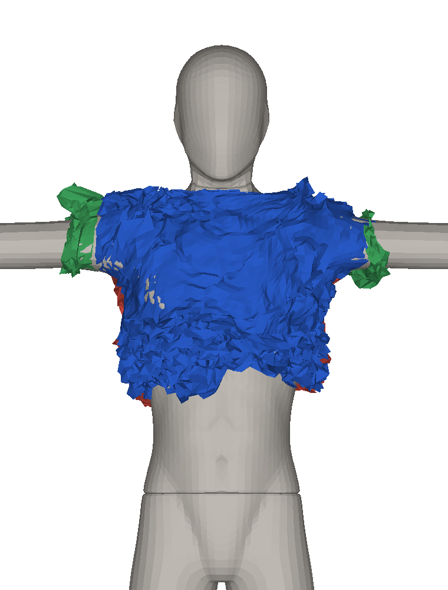
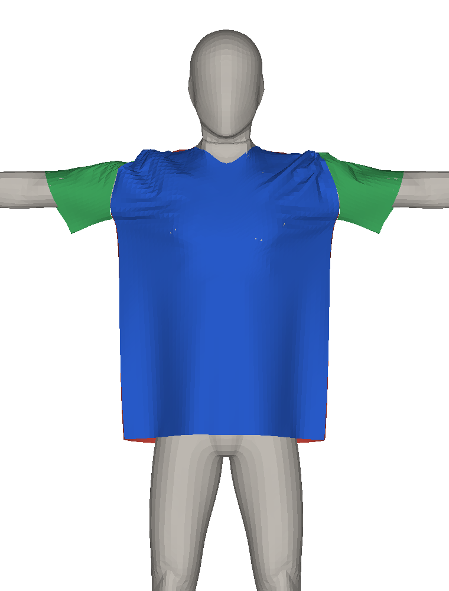
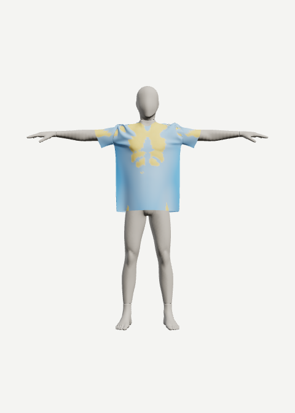
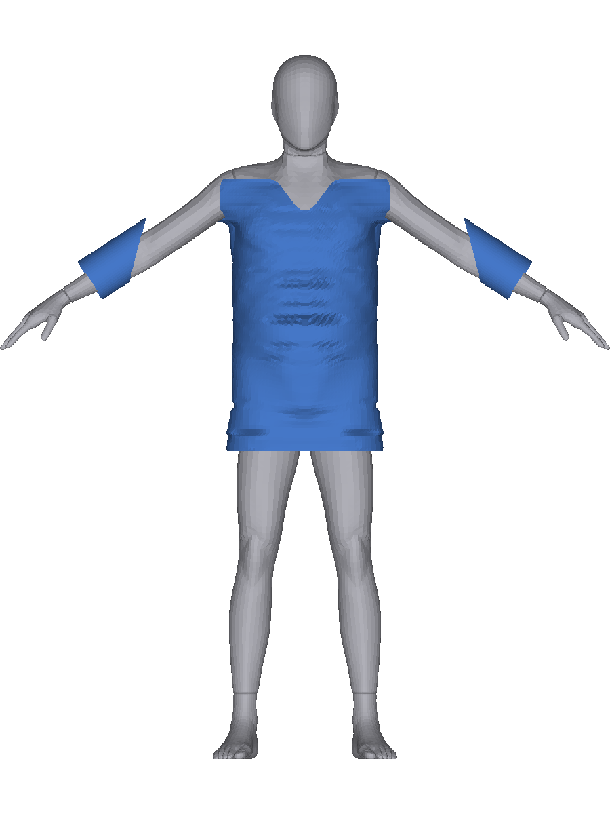
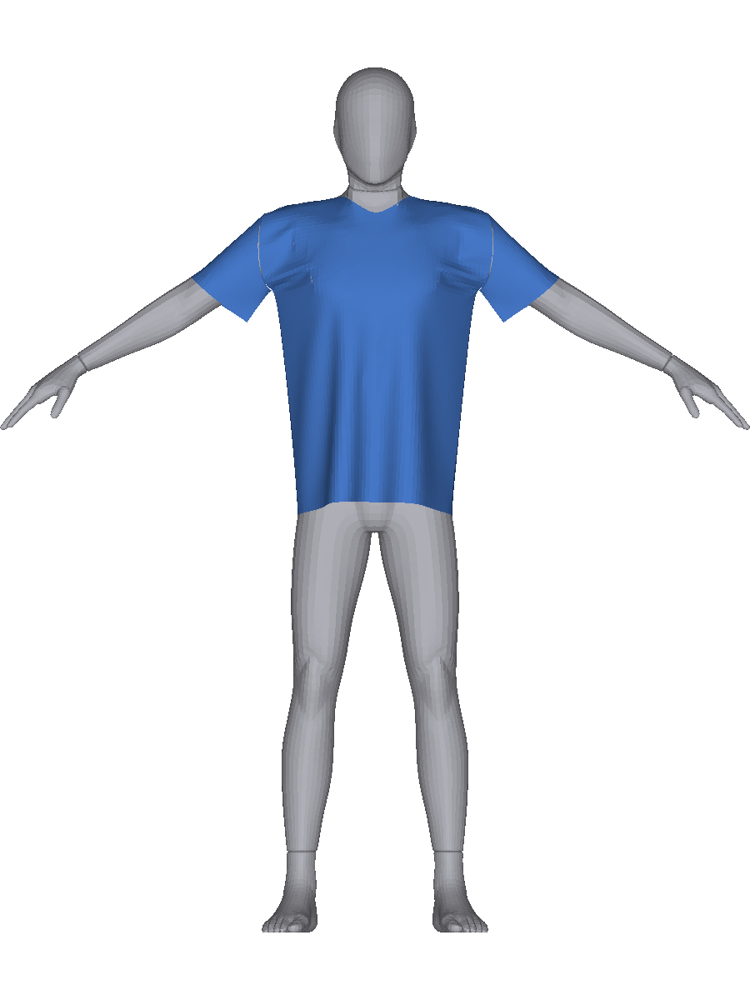
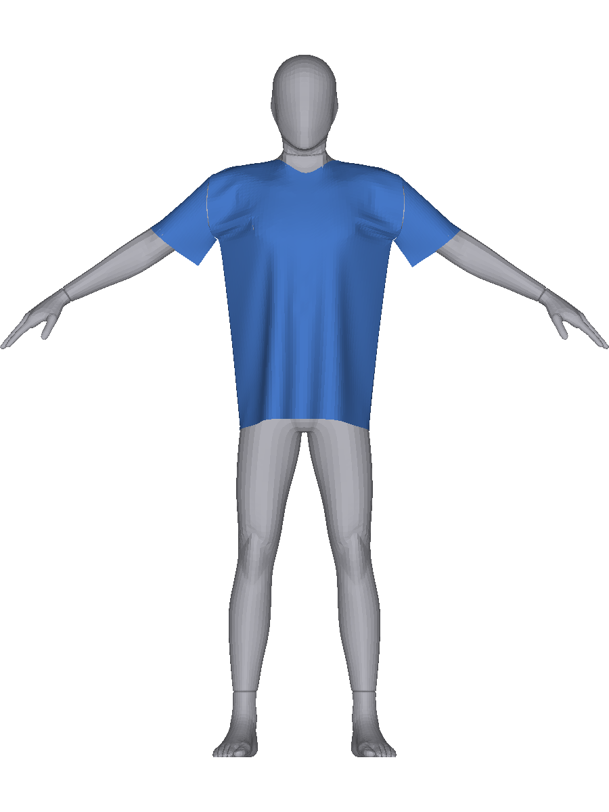

# 연대기 — v1 · v2 · v3 · v4

> **용도 = 개인 기록.** 잘 쓴 글보다 «정확한 기억»이 목적이다 —
> 몇 달 뒤의 승혁이 그때의 판단·막힘·뚫은 방법을 되살릴 수 있게.
> **창작 0.** 모든 서술 끝에 근거 회차를 적었다. 재료 = 저장소 안 전부
> (`.obsidian-log/` 볼트 · `docs/v3`·`docs/v4`·`docs/v5` 회차 노트 · `docs/product-axis` ·
> `docs/metrics-log.md` · `docs/captures`·`docs/v4/캡처`).
>
> **인용 표기** — v3·v4·v5 는 `(v3-52)` 처럼 회차 번호 · v2 는 `(2b-45회차)` 또는 `(P17)` ·
> v1 은 `(metrics 2026-07-30 09:50)` 처럼 측정 로그 블록 날짜.
> 이 문서가 «계산»한 수(합계·기간 등)는 그 자리에 **「이 문서 계산」**이라 적었다 —
> 볼트에 문자열로 없는 수를 측정처럼 적지 않는다(함정 44).
>
> 작성 = v5-기록 회차(2026-09-10) · 기점 `74a13a1`(v4-52 HEAD).
> **정정 = v5-기록-정정(2026-09-10)** — ③ 표 귀책 #8 내용 교체 · #11 채움 · ⑥ 스모크 완료 반영.

---

## ① 한 장 요약

**만드는 것** — 구매자가 자기 몸 치수를 넣으면 «그 옷이 그 몸에서 어떻게 앉는지»를
물리 시뮬레이션으로 보여 주는 웹 제품. 마네킹 메시 + 재단 패턴 + 봉제 + 천 물리.

```
 v1  2026-07-14 ~ 07-30   격자 옷 + 흡착 리졸버   — 「보조 힘을 빼면 무너진다」를 6번 확인했다.
                          결론: 없는 것은 물리였다(마찰·굽힘·부호). 옷 구조 자체를 교체해야 한다.
 v2  2026-07-30 ~ 08-15   패턴 옷(폐곡 패널+봉제) — 「무핀으로 옷이 서는가」에 처음 DONE 을 냈고
                          (2b-25회차), 화면도 처음 돌파했다(2b-46회차). 그러나 자기교차 1889 를
                          끝까지 못 내렸고, 79~109회차 30판이 «정지·집행 금지»로 소진됐다.
                          진짜 산출물은 옷이 아니라 **판정을 못 속이게 하는 절차**였다.
 v3  2026-08-15 ~ 08-30   물리 코어 재작성(XPBD + small-steps) — S1→S5 를 해석해와 대조해
                          한 단계씩 세우고, **v3-23 에서 흡착·앵커·핀·원주 상한 전부 0 으로
                          옷이 섰다**. 그 위에 제품 v1(몸 27 × 사이즈 4 = 108칸)을 구워
                          제공 35칸을 냈다(v3-91). 물리·조립은 v3-92 에서 «동결»했다.
 v4  2026-08-30 ~ 09-08   같은 물리를 Python + Taichi(GPU)로 이식 — 커널 5종 층1 전량 통과,
                          f64·병렬·셀프 충돌까지 가서 **v3 대비 12.45배**(v4-14).
                          A포즈로 몸을 바꾸고 108칸을 17.1시간에 다시 구워(v4-46)
                          제품 제공 29칸을 냈다(v4-52). v3 는 «정답지»가 됐다.
 v5  2026-09-08 ~ (진행)  옷을 데이터로 — 쇼핑몰 실측표 → 패턴 → 조립 → 굽기.
                          첫 실물(유니클로 supima-L)은 통과(v5-2), 격자 밖 오버핏은 흘러내린다(v5-3~7).
```

**한 줄로** — 네 번의 재작성은 실패의 반복이 아니라 **층을 한 칸씩 아래로 내려간 기록**이다.
보조 힘(v1) → 옷 구조(v2) → 물리 코어(v3) → 산술·병렬(v4) → 옷 데이터(v5).

---

## ②-1 v1 — 격자 옷과 보조 힘 (2026-07-14 ~ 07-30)

### 목표

이미 굴러가는 시뮬레이터의 **드레이프 품질**을 올린다. 옷은 44×28 격자 시트이고
몸 충돌은 캡슐 근사 + BVH 흡착 리졸버다. 지표(면각평균 · 주름RMS · maxStrain · coverage)를
세우고 한 손잡이씩 바꿔 게이트로 판정한다.

**기간·회차** — 2026-07-14 ~ 07-30 · 커밋 약 **201**(이 문서 계산 · `git rev-list`) ·
회차 = `docs/metrics-log.md` 블록 **63개**(파일 시작 ~ Stage 1a 블록 «직전» · 이 문서 계산) —
A-①~③ · C단계 · M0~M2-8 · 핀 전환 · LIFT · COLLAR · jitter 진단 마감.

### 핵심 사건

1. **첫 기준선과 「비트 동일」 규율의 시작**(metrics 2026-07-28 09:59) —
   제약 종류 태그와 iteration 보정 강성을 넣으면서 판정 조건을 「전후 비트 동일」로 걸었다.
   면각평균 3.506 · 주름RMS 1.779 · maxStrain 2.1383 이 전후 같았다. `k=1` 이면
   `1-(1-k)^(1/n)` 이 정확히 1 이라는 산수를 실측으로 확인한 판이다.
   **여기서 이 프로젝트의 습관이 생겼다 — 「바뀌지 않았음」을 값으로 증명한다.**

2. **A-③ shear 강성 축소 · C단계 소매 스냅 축소 — 지표는 전부 개선인데 화면이 참사**
   (metrics 2026-07-28 10:11 · 10:25). A-③ 은 「전 지표 개선인데 어깨/등 노출」이었고
   bot-back 버킷이 **+59pp** 였다. ⟹ **거리 지표는 커버리지 손실을 원리적으로 못 잰다**는
   문장이 CLAUDE.md 게이트 절에 박혔고 그 뒤 한 번도 안 지워졌다.

3. **M2-3 밀어내기 SDF 교체 — 3연속 실패**(metrics 2026-07-28 17:02 · 17:35 · 18:20).
   같은 층위에서 파라미터만 바꿔 세 판을 태웠다. 규칙이 그때 생겼다 —
   **3회 연속 실패 또는 원인 불명이면 즉시 정지하고 「외부 전략 검토 필요」로 보고한다.**

4. **「보조 힘은 결핍된 물리의 대체품」 — 원리 노트가 세는 횟수는 「v1 M2 캠페인 6회 · v2 2회 ⟹ 총 8회」다**
   ([보조힘은-대체품](../.obsidian-log/원리/보조힘은-대체품.md)). v1 사례로 열거된 것은
   A-③(shear) · C(소매 스냅) · B-1(smoothing) · M2-4(흡착 제거) · 핀 · LIFT · 칼라이고
   (열거는 일곱인데 셈은 여섯이다 — 노트의 문언을 그대로 옮긴다),
   전부 「보정을 빼면 미끄러진다」로 수렴했고 **원인은 한 층 아래의 마찰 부재**였다.
   M2-5 에서 마찰을 반복 «안»으로 넣자 가설이 증명됐고 비용은 캐시로 53.3 → 25.5 ms 로 내렸다
   (metrics 2026-07-28 20:40 · 21:20).

5. **계기가 제품과 다른 것을 재고 있었다**(metrics 2026-07-30 09:50). fixture 하네스가
   smoothing 을 기본 on 으로 **하드코딩**해, 워커가 스무딩을 끈 뒤에도 계기는 계속 on 으로 쟀다.
   블록에 붙은 라벨 「스무딩 off」가 오기였다. ⟹ **함정 12 — 계기 기본값은 항상 제품 코드에서
   도출한다**(규범 승격). 신 기준선(교정 계기)이 여기서 다시 세워졌다:

   ```
   cov 6.4%(41/644) · ripple mean 6.43mm · columnRipple mean 14.99mm(부호반전 0.411) ·
   strain 3.38 · 교차 0/616 · bowtie 어깨 2 · Δ20 4.57mm · 정착 65프레임
   계기 = 신 코어 · 스무딩 off(도출) · 600프레임 · fixture 9e8b2bf13925 · 출처 7cc3885
   ```

6. **`jitter` 는 시간 지표가 아니었다**(metrics 2026-07-30 · 함정 13). 이름은 「떨림」인데
   식에는 **시간 축도 dt 도 없었다** — 열 방향 공간 4차차분을 최종 프레임 «1장»에서 낸 값이고,
   정규화가 없어 파장 대역을 구분하지 못했다(순수 교대 이득 16 / 파장 4열 4 / 6열 1.0 —
   같은 14.99 를 0.94mm 교대와 3.7mm 매끈한 폴드가 똑같이 낸다).
   ⟹ `columnRipple` 로 개명하고 **판정에서 내렸다**. ripple(2차차분 = 곡률계)도 같이 내렸다.
   **함정 13 은 이후 v5 까지 가장 많이 재발한 함정이 된다.**

7. **Stage 1a(밀어내기 SDF) 동결 — 부호가 원리적으로 정의되지 않는다**
   (metrics 2026-07-30 · CLAUDE.md 「Stage 1a 동결」 절). 마네킹 메시 자체는 수밀인데
   `splitFrontBack` 이 몸통을 절반 시트로 자르고(열린 엣지 **597**) `excludeArms` 가 반경 9cm
   구멍 두 개를 뚫는다(**189**). 구멍 반경이 복셀(6mm)보다 훨씬 크므로 **몸 안에서 구멍을 통해
   밖으로 나가는 경로가 표면에서 한 복셀 이상 떨어진 채 존재한다** — 안과 밖이 연결되어 있어
   부호 규칙은 무엇이든 근사일 수밖에 없다. 증상 = 확산성 부호 모순 **2.95%**.
   그러나 3회차에서 만든 계기·기계는 「은행」으로 남겼다 — `bodySkeleton` 골격 부호 기준은
   오라클 실측으로 radial 보다 정확함이 확인됐다(어깨 대역 오분류 **36.3% → 1.8%** · 몸통 9.6% → 4.2%).

8. **M3(해상도 상향) 폐기**(2026-07-29 결정 · CLAUDE.md). 재개 조건을 프레임 비용이 아니라
   **SDF 굽기 주기**로 다시 세운 것이 이 판의 소득이다 — 마네킹이 슬라이더로 실시간 변하는
   제품이므로 굽기가 치수 변경 «1회당» 비용이고, 복셀 8mm 면 한 번 움직일 때마다 약 **5.3초**다.
   같은 자리에서 정정도 남겼다: **프레임당 16.7ms 는 이 제품의 제약이 아니다** —
   물리는 워커에서 돌고 렌더는 도착한 프레임을 그리므로 느려지는 건 «정착 시간»뿐이다.

### 남긴 원리·규약

- [보조힘은-대체품](../.obsidian-log/원리/보조힘은-대체품.md) — 보조 메커니즘을 빼면 무너지는 것은 버그가 아니라
  **진짜 물리가 없다는 증거**다. (v1 6회 + v2 2회)
- [몸에서-가져와라](../.obsidian-log/원리/몸에서-가져와라.md) — 근사 곡선을 만들지 말고 몸의 실측 폐곡선을 참조한다.
- 함정 01~14 — HMR · `__fitDebug` 재할당 · 셰이더 캐시 · PBD 강성 복리 · `tsc -b` ·
  와인딩 부호 · 스윕의 연속성 · fixture 표류 · 시간 발산 · 백로그 이름 · 관통 vs 노출 ·
  **계기 하드코딩(12)** · **지표 이름(13)** · **기준선이 결함에 의존(14)**.
- **3연속 실패 규칙** · **자동 판정 루프**(구현 → 측정 → 3지표 게이트 자체 판정 → 통과/실패/애매).

### 대표 수치

| 채널 | 값 | 출처 |
|---|---|---|
| 기준선 cov | **6.4%**(41/644) | metrics 2026-07-30 09:50 |
| maxStrain | **3.38**(limiter 상한 1.2 의 약 2.8배) | 같은 블록 |
| 정착 | **65 프레임** · Δ20 4.57mm | 같은 블록 |
| 물리 | **26.9 ms/프레임**(단일 측정 · 판정 금지) | 같은 블록 |
| Stage 1a 부호 모순 | **2.95%** · 열린 엣지 597 + 189 | metrics 2026-07-30 Stage 1a 3회차 |
| Stage 1b 관통-only | cov **6.4 → 54.2%** · 앞판 mid/bot **+70~84pp** | metrics 2026-07-30 T2 |

### 대표 캡처



*`docs/captures/prod-default/front.png` — 2026-07-30 `423fd40`(「newCore 기본값 true — 용접 코어가
제품 기본」). v1 격자 옷의 마지막 모습이다. 보기 판단은 사용자 몫(CC 화면 판정 0).*

---

## ②-2 v2 — 패턴 옷과 「무핀 질문」 (2026-07-30 ~ 08-15)

### 목표

옷을 **격자 시트에서 재단 패턴으로** 교체한다. 폐곡 패널 4매(앞·뒤·소매×2)를 제도하고
삼각화해 시접으로 봉제하고, 몸에 «입힌다». 규범 문서는 `docs/v2-design.md`.
핵심 질문은 하나였다 — [무핀-질문](../.obsidian-log/원리/무핀-질문.md):
**옷이 핀 없이 몸 위에 설 수 있는가.** v2 설계 §8-3 이 「무핀 안정 상태는 한 번도 실증된 적 없다」고
적었고, 2b 캠페인 109판 전체가 사실상 그 실험이었다.

**기간·회차** — 2026-07-30 ~ 08-15 · 커밋 약 **376**(이 문서 계산) ·
회차 = Stage 1a/1b/2a-thin/2a(07-30) + **2b 1~109회차**(07-30 ~ 08-10) +
**제품 축 P1~P34**(08-10 ~ 08-15 · 하위 판 포함 노트 **42편** · `docs/product-axis/`).

### 핵심 사건

1. **Stage 2b 1회차 — 옷이 60cm 흘러내렸다**(metrics 2026-07-30 T5).
   기하 조건(목선 33.30cm < 어깨 통과 107.00cm)은 Stage 2a 에서 성립했는데도 넘어갔다.
   어깨 이음선 y **146.9 → 87.3cm** · 소매 정점 561개가 골반 높이에서 관통 ·
   cov 몸통 65.2% / covShoulder 63.7% · 화면 4뷰 = 상체 전면 노출.
   **기전 = PBD 가 늘어난다**(목선 링 최대 **5.67배**). v1 M2-6 이 등재한 반례 기전
   (「링이 원주를 유지한 채 미끄러진다」)보다 한 단계 나빴다.

2. **t=0 게이트가 열 판 가까이 막았다**(게이트 배선 **10회차** → 통과 **19회차**).
   「배치가 적법한가」(패널이 몸 SDF 안에 없을 것 · 패널끼리 SEP 유지)를 통과하지 못해
   물리를 못 돌렸다. 19회차에 **평면 배치 + 어깨 용접 반납**으로 **t=0 4/4 첫 통과**
   (metrics 2026-07-31 19회차). 볼트 「물리 도달 이력」의 문언 그대로 —
   **「19회차에 t=0 를 통과해 8회차 만에 유효 물리 실행」** 이고 19~24회차는 ABORT 였다.

3. **2b-25회차 — DONE 첫 도달**(metrics 2026-07-31 25회차). 링을 폐곡선으로 만들자
   정착 **f=260** · RETRY 0 · **240/240 봉합** · 낙하 0. 하드 게이트 잔여 실패는 1건
   (자기교차 1889 · 문턱 3)만 남았다. **무핀 질문에 처음 「돈다」가 나온 자리다.**

4. **링을 벌리는 것이 무게가 아니었다**(2b-27 ~ 31회차). 26회차의 총 길이 상한은
   **증상 상한**이었고(여분이 둘레에서 변형률로 이동), strain 상위 11 이 전부 목선 대역
   «안쪽»이었다. 31회차가 f1 의 +32.07cm 를 패스별로 갈랐다 —
   **거리 제약 반복(0b+1b)이 77.7%**, 자기충돌 0.00, 흡착은 오히려 −5.53cm(줄인다).
   30회차의 1순위·2순위 가설이 둘 다 기각됐다.

5. **범인은 S0 의 하드 핀이었다 — 그리고 「앵커 off」는 절반만 반납이었다**(2b-33회차 · 함정 17).
   `anchors: () => []` 는 소프트 경로만 껐고 `setAnchorHard` → `sim.pin` 은 살아 있었다.
   핀이 좌표를 앵커 목표로 «덮어써» rest 6.64mm 엣지가 3D 199.80mm(30.1배)가 됐다.
   34회차 처방(위치 램프)으로 f1 순변화 **+32.07 → +12.71cm(−60.4%)**.
   ⟹ **함정 17 — 전제가 반납된 결정은 자동으로 재검토되지 않는다.**

6. **2b-45회차 — 캡슐 층을 통째로 끄고 그것을 기준선으로 승격**했다. 기준선 A(off):

   ```
   자기교차 1889 · maxStrain 2.661@2146 · cov 6.8%(118/1728) · covShoulder 44.8%(637/1421) ·
   관통 50/5244 · 정착 260 DONE · RETRY 0 · dress-state md5 14e50b89… · patternHash 9f7ba80b3497
   재현 명령 = RINGTOTAL=0 PATTERNCORE=1 npm run dress:pattern
   ```

   **2b-46회차에 캠페인 최초의 화면 돌파**(사용자 판정 · V1 통과 조건부 · V2 통과 · V3 부분 통과).

7. **흡착이 구동력이면서 동시에 지지력을 겸하고 있었다**(2b-49회차 · 갈래 1).
   관통-only ablation 으로 흡착을 빼니 프릴이 사라지고(프릴 중앙 f8 **6.39 → 0.00mm**)
   몸 거리가 흡착 margin 수렴에서 풀렸다(f8 15.4 → 95.5mm) — **α 구동력 확정**.
   그런데 그냥 빼면 **옷이 벗겨졌다**(cov 6.8 → 88.2% · covShoulder 44.8 → **100.0%** ·
   ABORT@f1108). ⟹ 처방은 「지지를 다른 층에서 만들고 빼기」가 되어야 한다
   ([보조힘은-대체품](../.obsidian-log/원리/보조힘은-대체품.md) 사례 9).

8. **기준선이 재현되지 않았다 — 하루 만에 원인이 밝혀졌다**(2b-81 → 82회차 · 함정 26).
   81회차가 태그를 체크아웃해 실행해도 값이 달랐다(자기교차 1889 → 1917 등). 런타임 드리프트를
   의심하고 노트에 경고를 넣었는데, 82회차가 **실행에 `RINGTOTAL=0` 이 빠져 있었음**을 찾았다
   (링 총길이 상한 = 물리 제약). 3회 연속 비트 재현으로 복구.
   ⟹ **함정 26 — 기준선을 «값»으로만 들고 다녔다. 그 값을 다시 내는 «명령(env)»이 어디에도 없었다.**

9. **79~109회차 = 30판의 진단 캠페인 — 그리고 그 대부분이 「정지·집행 금지」였다.**
   표적은 소매·어깨의 노출 패치였다. 이 구간이 남긴 것은 옷이 아니라 **함정 27~32** 다:
   - **27 분모 없는 채널** — 셈만 있으면 「불변」과 「포화」가 구별되지 않는다(84회차).
   - **28 대리 지표 승격** — 부분집합의 특이성을 검증하지 않았다(91회차: 패치창 48 이
     대역 1421 과 **구별되지 않는다** · P 39.0/43.0%).
   - **29 측정 주체 고정** — 12회차 동안 **몸 쪽에서만 재고 옷 쪽 형상을 안 쟀다**(93회차).
     옷 쪽을 재자 캡슐 접촉률이 **6~7%**뿐임이 드러났고 「캡슐이 소매 위치를 정한다」는 전제가 무너졌다.
   - **30 창 폭과 창 위치** — 값역 «안»인데 창이 신호와 어긋난다(94회차).
   - **31 절제 작용점** — 절제가 표적의 «결정항»에 닿지 않는다(97회차).
   - **32 소비처 부분 적용** — 처방이 결정항에 닿되 «일부 소비처»에만 닿았다(101회차).
   101 · 102 · 104회차의 margin·폭 도출 처방은 **전부 갈래 C(실패·원복)** 였고
   105회차는 사전 등록 갈래 어디에도 해당하지 않아 **판정 불가**로 정지했다.

10. **제품 축 P1~P34 — 「전제가 뒤집힌 판」이 세 개 나왔다**(2026-08-10 ~ 08-15).
    - **P10** — 「긴팔 관통 2배의 자리가 전완 콜라이더 부재」가 **거짓**(103 → 105 로 그대로).
    - **P14** — 관통 자리가 특정됐다: 소매 **87.0%**(반팔) / **93.2%**(긴팔) ·
      **소매 두 대역에만** 있고 중간 38cm 가 정확히 0. 눌림 ↔ 관통이 **완전히 같은 집합**.
    - **P15** — 「옷 어깨너비가 마지막 미배선 슬라이더」가 **거짓**(이미 배선돼 있었다).
      진짜 결함은 **하한 클램프가 조용했던 것**이고(몸 어깨 55cm 에서 죽은 구간 **33.5%**),
      처방은 UI 고지 3건뿐이었다.
    - **P17** — 핏 맵 색이 안 나온 것은 **`showFitMap` 을 렌더가 아예 읽지 않아서**였고
      「토글이 다른 렌더 경로로 보낸다」는 가설은 거짓이었다. 납작판은 **렌더 순서**(정착 좌표가
      정적 배치로 덮인다)였고 뿌리는 **마네킹 지연 + 조용한 fixture 폴백**이었다.
    - **P19~P21 — 비결정성의 정체 = `round()` 경계 증폭기.**
      세 입력 해시가 전부 같은데 `cuffArmGirthM` 이 **ULP 11** 차이 →
      `sampleBySizeField` 의 `round(total)+1` **정수 경계** → 정점 수 **±2** →
      삼각화·엣지·배치·정착 전부. **밴드가 없으면 그 경계에 걸리는 세그먼트가 하나 적어**
      기준선 B-2 가 정확히 재현되는 것과 모순이 없었다.
    - **P22~P27 — 결정성 완성.** A포즈를 «누적곱»에서 **절대 구성**으로 바꾸자
      (`setBoneTowardWorldDirection` · roll = bind 기준 최소호 · 현재 `quaternion` 을 읽지 않는
      순수 함수) **전 27회 실행이 조건별로 전량 비트 동일**(기본값 3/3 · 가슴 6/6 · 키 3/3 ·
      원복 6/6 · 긴팔 3/3) · 착장 실패 **0/27**. 대가로 기준선이 옮겨갔다(B-2 → **B-3**).

### 남긴 원리·규약

- **사전 등록**([사전등록](../.obsidian-log/원리/사전등록.md)) — 실행 «전»에 갈래에 이름을 붙이고,
  **실행 전에 답이 확정된 갈래는 갈래가 아니다**. 실패 양식이 15가지까지 열거됐고
  「지시자 귀책」 개념이 여기서 생겼다.
- **화면 판정 규칙**([화면판정](../.obsidian-log/규칙/화면판정.md)) — 뷰별 정본(소매 = cuff · 밑단 = hem ·
  목선 = neck · 실루엣 = front/back) · **원경으로 국소를 판정하지 않는다** ·
  **자동 픽셀 판정 금지**(73회차의 「미반영」 판정 5회가 전부 무효였다 — 창 밖 화면을 쟀다) ·
  **CC 자체 화면 판정 0**.
- **계기 의존 판정 감사**([계기의존판정감사](../.obsidian-log/감사/계기의존판정감사.md)) — 80회차가 25~79회차의
  `cov`·`covShoulder` 등장 전량을 훑어 결함 2건을 찾고 재계산 대상 7건을 표로 만들었다.
  **과거 판정을 값으로 회수하는 절차**가 이 판에서 태어났다.
- **몸 좌표 민감도**(P5b/P6) — v2 착장 채널은 몸 정점 좌표 **0.14mm** 에 자기교차 **+13.4%** 로
  반응한다. ⟹ 기준선 A 의 비트 재현성은 «같은 fixture»의 성질이지 **몸에 대한 안정성이 아니다**.

### 대표 수치

| 채널 | 값 | 출처 |
|---|---|---|
| 첫 DONE | 정착 **f=260** · RETRY 0 · 240/240 봉합 | 2b-25회차 |
| 기준선 A(off) | 자기교차 **1889** · cov 6.8%(118/1728) · 관통 50/5244 | 2b-45회차 |
| 기준선 B-3(제품) | cov **6.94%**(120/1728) · 자기교차 **1777** · DONE **f=369** | P28 |
| 하드 게이트 잔여 실패 | **1건 = 자기교차 1889**(문턱 3) — 캠페인 끝까지 | 2b-45~108회차 |
| 흡착 제거 시 | cov 6.8 → **88.2%** · covShoulder → **100.0%** · ABORT@f1108 | 2b-49회차 |
| Stage 2a 미달 | 크기장 이탈 p99 **31.0~33.2%**(문턱 30%) | metrics 2026-07-30 T4 |
| 결정성 | 조건별 **27/27 비트 동일** · 착장 실패 0/27 | P27 |
| 물리 | **72.4 ms/프레임**(2b-92 대조군) | 2b-92회차 |

### 대표 캡처



*`docs/captures/2b-45-off/front.png` — 2b-45회차 승격분(off) 5뷰 중 front.
이 상태가 **2b-46회차에서 캠페인 최초의 화면 돌파** 판정을 받았다.*



*`docs/captures/2b-71-print/front.png` — 2b-71회차 프린트 합성 + 패널별 map 분리.
72회차 수령분에서 「반영」 갈래가 화면으로 확정됐고, 같은 판정에서 **넥라벨이 앞판 가슴에 합성됨**
(bbox 단일 상자라 분리된 두 덩어리를 못 가른다)이 신규 관측으로 등재됐다 —
그 결함은 v2 에서 못 닫히고 **제품 축 P32~P34** 로 넘어가 성분별 배치로 해소된다.*

---

## ②-3 v3 — 물리 코어 재작성 (2026-08-15 ~ 08-30)

### 목표

**v2 위에서는 CLO 계열 메커니즘이 원리적으로 안 선다** — v2 가 스스로 등재한 근거 5건
(v3 설계 문서 · 2026-08-15):

```
 ① fabricPresets 에 물성값이 0건이다(gravityScale·damping·iterations 뿐)
 ② bvhFromArrays 가 «부호 없이» margin 거리로 스냅한다 = 밀어내기가 아니라 «흡착»
 ③ 흡착이 중력을 이긴다(2b-96 §4 · 107 판정 2)
 ④ 굽힘 제약이 «부재»다 — bend 가 이면각이 아니라 «마주보는 정점 쌍 거리»라
    곡률 단위도 주름 파장도 없다
 ⑤ 5,204정점 = 간격 13.4mm
```

⟹ **XPBD + small-steps** 로 물리 코어를 새로 쓴다. 검증은 해석해 대조로 단계별
(S1 솔버 → S2 굽힘 → S3 충돌·마찰 → S3b 자기충돌 → S4 봉제+실제 패턴 → S5 물성 4종).

**기간·회차** — 2026-08-15 ~ 08-30 · 커밋 약 **407**(이 문서 계산) ·
회차 = v3 설계 + **v3-01 ~ v3-92**(v3-61 · v3-68 은 **결번** — 발주 유실로 미집행 ·
「없는 회차의 이력을 만들지 않았다」).

### 핵심 사건

1. **v3-01 — 값보다 «앞선» 리스크가 있었다.** ARCSim 소스를 직접 읽어 확인:
   `stretching_stiffness(const Mat2x2 &G, samples)` — **신장 강성이 현재 변형 텐서 G 의 함수**이고
   런타임 전 룩업으로 전개된다. **XPBD 는 제약당 컴플라이언스 α 를 «상수»로 준다** ⟹
   Wang 값을 α 에 그대로 넣는 것은 성립하지 않는다 — **값이 있어도 못 쓴다.**
   세 갈래(ⓐ 서브스텝마다 G 에서 α 룩업 갱신 · ⓑ 소변형 접선 강성 1점 · ⓒ 다른 소스)를 열고
   S1 에서 값으로 골랐다(v3-02 → **ⓐ 채택** · ⓑ 는 주신장 2% 에서 이미 ±1% 초과 · 부호가 «항상 같은»
   방향성 편향).

2. **S1 통과 · 그리고 사전 예측 1건이 틀려 정정했다**(v3-02).
   자유낙하 오차 0.2083% · 스프링 3.16e-9m · 서브스텝 8 vs 16 상대차 0.0000%.
   「투영 전 중력 ⟹ 정지점에 g·h² 잔차」로 등록했는데 **g·h² 는 예측 위치에만 있고 투영이 정확히
   제거한다** ⟹ 정지 늘어짐 = mg/k, h 와 무관. sub 1~64 전 구간 `|Δx − mg/k| < 3e-13`.
   **XPBD 의 주장 자체(강성 ⊥ dt·반복수)가 성립한 것**이다. 부수로 LUT 이 40³ 이 아니라
   **30³** 임을 코드에서 정정했다.

3. **결합 제약계의 «정지 해»가 서브스텝 수에 의존한다**(v3-03 · #14).
   인장 사슬 20칸에서 실효 강성이 명목의 **6.9%** 였고 T 를 6배 늘려도 한 자리도 안 변했다 —
   미정착이 아니라 **부동점 자체가 다르다**. ⟹ 「XPBD 가 강성을 dt·반복수와 분리한다」는
   **제약 «1개»에서만** 실증됐다. **S1 게이트 ③ 이 원리적으로 못 보는 축**이었다.
   v3-04 가 법칙을 찾았다: `r ≈ 1/(1+(h·ω_el)²)` — 무차원 붕괴가 결정적이었고
   (두 다른 설정이 같은 `h·ω_el=1.47` 에서 소수 4자리까지 같은 r=0.3414),
   v3-03 의 「사슬이 길수록 무르다」는 **교락**(강성 축을 함께 밀고 있었다)으로 정정됐다.
   또 `B_eff = ke/4` 를 순수 굽힘 에너지 계기로 확정했다(`¼·(1−1/(N−1))` 과 자릿수 전량 일치).

4. **굽힘 오차의 지배 변수는 «원소 종횡비»였다**(v3-05 ~ 09). 절대 해상도도 세장비도 아니었다 —
   `nu` 를 전혀 안 바꾸고 `nv` 만 올려 **76.20% → 4.77%** 로 떨어뜨렸다(v3-07 계열 C).
   통과 대역 `dv/du ≲ 0.4`. 그런데 **제품 메시는 거의 등방**이고(최소각 게이트가 종횡비를
   위에서 `1/sin(25°) = 2.366` 으로 묶는다) 한 메시로 두 굽힘 방향을 동시에 만족시킬 수 없다(v3-08).
   ⟹ v3-09 가 **문턱을 재도출하지 않고 «요구를 재확인»** 했다:
   `ℓ ∝ B^(1/3)` 이라 일률 −18% 는 모든 원단에 **같은 배율**을 준다 ⟹ **일률 오차는 순서를
   원리적으로 보존한다.** 순서 판정에서 걸리는 값은 오차의 «크기»가 아니라 **«퍼짐»**이고
   실측 퍼짐은 **0.00pp** ≪ 인접 간격 0.40% 였다. ⟹ **#20 닫힘 · #19(이차형) 착수 0.**

5. **S3 · S3b 성립**(v3-10 · v3-12). 몸 충돌은 v2 의 흡착 자리를 **단방향 충돌**로 세웠다 —
   관통했을 때만 밀어낸다. 관통 **0** · 마찰 임계각 `tanθ_c = μ` 오차 **0.00~0.10%**
   (문턱 ±10% 대비 100배 여유). 자기충돌은 정점–삼각형 6 + **엣지–엣지 9** 를 쌍마다 재고
   sep 안인 것을 전부 낸다. **해소는 Gauss–Seidel 이 필수였다** — Jacobi 는 교정이 겹쳐 더해져
   **발산**했다(천 4.3m 비행 · |v| 172 m/s).

6. **마네킹은 수밀이었다 — v1 의 「부호 원리적 불가」는 v2 의 절단 탓이었다**(v3-13).
   `mannequin.glb` 를 glTF 규격대로 직접 파싱: 정점 15882 · 삼각형 28880 ·
   **열린 엣지 0 · 비다양체 0 · 와인딩 불일치 0 · 연결 성분 1 · χ = 2 · 종수 0.**
   구멍 597/189 는 v2 의 `splitFrontBack`·`excludeArms` 가 «낸» 것이고 원본에는 없다.
   ★ **계기 정의역이 결론을 뒤집는 자리** — 원시 인덱스로는 열린 2774 · 성분 61 로
   「비수밀」로 읽힌다(glTF 의 UV·법선 이음매 정점 분할). **위치 용접 기준을 함께 내지
   않았으면 정반대 결론이 나왔다.**
   대신 격자 SDF 의 곡률 오차가 남았고(구 0.077mm), v3-14~16 이 그것을 **모형으로 설명**했다:
   `P_smooth + c·f(θ)·h` 로 실제 몸 **0.766 PASS**. 「작다」와 「설명된다」는 다른 판정이다.

7. **S4 첫 착장 — 해상도가 «도출되지 않았다»**(v3-18 · #34).
   주름 파장 조건(≤ ℓ/2 = 11.65mm)과 벽시계 예산(95초/300프레임)을 **동시에 만족하는 d 가 없었다**
   (④만 보면 36mm 55초 · ①만 보면 11mm **2286초**). 비용 법칙을 실측으로 세웠다:
   `ms/f = 5.333e-3 · d^−3.143`(잔차 ±1.2%) · 분해 = 제약 투영 13% · **몸 충돌 31% · 자기충돌 54%**.
   d=11mm 로 갔고 v3-19 에서 **미정착**(|v|max 192 → 198 m/s · 7190정점 중 7189개가 문턱 초과) ·
   원인이 «단독으로» 갈렸다: **자기충돌**(self 끔 |v| 중앙 664.6 ↔ 기준 35,055).

8. **v3-20~22 — 「보정이 크다」가 아니라 «보정이 안 끝난다»였다.**
   자기충돌이 한 서브스텝에 **한 번만** 해소되고 그 한 번이 수렴하지 않아 잔차 **1.027mm** 가
   매 서브스텝 남고, 그것이 `/h` 로 속도가 된다. 전략 세션 가설 2건은 **둘 다 그대로 반증**됐다.
   v3-21 이 배치 결함 2건을 «독립적으로» 찾아 고쳤다 — ① 옷 높이대 전체 볼록 껍질 하나를
   모든 높이에 써 옆선이 구조적으로 9.24cm 벌어졌다(→ 높이별 실루엣 튜브로 **0.30cm**)
   ② **왼쪽 소매의 앞뒤가 뒤집혀** 있었다. 결과: **자기교차 21,983 → 0**(비인접 최소 거리
   0.001 → 정확히 2.000mm) · 몸 관통비 4.670 → 0.579 · 비용 33.9 → **7.02 s/f**.
   v3-22 가 정착 채널을 대리 지표(`|v|max`)에서 본래 양으로 되돌렸다 —
   **창 N=10프레임의 정점 순변위 최대 ≤ 0.1mm** ⟹ v3-21 의 f=600 에서 **0.00151mm**(66배 여유).
   대조 5종 전부 FAIL · 동적 범위 **약 34만 배**. 가장 값어치 있던 대조는
   **「조용한데 표류하는」 NORAMP f=100** 이었다.

9. ★★★ **v3-23 — S4 가 성립했다. 무핀 질문에 처음 「예」가 나왔다.**
   흡착 · 앵커 · 핀 · 원주 상한 **전부 0** 에서 옷이 걸리고 형상이 정착했다
   (순변위 0.00151mm · 어깨 낙하 −2.61cm · 어깨 접촉 1379) · 몸 관통 0.579 ∈ [0.5,1.25] ·
   자기관통 0 · 시접 중앙 2.15mm · 보조 0 · 7.02 s/f.
   **v2 가 흡착 없이 못 하던 것을 보조 항 0 으로 한다.**
   남은 목선 10.28% 는 **기하가 강제한 것**이었다 — 48.27cm 구멍이 53.73cm 둘레에 얹히려면
   원리적으로 11.3% 늘어야 하고, 변형은 균일했다(중앙 1.1244). ⟹ 「제도/치수 한계」로 종결.

10. **S5 — 원단이 갈렸다. 그런데 지배 인자가 예측과 달랐다**(v3-26).
    `O4 접촉 비율` 이 4종을 전부 갈랐다(17.30 / 20.14 / 21.71 / 23.06% · 최소 인접 차가
    잡음 바닥의 **5.4배**). 그러나 순서가 등록한 `ℓ`(굽힘 길이) 예측과 어긋나고
    **`k`(신장 강성) 예측과 «완전히» 일치**했다. ⟹ **#49 — 지배 인자가 하나가 아니다.**
    ★ **두 순서를 «어긋나게» 선정해 둔 것이 여기서 값을 했다 — 가설이 하나뿐이면 반증이 불가능하다.**

11. **브라우저 접속 — 「Node 와 같은가」를 「브라우저가 자체 재현되는가」로 바꿨다**(v3-34~37).
    조립을 하네스에서 `src/v3/garmentScene.ts`(776줄)로 추출하고 **비트 동일**로 판정했다
    (체크포인트 md5 4/4 · 출력 전량 정규화 대조 차이 1줄 = 경과 초).
    v3-35 에서 Node ↔ 브라우저가 f=86 에 **20.5563mm**(허용의 205.6배) 갈렸고,
    시점이 결정적이었다 — **f=0 조립 직후(스텝 0회)에서 이미 갈린다**(비트 동일 성분 48.34%).
    v3-36 이 원인 함수를 완전히 좁혔다: **cos · atan2 · exp · cbrt 가 다르고**
    sin·tan·acos·log·sqrt·pow·hypot 은 같다(cos(0.1) 이 정확히 **1 ulp**).
    그리고 **브라우저는 «자기 안에서» 결정적**이었다(4회 sha 동일) ⟹ **제품 재현성은 선다.**
    ⟹ 질문 전환이 통했다. Node 게이트는 「물리 검증용 · **제품을 보증하지 않는다**」로 지위가 정해졌다.

12. **목선 문턱을 «몸에서 도출»했다**(v3-40 · #84). 어림수 1.10 을 정의로 교체:
    `R = C_ring / C_allow ≤ 1` · `C_allow = C_body + 2π·(THICK + TOL_SELF)`.
    **문턱 1 은 고른 수가 아니라 «정의»**이고 원단 조건부가 «자동» 성립한다.
    sweat 가 통과한 이유가 값으로 보였다 — 그 자리 몸 둘레가 58.418cm 라 휴지 목선 49.32cm 로는
    **18.4% 늘어나야** 얹히는데 실제 신장은 15.8% 였다. **어림수 1.10 이 벌점하던 것이
    정확히 «몸이 강제하는 몫»이었다.** 그리고 게이트가 실제로 거르는 것도 확인했다(denim d12 FAIL).

13. **4/5 완결 — 핏 리포트가 v3 만으로 섰다**(v3-50~56).
    `chestY` 를 위상에서 **규격 의미론**으로 옮겼다(ISO 8559 계열: 가슴둘레 = 겨드랑이 밑 수평
    최대 둘레) — **데이터가 한 일은 옛 정의의 «반증»뿐**이고 규칙은 구현 «전»에 커밋했다.
    부수 효과로 **팔 배제 기준이 «불필요»해졌다**(v3-52).
    v3-52 의 자기검사(G6)가 계기 한계를 «잡아냈다» — 표의 8.90mm 는 «측정»이 아니라 **SDF 밴드
    포화 상한**(`band = THICK + 2h` = 8.902mm)이었다. v3-53 이 정확 거리로 바꿔 포화를 풀자
    (허리 중앙 8.90 → **45.16mm**) 국면 개수가 3종 전부 바뀌어 **정지 조항이 둘 동시 발화**했고,
    「작으니 통과」로 문언을 완화하지 않았다(함정 14). v3-54~55 가 채널을 확정하고
    접촉 모델을 «정의»로 등재했다.
    ★ 그 과정에서 **#117 이 신설됐다 — 문턱 출처와 정의역은 «서로소»여야 판별력이 생긴다.**
    ③b 게이트가 같은 blob 의 밴드 안 최대차를 문턱으로 써서 **구조적으로 떨어질 수 없었고**
    gray 가 «정확히 동률»로 통과한 것이 그 증거였다.

14. **제품 v1 — 몸 27 × 사이즈 4 = 108칸을 구웠다**(v3-69~78).
    v3-69 가 결손 4건을 지목했다(정점 주입 경로 0 · `BEXT` 몸 1개 가정 · 차트가 암홀을 안 준다 ·
    재개가 하네스에만). v3-73 에서 **판정 채널이 «부재»** 했고(`deriveLevels` 가 구운 A포즈 몸에서
    산출 불가) v3-74 가 **T포즈로 굽어** 복원했다 — `bodyLevels` **수정 0** 으로.
    ★ 같은 판에서 **㉮″ 3단 분해**가 나왔다: **591.87 → 69.16 → 4.11mm**(자세 제거 → 스케일 체계 제거)
    ⟹ 정의 차이의 주성분이 «자세»였다.
    v3-75 민감도 순회 **5시간 54분 32초** · v3-78 본 그리드 **완주 108칸**:

    ```
    편입 38 · 보류 43 · 착용불가 27 · 합 108 ✅
    ★ 가슴 축 U 자 — c87.5 편입 9/보류 21 · c100 편입 22/보류 11 · c122.5 착용불가 18
      ⟹ 마른 몸은 «보류»로, 굵은 몸은 «착용불가»로 빠지고 편입은 기본 몸에 집중된다
    ★ sha 불일치 4건 · 귀책 CC — 2호기 blob 복사가 중복 칸의 맥 blob 을 덮었다(복구 불가)
    ★ ③a 문턱 바로 위 6건(0.502~0.523) · 경계 칸 2건은 교차 머신에서 분류가 뒤집힌다
    시간 — 맥 50칸 평균 59.5분(최소 26.0) · 2호기 31칸 평균 120.5분(par 4 병렬 · 시간 채널 강등)
    ```

15. **자산이 옳아졌는데 제공이 줄었다**(v3-81~85 · 함정 34·35·36).
    v3-81 에서 저장 자산이 **비트 재현 불가**였고, 재생성 ÷ 저장 = **1.03827**(26칸 유일값)이
    `unitScale` 역수였다. v3-83 이 정체를 찾았다 — **unitScale 이 한 적재에 4회 계산되고
    3·4회는 이미 정규화된 높이를 재 몫이 1 이 돼 `setScalar(1)` 로 되돌린다 = 자기 상쇄**
    (함정 35). v3-84 가 `rawHeight` 를 지오메트리 공간 bbox 에서 뽑아 멱등화했고,
    v3-85 가 몸을 재굽자 **옷 4칸이 착용불가**가 되어 **옛 몸에서 편입이던 2칸이 사라졌다.**
    ⟹ 「자산이 옳아졌는데 제공이 줄었다」의 처분이 넘어갔다.

16. **소매가 자기 자신과 겹치고 있었다**(v3-86~91). 최소쌍 0 을 내는 쌍이 전부
    `sleeveR ↔ sleeveR` 이었고(v3-87), 기전이 **한 줄의 산수**였다 —
    `RMIN = CAP_W/π` ⟹ **감김 호가 정확히 2π** ⟹ **소매 두 끝이 만난다.**
    `fitSleeve` 는 몸·몸판만 보고 통과시키고 `GAP_SIDE` 는 몸통 폭 전용이라 못 고친다.
    v3-88 처방 `RMIN′ = (2·CAP_W + SEP)/(2π)` 가 적중했으나 **소매 7칸 밖 101칸 중 78칸의
    해시가 흔들렸다**(규모 2.6e-16 ~ 1.7e-14 m) — 원인은 **하한이 이분 브래킷을 겸함**(함정 37) ⟹ 즉시 복원.
    v3-89 가 «제약만» 남기자 **100/101 비트 그대로**이면서 R 이 1.0064~1.0074배 상승했다 —
    ★ **제약이 답을 민다**([순서도-이식의-조건이다](../.obsidian-log/원리/순서도-이식의-조건이다.md) 계열의 첫 형태).
    v3-90 에서 **같은 코드가 B → A** 로 바뀌었다 — 갈린 것은 기대 집합을 «열거»로 걸었나
    **«규칙»으로** 걸었나뿐이었다. 조립 **77 → 82/108**.

17. **v3-92 — 조립 트랙 종결 · v3 물리·조립 «동결».**
    정본 = `index-merged-108.v3-91.json` · `v1-provide-35.v3-91.json`(제공 **35칸**).
    **열린 채로 닫은 것** — 목선 초과비 4칸(1.2~1.9%) · bb 7 호 사상 접힘 · fb 2 ratio>1 ·
    ③a 관통 2칸 · 자기관통 교차 1칸. **고치지 않고 백로그로 옮겼다.**
    ⟹ 이후 그 층의 수정은 **v4 엔진에서** 한다.

### 남긴 원리·규약

- **동결과 정답지** — 「종결은 «한계 없음»이 아니라 «한계가 등재됨»이다」(#109 · v3-49).
- **선언 귀속** — 완결·종결은 **사용자 화면 합격 + 전략 세션**이 선언하고 **CC 는 등재만 한다**.
- **#117** 문턱 출처와 정의역은 서로소여야 판별력이 생긴다 · **#118** 상관을 재려면 두 채널이
  독립이어야 한다(v3-57 이 그 조건 위반으로 **판정 불가**로 정지했다 — 문턱은 넘었으나
  그 수가 «상관»을 뜻하지 않음을 값으로 보였고, **A 의 문언을 사후에 고치지 않았다**).
- 함정 33~38 — 해상도 무관 문턱 · 순회 첫 항목 · 정규화 자기 상쇄 · 판정 집합의 최대값 문턱 ·
  이분 브래킷과 비트 동일 · 이름과 자리가 다른 사유.
- **수신기**(`scripts/v3Receiver.ts` · v3-86 승격) — 굽기 산출물을 브라우저 다운로드로 받지 않는다.
  크롬이 한 페이지의 자동 다운로드를 2건째부터 막는다. sha 가 어긋나면 **저장하지 않고 409**.

### 대표 수치

| 채널 | 값 | 출처 |
|---|---|---|
| S1 | 자유낙하 0.2083% · 스프링 3.16e-9m · sub 8vs16 **0.0000%** | v3-02 |
| S3 마찰 | `tanθ_c/μ` = **1.0010 / 1.0003 / 1.0000** | v3-10 |
| 몸 메시 | 정점 15882 · 삼각형 28880 · **χ=2 · 종수 0** | v3-13 |
| S4 성립 | 순변위 **0.00151mm** · 보조 항 **0** · 7.02 s/f | v3-23 |
| S5 | O4 **17.30 / 20.14 / 21.71 / 23.06%**(4원단) | v3-26 |
| 브라우저 갈림 | f=86 **20.5563mm** · 원인 cos·atan2·exp·cbrt **1 ulp** | v3-35 · 36 |
| 목선 문턱 | `R = C_ring/C_allow ≤ 1` — **새 수 0** | v3-40 |
| 108칸 | 편입 **38** · 보류 43 · 착용불가 27 | v3-78 |
| 제공(정본) | **35칸** | v3-91 |
| 정본 속도 | **9.476 s/프레임**(f=180 · 셀프 충돌 포함 · 1,705.7 s) | v3-78 계열 · v4-08 인용 |

### 대표 캡처



*`docs/captures/v3-19-첫착장/front.png` — v3-19. 옷은 몸에 남았지만 «정착하지 않는» 상태다
(|v|max 가 150프레임 동안 192 → 198 m/s 로 줄지 않았다). 원인은 자기충돌로 단독 특정됐다.*



*`docs/captures/v3-21-배치개선/front.png` — v3-21. 같은 솔버·같은 서브스텝·같은 해상도에서
**배치와 봉제 경로만** 고쳐 자기교차 **21,983 → 0** · 비용 33.9 → **7.02 s/f** 가 된 상태.
두 판 사이에 물리 코드는 한 줄도 안 바뀌었다.*



*`docs/captures/v3-66-제품기본화면/v3-66-gray-fit.png` — v3-66. 제품 기본 경로가 v2 에서
**v3 정본 재생**으로 넘어간 첫 화면이다. 정본 재생은 **sha·정점 대조 «후»에만 표시**하고
불일치 시 **표시하지 않는다**(폴백 0).*

---

## ②-4 v4 — GPU 이식과 A포즈 (2026-08-30 ~ 09-08)

### 목표

v3 물리를 **Python + Taichi(GPU)** 로 옮긴다. `gpu/` 아래 따로 살고 `src/` 는 **읽기만** 한다.
v3 는 «정답지»이고, 이식이 옳은지는 **v3 산출물과의 대조**로 판정한다.

**기간·회차** — 2026-08-30 ~ 09-08 · 커밋 약 **216**(이 문서 계산) · 회차 **v4-01 ~ v4-52**.
기계 — 개발 = 에어 M4(Metal) · **정본 = 2호기(CUDA · GTX 1660 Ti)** ·
이음 = Tailscale + SSH 키(맥 → 2호기 **단방향**) · 자산은 git 밖이라 **scp**(v4-02 §0-2).

### 핵심 사건

1. **검증 기준이 세 번 바뀌었고, 두 번은 «폐기»였다.** 이 프로젝트에서 가장 값비싼 교훈 구간이다.
   - **초판: 궤적 대조**(M 스텝 뒤 좌표차) → **폐기**(v4-04 · **함정 39**).
     v4-03 이 합성 힌지에서 **M 600배에 오차 7.6e5배**를 실측했다 — `K×ULP×M` 은 선형 누적
     전제라 **증폭계에서는 어떤 K 로도 성립하지 않는다.** 문턱은 옮기지 않았다.
     ⟹ **귀책 = 전략 세션 2연속**(v4-02 · v4-03 상한 «형식»).
   - **2판: 3층(층2 = 수렴 판정까지 돌린 «최종» 정점 좌표)** → **폐기**(v4-08 · **함정 41**).
     v4-07 이 실측으로 전제를 부정했다 — 섭동 ε 를 네 자릿수(1e-7~1e-4) 훑어도 **보존비가
     0.87~0.94 에 머물고**(척도 불변), 연장 400프레임에 두 실행이 각각 **1.7e-11 / 2.4e-11**
     까지 «진짜로» 서는데 둘 «사이»의 차이만 **2.691147e-03 에 얼어붙는다.**
     ⟹ **이 계는 강체 방향으로 평형이 «유일하지 않다»** — 고정점 0개이고 옷을 붙드는 것이
     정지 마찰뿐이라 옷은 «놓인 자리»에 그대로 선다. 「최종 정점 좌표」는 **well-posed 하지 않다.**
     ⟹ **귀책 = 전략 세션 4판째** · CC 귀속 0.
   - **정본: 2층**(층 번호 1·3 유지 · 2 는 «빈 자리») —
     **층1** = 제약 커널 «1스텝» ↔ f64 참조 · 상한 `K × ULP_f32` · **M 없다** ·
     **층3** = 핏 리포트 5행 mm + 게이트 판정을 v3 정본과 대조 · 문턱은 v3↔v3 재현성에서 유도.
   - ★ **원리로 승격** — 검증 기준은 **계가 답할 수 있는 질문**이어야 한다.
     못 답하면 정교화가 아니라 **폐기**다([검증은-도착점과-관측량으로](../.obsidian-log/원리/검증은-도착점과-관측량으로.md)).

2. **층1 은 전부 통과했다 — 그리고 「그 자리 값」을 사전에 못 박은 것이 380배를 갈랐다**(v4-02~06 · 14).
   커널 5종 비 — 늘어남 0.0924 · 굽힘 0.1438 · 몸 충돌 0.0275 · 봉제 0.0810 · 셀프 충돌 0.0625.
   **초과 정점 0/9,388**(전부). f64 로는 1e-16 자리(봉제는 **비트 동일 0.000000e+00**).
   ★ v4-04 가 「그 자리 값」을 **집행 전에** 「정점 위치의 최대 성분」으로 못 박았다 —
   좌표별로 읽으면 비가 **35.96** 이 된다(0 을 지나는 좌표엔 자가 없다).
   **380배 차이를 사전 등록이 갈랐다.**

3. **봉제를 빼면 흘러내린다 — 층2 의 선행 조건**(v4-05).
   「정답지 한 칸을 골랐다고 구속계가 되지 않았다」 — 봉제를 빼면 10프레임에 옷 중심이
   **−84.6mm** 내려가고 중앙 변위 96.5mm 다. 봉제를 넣으면 제자리(중앙 **0.8mm**).

4. **미수렴의 원인이 `f32` 로 확정됐다**(v4-12).
   같은 코드·같은 칸·같은 초기 상태를 f64 로 돌리자 **v3 의 감소 곡선을 인쇄 자릿수 전량 재현**
   (f10 1.599926e-02 → f60 2.530865e-04 · 비 1/63.2)했다. f32 는 2.7e-02 에서 «진동»한다.
   arch 도 실측으로 골랐다 — CUDA f64 **69.280 s/프레임** ↔ x64 f64 **0.963** ⟹ x64 채택.
   ★ 참고 사실 하나가 인상적이다 — **f64 CPU 0.963 s/프레임이 f32 CUDA 직렬 12.690 보다 13.2배 빠르다.**
   같은 판에서 **함정 43** 이 신설됐다: 갈래에 쓴 「f=1」은 「1스텝」이 아니다 —
   **1프레임 = 229 서브스텝 = 10,282,680회 투영**이다.

5. **색 분할판은 «한 번도» 병렬로 돈 적이 없었다**(v4-11 · **함정 42**).
   프로파일러가 «센» 서브스텝당 태스크는 **6개**인데 코드에서 손으로 센 것은 **29** 였다.
   **99.95%** 가 `substep_…_kernel_4_serial`(**grid 1 × block 1** · 55.95 ms/서브스텝) —
   늘어남 8색 + 굽힘 14색 + 봉제 + 몸 충돌이 **한 덩어리 직렬 태스크**였다.
   기전도 기계로 검증했다 — **`if` 안의 최상위 `for` 는 병렬 태스크가 되지 않는다.**
   ⟹ v4-09·10 의 「최상위 루프 1 → 15 → 29」는 코드에서 «손으로 센» 수이고
   「굽힘 59.3% 직렬」 Amdahl 전제도 틀렸다(전부 직렬이었다).
   **수치는 그대로 유효 · «해석»만 정정.**
   ⟹ v4-12 가 `if` 를 커널 «최상위»로 올려(런타임 `if` 하나 · 투영 산술 재작성 **0줄**)
   **57.34배**를 냈다.

6. ★★★ **v4-14 — 셀프 충돌 이식(마지막 커널) · 「순서가 조건이었다」.**
   v3 접촉 순서를 재현하지 않으면 f64 차가 **1.527e-06 m**(**3.4e+09배**)가 되고 층1 을
   76 정점에서 초과한다. **Gauss–Seidel 은 순서 의존이다.**
   쌍 집합 동등성도 전수로 증명했다 — 삼각형 쌍 **162,279,120 전수** 검사로 정본 R = **41,567**,
   v3 `selfStats[0]` = 41,567, v4 공간 격자 41,567, **차집합 양방향 0.**
   그리고 정의역이 완성되자:

   ```
   정착 도달 f=10(창 순변위 9.000416e-05 ≤ 1e-4) · 2.351 s/프레임 · 발산·NaN·degenerate 0
   v3 정본 blob 과 좌표차 — 중앙 0.006600 · p99 0.051408 · 최대 0.090004 mm
     (셀프 충돌 없이 돈 v4-13: 0.011974 / 0.439469 / 4.186409 ⟹ 최대 46.5배 축소)
   게이트 — v3 pass true · v4 pass true · fails 둘 다 빈 집합 · 자기관통 교차 0 ↔ 0
     ⟹ ★ v4 가 S4 게이트를 «처음» 통과한다
   속도 — v4 2.351 ↔ v3 정본 경로 29.276 s/프레임 = ★ 12.45배
   ```

   ⟹ **새 원리** — 「이식은 «집합»만 같아서는 안 된다. **순서도 같아야 한다**」
   ([순서도-이식의-조건이다](../.obsidian-log/원리/순서도-이식의-조건이다.md)).

7. **f32 축 폐기 · 「같은 옷」 정의가 두 번 다시 쓰였다**(v4-15 · 16).
   f32 는 셀프 충돌이 들어온 뒤에도 **정착에 못 든다**(문턱의 81~96배) · v3 정본과 중앙
   4.46/15.52mm · **속도 이득은 3.6%뿐**(2.260 ↔ 2.345) ⟹ **정본 정밀도 = f64 확정.**
   「같은 옷」 정의는 이렇게 정착했다(v4-16 → v4-17 최종):

   ```
   ① 대역 이름 5/5 일치  ② 게이트 pass «그리고» fails 집합 일치
   ③ 표시 리포트 5행의 «중앙 차» ≤ 0.05mm — 단, 밴드 «정점 집합»이 같은 행에 한해서
     (0.05 는 toFixed(1) 반올림 폭 0.1mm 의 절반에서 «유도» · 손 상수 0)
   ★ 「표시 1자리 «일치»」는 채널에서 «내렸다» — 갈린 6행 중 5행이 0.05mm 미만에서
     경계를 넘었고, 경계를 넘느냐는 계가 답할 수 있는 질문이 아니다(함정 41 과 같은 형태)
   ★ 채널 조정은 여기서 끝이다 — 내린 것은 전부 well-posed 하지 않은 양이고
     남은 채널은 «소비자가 보는 것»뿐이다(대역 이름 · 표시 mm · 게이트 한 비트)
   ```

8. **JIT 이 칸마다 다시 든다 — 굽기 워커를 다시 설계했다**(v4-17 → 18 · Taichi 함정 ③).
   한 프로세스로 8칸을 이었더니 JIT 이 10.1 → **79.2 s** 로 «늘고» s/프레임이
   2.798 → **26.911** 로 무너졌다(앞 칸 자원이 풀리지 않는다). 총 시간 965.7 → **2,729.7 s**.
   ⟹ **칸 간에는 프로세스를 «분리»한다** — 부모는 순서·PAUSE·체크포인트·로그, **칸마다 자식 프로세스**.
   결과: 비트 동일 8/8 · 게이트 8/8 pass · 총 벽시계 2,729.7 → **569.9 s(4.8배)** ·
   누적 저하 소멸 · **JIT 만 아래로 이탈**(9.3~10.8 s — 오프라인 캐시로 읽힌다).
   ★ 같은 판에서 사고 1건이 «실패 처분»을 실증했다 — 패치 TDZ 로 7칸 자식이 실패했고,
   사유가 로그에 남고 다음 칸으로 넘어갔고, 정정 후 8/8 이 됐다.

9. **정본은 기계 좌표를 갖는다**(v4-23 · 새 원리).
   맥에서 v3 를 재굽자 정본과 **바이트 전량 동일**(좌표차 정확히 0)이었다 —
   **v3 는 한 기계 안에서 결정적**이다. 그런데 2호기에서 같은 코드·같은 f=180·같은 pass 로
   돌린 산출은 sha 가 다르고 좌표차 **최대 29.41 · 중앙 0.777mm** 였다 ⟹
   **기계 사이에서는 비결정**이다. ⟹ 정본을 인용할 때는 **그 정본이 난 기계**를 함께 인용한다
   ([정본은-기계-좌표를-갖는다](../.obsidian-log/원리/정본은-기계-좌표를-갖는다.md)).
   그리고 「같은 옷」 ③의 **0.05mm 문턱이 체제의 자연 변동보다 작다**는 사실이 병기됐다.

10. **A포즈 — 열 판 넘게 막혔고, 뚫은 것은 «가상 실험»이었다**(v4-24~37).
    T포즈 마네킹을 A포즈(팔 35° 내림)로 바꾸자 옷이 어깨에서 이탈했다.
    - v4-25 — 실측 축을 넘기면 **소매 1,020 정점 전부 NaN**(대역 안 정점 0 ⟹ `ARM.yc/zc = NaN` ·
      **던지지 않는다**). ⟹ 함정 후보 「배치 산출의 조용한 NaN 통과」.
    - v4-27 — ★★★ **①이 ②를 못 바꿨다**(§0-4ㄴ 사전 예측 적중). 대역 조건을 고쳐도
      조립 페이로드 462,912 B 전량 동일 · 굽기 sha 동일 · **캡처 2장 바이트 동일** ⟹
      「대역 → SLV_R → 벗겨짐」의 **첫 화살표가 부재**였다(`ARM.yc/zc` 는 미전달 분기에서만 읽힌다).
    - v4-30 — 이탈 «시점»을 쟀다: f0→f10 목선 **−73.232mm(61.6%)** · 어깨봉제 **−108.688mm(83.0%)** ·
      f98→f280(정착) −0.195mm. **첫 프레임에 어깨봉제 −62.076mm.**
      ★ T포즈 대조군은 **반대로 상승**한다(목선 +59.7mm · 어깨선 위 164 → 747).
    - v4-31 · 32 · 33 · 36 — 소매 t 오프셋 · 캡↔암홀 중심 정합 · 강체 정합(Kabsch) · 축 성분 이동 —
      **네 판 전부 기각**. 값이 명확했다: 평행이동만으로는 «닫으면 뚫고»(위반 0 → 291),
      자유도 6 으로도 «닫으면서 안 뚫는 자리가 없다»(위반 0 → 148).
    - v4-34 — ★ **세 판의 같은 수 10.5054mm 는 깊이가 아니라 «자의 끝»이었다**
      (SDF 상한 = SEP + band). 참깊이는 중앙 **19.3403** · 최대 **41.3362mm**(2~4배) ⟹
      v4-32·33 의 「이동 전 위반 0」은 SDF 자 기준이었다는 정정.
      ⟹ 함정 후보 「포화된 계기로 잰 깊이를 참값으로 안다」.
    - v4-29 — **가상 실험이 코드 0 으로 후보를 걸렀다.** R 을 강제한 가상 관에서
      C 배치는 위반 **69**(min −8.5054mm) ↔ P 배치는 위반 **0**(min +7.2720mm) ⟹
      배치 원점을 분리하는 처방이 값으로 먼저 서고 나서 코드가 들어갔다.
    - ★★★ **v4-37 — A포즈 게이트 첫 pass.**
      관통 최대 **0.3641023393151302 mm** · 교차 **0** · 목선 초과비 0.9889618866955814 ·
      창 순변위 0.04995022847012743 mm · pinned 0 · 정착 **f290** ·
      T포즈 조립 회귀 **82/82 비트 동일**.
      이탈 궤적이 뒤집혔다 — 어깨선 위 정점 **48 → f10 0 → f73 779 → 787.**

11. **`chestY` 가 겨드랑이를 흡수했다**(v4-39). A포즈에서 비몸통 성분이 **손끝**에서 처음 나타나
    창이 진짜 최소보다 아래에서 잘렸다(v4-38). 규칙을 **값 보기 «전»** 등재했다 —
    몸통 고리 둘레 `C(y)` 의 **상대 증가가 최대인 1cm 전이** = 팔 흡수 · 두 끝 둘레의 «중점»
    술어로 이분법 · 아래 끝 = `chestY`. 새 상수·문턱 **0**.
    효과: A포즈 가슴 중앙 **42.081225636607314 → 2.0790 mm** · 밀착/여유 0/228 → **123/128** ·
    대역 중심 **+336.875mm**(손끝 → 겨드랑이).

12. **하네스가 안 돌았다 — 두 판이 그 원인을 찾는 데 갔다**(v4-41 · 43).
    - v4-41 — 원인은 **프레임 0**. 잔차 정체값이 `|1 − 배율|` 과 일치하고, 정상이면
      프레임당 ×0.891335 로 줄어 600프레임 뒤 1e-31 이 된다 ⟹ **루프가 돌지 않았다.**
      후보 (a) 회전 · (b) 순서를 **둘 다 코드로 기각**하고 자리를 특정했다.
    - v4-43 — ★ **R3F 가 `advance(t)` 의 `t` 를 버린다.** delta 는 `state.clock.getDelta()`
      (실제 경과)로 만들고, 인자는 `frameloop === "never"` 에서만 쓰인다.
      관측 비 0.665634 ⟹ 실제 delta **9.843242e-05 s**(의도의 **1/169**).
      ★ 기준 칸이 통과한 이유 = 목표 배율 1.0 ⟹ 잔차 0(lerp 무관) ⟹
      **배율 칸 26개 고유 · 속도 의존 결함**이었다.
      ⟹ 자가진단에 3프레임 비와 역산 delta 를 넣고 **1/10 미만이면 즉시 정지**로 만들었다.

13. **정본 몸이 «브라우저 27칸»으로 정해졌다**(v4-44 · 45).
    브라우저 몸 = Node 몸 × **0.963145**(등방) + y **−3.9609mm** · **정합 후 잔차 최대 0.0002mm**
    ⟹ 구조 차이 0. `1/0.96314478 = 1.038276` = 볼트가 이미 아는 `unitScale` 계열(v3-81·82).
    ⟹ 정본 = 브라우저 27칸 · Node 몸 = 참조.

14. **v4-46 — A포즈 108칸 본굽기.**

    ```
    108/108 처리 = 굽기 96 + 옷 던짐 12 · 총 굽기 61,737.1 s(≈17.1 h) ·
      s/프레임 중앙 2.6786 · 최대 5.9642 · 정착 f 최소 160 · 중앙 200 · 최대 400(상한)
    게이트 pass 33 / fail 63 · 층3 5행 96/96 성립 · chestY > waistY 96/96
    fail 채널(중복 포함) — 자기관통 교차 49 · ③a 관통 28 · 정착 창 순변위 7 · 목선 초과비 1
    사이즈별 pass/fail/던짐 — S 11/11/5 · M 9/14/4 · L 6/19/2 · XL 7/19/1 · 미정착 7칸
    사고 2건 — (a) 옛 T포즈 scene 재사용으로 2칸 즉시 실패 ⟹ 항상 재-export
               (b) ssh Broken pipe 반복 ⟹ 자동 재접속 루프(.done 이 이어붙임 · 재굽기 0)
    ★★ 자기신고(CC 귀책) — 조립 산출물이 T포즈 정본 30개·SDF 27개를 덮었다가 복구
    ```

15. **문턱을 재도출했는데 값이 안 움직였다**(v4-47). ③a 규칙은 `penMax ≤ THICK × 0.5` 로
    **옷 상수의 함수**이고 교차 0 은 **정의**다 ⟹ 같은 규칙을 A포즈에 적용하면
    **0.5mm · 0 그대로**(분포 함수가 아니라 값이 안 움직인다).
    ★ 교차 fail 49칸 실측: 전체 639 중 **겨드랑이 대역 22(3.44%)** ⟹ 「상시 접촉」 가설 **기각**.
    ⟹ 편입 **33** · 보류 **63** · 착용불가 **12**.

16. **제품 전환의 잔가지 세 판**(v4-48~50).
    - v4-48 — 기본을 A포즈로, `?tpose=1` 을 구판으로. 각주 한 줄까지 등재.
    - v4-49 — ★ **주입 blob 은 48 B/정점 = 위치 f64×3 + 속도 f64×3** 이었다(T포즈 정본 교차 확인
      477,504 ÷ 9,948 = 48.0) ⟹ v4-48 포장은 위치만(24 B) — **CC 귀책**. 재포장 33칸 · 불일치 0건.
    - v4-50 — 화면이 안 뜬 이유는 **정본 sha 대조 불일치**였다. 규약은 「blob 헤더 «제외» 본문의
      sha256」인데 v4-47 색인은 「굽기 산출 «파일»」 sha 를 넣어 33칸 전부 불일치했다.
      캔버스가 `hidden={!scened}` 이고 `scened` 가 대조 성공 뒤에만 켜지므로
      **화면에만 오류가 나고 콘솔은 무오류**였다 — 그 정합이 진단의 열쇠였다.

17. **v4-51 → 52 — 게이트가 못 보던 채널을 값이 가리켰다.**
    편입 33칸의 「어깨선 위 옷 정점」이 **이봉 분포**였다 — 중앙 694 · **0~1 인 칸 4개**
    (전부 `c87.5-h155-s4x`) ↔ 다음 **343**(빈 구간 342) · 옷 최고점 − 어깨선
    **−10.03~+1.72mm** ↔ **+27.76mm 이상**. **게이트에 이 채널이 없었다.**
    ⟹ v4-52 가 채널을 신설했다: 편입 ⟺ 게이트 pass **그리고** 어깨선 위 옷 정점 **≥ 172**
    (**N = (1 + 343)/2 = 172** — 빈 구간의 중점 · **어느 칸의 값도 아니다**).
    제공 **33 → 29** · 강등 4칸은 **보류 + 사유·값**으로 색인에 남겼다 ·
    88/155/40 입력은 착지 **null** ⟹ 「이 몸에 맞는 준비된 사이즈가 아직 없습니다」 ·
    **L 폴백 소멸**.

### 남긴 원리·규약

- [검증은-도착점과-관측량으로](../.obsidian-log/원리/검증은-도착점과-관측량으로.md) · [순서도-이식의-조건이다](../.obsidian-log/원리/순서도-이식의-조건이다.md) ·
  [정본은-기계-좌표를-갖는다](../.obsidian-log/원리/정본은-기계-좌표를-갖는다.md) — 세 원리가 다 v4 산이다.
- 함정 39~44 — 증폭계 궤적 상한 · 합성계 · **답할 수 없는 질문을 계기로 삼는다(41)** ·
  루프 수와 태스크 수(42) · **갈래의 단위(43)** · **인용 SHA 와 값의 출처(44)**.
- **함정 44 의 규약화** — 「보고에 적는 수는 회차 노트·metrics 에 **문자열로** 있어야 한다.
  볼트 어디에도 없는 수가 보고에 있으면 그것은 계산이지 측정이 아니다(예: 12.690 ÷ 7.92 = 1.602).」
- **v4 회차 보고 형식** — 전략 세션이 GitHub raw URL 을 «열지 못한다»(도구 제약) ⟹
  링크만 있는 보고는 **판정 불가** ⟹ **본문 전량 + 링크는 부록**.
  그리고 「보고 «파일»이 정본」(v4-18 이후) — 전달은 **파일을 여는 것**으로 한다.
- **Taichi 함정 3건** — ① `ti.init(arch=…)` 는 요청 arch 가 없어도 **조용히 폴백**한다
  (`current_cfg().arch` 로 확인) ② `from __future__ import annotations` 는 커널 인자 주석을
  문자열로 만들어 `TaichiSyntaxError` ③ **필드 크기·정적 인자가 바뀌면 커널이 다시 컴파일된다.**
- **캡처 규약** — 회차의 모든 캡처는 촬영 직후 `docs/v4/캡처/<회차>-<번호>-<이름>.png` 로 저장소에
  넣고 그 회차 커밋에 포함한다. **git 경유가 유일한 경로**(데스크톱 폴더·scp 폐기 · v4-23 §4).

### 대표 수치

| 채널 | 값 | 출처 |
|---|---|---|
| 층1 비(커널 5종) | 0.0924 / 0.1438 / 0.0275 / 0.0810 / 0.0625 · 초과 정점 **0/9,388** | v4-04~06 · 14 |
| 쌍 집합 | **41,567** — 전수 162,279,120 검사 · 차집합 양방향 **0** | v4-14 |
| v3 대비 좌표차 | 중앙 **0.006600** · p99 0.051408 · 최대 0.090004 mm | v4-14 |
| 속도 | v4 **2.351** ↔ v3 **29.276** s/프레임 = **12.45배** | v4-14 |
| 병렬 배수 | 직렬 12.690 → **0.221** s/프레임 = **57.34배**(f32) | v4-12 |
| 워커 재설계 | 총 벽시계 2,729.7 → **569.9 s**(4.8배) · 비트 동일 8/8 | v4-18 |
| A포즈 첫 pass | 관통 **0.3641023393151302 mm** · 교차 0 · 정착 f290 | v4-37 |
| 108칸 본굽기 | **61,737.1 s ≈ 17.1 h** · pass **33** / fail 63 / 던짐 12 | v4-46 |
| 제공(최종) | **29칸** · 어깨 걸림 문턱 N = **172** | v4-52 |
| pytest | 40 passed · 2 xfailed · 1 xpassed(2호기 CUDA) | v4-14 이후 전 회차 |

### 대표 캡처



*`docs/v4/캡처/30-f000-1-front.png` — v4-30. A포즈 조립 직후(f=0). 이 시점에서
어깨봉제 − Y_TOP 이 A·T 모두 **0.0000mm** 인데 어깨선 위 정점은 **A 4 · T 164** 였다 —
같은 수를 두 포즈가 다르게 낸다는 사실이 이탈 진단의 출발점이었다.*



*`docs/v4/캡처/37-1-front.png` — v4-37 정착 상태. **A포즈에서 게이트가 처음 `pass · fails []` 를 냈다.**
이탈 궤적이 어깨선 위 정점 48 → f10 **0** → f73 **779** → 787 로 뒤집혔다.*



*`docs/v4/캡처/46-2-기본M-1-front.png` — v4-46 대표 캡처 8장 중 「기본 M」.
이 칸(`c100-h170-s45_M`)이 v4-45 의 `Bwsr_M` 재현 칸이고 A포즈 정본 기준 칸이다.*

---

## ③ 사고와 귀책의 장 — 무엇을 배웠나

**미화 0.** 이 절은 «틀린 것»을 이름과 귀책까지 적어 둔다.
그것이 이 저장소에서 가장 재사용된 자산이다.

### 전략 세션 귀책 (v4·v5 통산 — 14건)

| # | 회차 | 무엇을 틀렸나 | 배운 것 |
|---|---|---|---|
| 1 | v4-02 | 오차 상한식 `K×ULP×M` 의 **형식** | 상한이 스텝 수만 세고 스텝 «안» 연산 사슬을 안 셌다 |
| 2 | v4-03 | 같은 상한 형식으로 **궤적 대조**를 걸었다 | **증폭계에서는 어떤 K 로도 성립하지 않는다**(함정 39) |
| 3 | v4-05 | **이식 순서에서 봉제를 빼먹었다** | 구속이 없는 계에 「도착점」 검증을 걸 수 없다 |
| 4 | v4-06~08 | 판별력 섭동 1e-7 을 근거 없이 고르고 **층2 자체를 오설계** | **계가 답할 수 없는 질문은 폐기해야 고쳐진다**(함정 41) |
| 5 | v4-28 | 확정 방향 오지정(「몸통 기둥이 R 을 키운다」) | CC 의 사전 예측이 값으로 맞았다 |
| 6 | v4-29 | 대역 산정 원점(함정 37 의 기하판) | 원점을 명시하지 않으면 두 좌표계를 오간다 |
| 7 | v4-31 | v4-29 문언이 **`t` 원점을 미지정** | 함정 37 세 번째 재발 |
| 8 | v4-36 | **v4-31 훑기가 이미 답(200 mm → 봉제 중앙 75.6)을 보여줬는데, 기준선(T포즈 f0 최대 217.0112)이 서기 «전»의 임의 문턱(1/10)으로 그 후보를 죽였다** | **원칙 없는 문턱이 살아 있는 후보를 죽인다** · 함정 후보 「기준선이 서기 전의 임의 문턱으로 후보를 죽인다」 |
| 9 | v4-37 | **판정 규칙이 비대칭**이었다(자백) | 성공 조건과 실패 조건이 같은 자를 써야 한다 |
| 10 | v4-41 | **1칸 드라이런 갈래 없이 27칸 일괄**을 설계 | ★ CC 병기 — 절차서가 v3-83 개시 시퀀스를 누락하고 계수기를 안 봤다 |
| 11 | v4-42 | **수신기 로그의 색인 6개를 «색인 스팸(하네스 결함 · CC 귀책)»으로 판독** — 실제는 **6번의 실행 흔적**(색인 전송은 칸 루프 «밖» · 실행당 1회)이고 매 실행이 27칸 전부 실패해 bin 0 · 색인 1 이 나갔다 ⟹ **CC 귀책 철회** | **로그의 «반복»이 결함인지 «실행 횟수»인지는 전송 규약을 먼저 본다** · 요약이 아니라 원문 판독 |
| 12 | v4-48 | ③a 문턱이 포즈 의존이라는 전제 | ③a = `THICK × 0.5` 는 **옷 상수의 함수**(포즈 무관 원리 문턱) |
| 13 | v5-5 | 목선 종속 전제 · **인과 방향 오독** | 91.99cm 는 «결과»다 — 흘러내림 → 링 확장 |
| 14 | v5-7a | v5-5 의 「W 54.5 행」을 같은 어깨의 W 훑기로 읽어 **「지배 변수 = W 단독」**을 세웠다 | 실측 근거 = `W 54.5 × SW 52` 는 제도가 던진다(SEP 미달 0.8876mm) |

★ v2 캠페인에는 별도의 「전략 세션 정정」 대장이 있고 **24건째**까지 갔다(2b-78 §8-2 · 인수인계 §3).
90 · 95~103회차에서 「부재 주장 미검증」(실패 양식 18)이 **여섯 회차 연속** 발화한 구간이 있다.

### CC(집행) 귀책

| 회차 | 무엇 | 배운 것 |
|---|---|---|
| v3-78 | 2호기 blob 복사가 **중복 칸의 맥 blob 을 덮었다**(4칸 · 복구 불가) | 병합 절차에서 blob 충돌을 미리 못 봤다. **사고와 처분이 둘 다 남는다 — 취소되지 않는다** |
| v3-82 · 83 | 「인스턴스 2개 가설 기각」 · 「`Scene.scale.x = 1`」(노드 오독) | 둘 다 틀렸고 v3-84 가 값으로 정정 |
| v4-08 | 층3 문턱 표본의 **중심을 정본 blob 으로 잡아** 정의역 offset 과 강체 감도를 섞었다 | **사후 교체 0**(함정 14) — 분해만 사실로 적었다 |
| v4-20 | §0 선커밋이 **집행 «뒤»에 섰다** | 선커밋의 뜻은 「값을 보기 전에 등재」다 |
| v4-27 | 「대역 → SLV_R → 벗겨짐」 사슬의 첫 화살표 부재 | v4-28 에서 **CC 자기 정정** — v4-27 §4 의 서술이 값으로 틀렸다 |
| v4-46 | 조립 산출물이 **T포즈 정본 30개·SDF 27개를 덮었다** | 즉시 복구 + pytest 회복 · **자기신고** |
| v4-49 | v4-48 blob 포장이 **48 B/정점 형식을 반만 채웠다**(위치만 24 B) | 형식은 «교차 확인»으로 잡는다(477,504 ÷ 9,948 = 48.0) |

### 함정 대장 — 44건 + 후보 6건

무엇을 배웠나로 묶으면 여섯 계열이다.

| 계열 | 함정 | 한 줄 |
|---|---|---|
| **이름이 실물을 주장한다** | 10 · 13 · 38 | 지표·백로그·실패 사유의 «이름»이 계산되지 않은 물리량을 주장하고, 그 이름이 문턱 설계와 조사 방향까지 전파된다 |
| **계기가 다른 것을 잰다** | 08 · 12 · 19 · 22 · 27 · 29 · 33 · 후보(포화된 자 · 다른 몸) | 정의역·시점·정규화·집합 넷 중 하나만 틀려도 답이 나오고 그 답이 틀린다 |
| **문턱이 기준선/정의역에 기생한다** | 14 · 26 · 28 · 30 · 36 · 후보(기준선 서기 전 임의 문턱) | 문턱 «출처»와 판정 «정의역»이 겹치면 판별력이 0 이거나 결함을 동결한다 |
| **반납·처방이 절반만 닿는다** | 17 · 31 · 32 | 스위치 하나를 끈 것이 전 경로를 끈 것이 아니다. 진입점 단위로 grep 한다 |
| **답할 수 없는 질문** | 39 · 40 · 41 | well-posed 하지 않은 양을 대조 채널로 삼으면 어떤 문턱도 뜻이 없다. **정교화가 아니라 폐기다** |
| **인용과 단위** | 20 · 24 · 42 · 43 · 44 | 브랜치 URL 은 옛 판본을 200 으로 준다 · 가진 것을 안 봤다 · 코드 루프 수 ≠ 태스크 수 · 「1스텝」이 1,028만 투영 · 같은 SHA 를 인용한 두 보고가 어긋난다 |

★ **가장 값비쌌던 것** — 함정 13 계열(계기가 다른 것을 잰다)이다.
v1 의 `jitter` 에서 시작해 v2 의 patchwindow(28) · 측정 주체(29) · 창 폭(30),
v3 의 밴드 포화(v3-52) · 채널 비독립(v3-57), v4 의 태스크 수(42) · 포화된 자(v4-34) 까지
**모든 버전에서 재발했다.** 그래서 규약이 「계기를 채택할 때 **축 · 시점 · 정규화 · 집합** 네 항목을
식에서 재도출한다」로 굳었다.

★ **가장 값진 것** — [사전등록](../.obsidian-log/원리/사전등록.md)이다.
「실행 전에 답이 확정된 갈래는 갈래가 아니다」 한 줄이 v4-04 에서 **380배 차이를 갈랐고**,
v4-27 에서 **「①이 ②를 못 바꾼다」는 사전 예측을 적중시켰고**,
v3-26 에서 **가설을 «두 개» 어긋나게 등록해 둔 덕에 지배 인자 오독을 잡았다.**

---

## ④ 도구와 체제의 장 — 무엇이 어느 사고에서 태어났나

### 3층 워크플로 — 사용자 · 전략 세션 · CC

```
 사용자(승혁)   목표·예산·미학 판정 · 화면 합격/불합격 · 사이즈 실측표 · 갈림 선택
 전략 세션      진단·판정·다음 회차 발주(사전 등재 갈래·문턱·정지 조건) · 완결 선언
 CC(집행)       코드·계기·굽기·측정·볼트 등재 · 갈래 이름으로 답한다 · «판정하지 않는다»
```

**어느 사고에서 태어났나** — v1 에서 「지표는 전부 통과인데 화면이 참사」가 두 번 나왔다
(A-③ · C단계). 그때부터 **CC 는 시각적 「정상/고쳐짐」을 스스로 선언하지 않는다**가 규약이 됐다.
v2 에서 **완결 선언의 귀속**이 명시됐다(#109 · v3-49 에서 형식화) —
선언은 사용자 화면 합격 + 전략 세션이 하고 **CC 는 등재만 한다**.
v2 73회차의 「자동 픽셀 판정 5회 전부 무효」(창 밖 화면을 쟀다)가
[화면판정](../.obsidian-log/규칙/화면판정.md)에 **자동 픽셀 판정 금지**를 박았다.

★ 그리고 보고 형식이 **세 번** 바뀌었다 —
① 채팅 출력은 **raw 링크 전량뿐**, 본문은 회차 노트에(채팅 스크롤 비용 절감 ·
CLAUDE.md 「보고」 절의 「59회차 요청」).
② v4-12: **전략 세션이 raw URL 을 열지 못한다**(도구 제약)는 사실이 드러나 **본문 전량 + 부록 링크**로 되돌렸다.
③ v4-18: **보고 «파일»이 정본**(`docs/v4/보고/<번호>.md`) — 전달은 파일을 여는 것으로 한다.
**계기 문화가 워크플로 자체에도 적용된 것**이다.

### 회차 규약 — §0 선커밋 · 사전 등재 갈래 · 「이 판에서 하지 않는 것」

```
 §0 선커밋      집행 «전» 별도 커밋 — 판정문·갈래·문턱·바꾸지 않는 것을 값 보기 전에 박는다
 사전 등재 갈래  (가)/(나)/(다)… 이름을 미리 붙이고, 갈래에 없는 결과면 «판정 불가»로 적고 정지한다
 사후 신설 0    결과를 보고 갈래를 만들지 않는다 · 문턱을 옮기지 않는다(함정 14)
 단위 명시      갈래 문언에 프레임/서브스텝/투영 중 무엇인지와 그 수를 함께 적는다(함정 43)
 사전 반증      전략 세션이 쓴 기전·계기 설계는 예외 없이 strategist 에 넘겨 «반증만» 받는다
                (제안 금지) · 걸리면 계기를 돌리지 말고 정지·보고한다(회차를 아낀다)
 자기신고       절차 이탈·한정·미집행·귀책을 보고에 스스로 적는다
```

**어느 사고에서 태어났나** — 2b-37회차 E1 이 **실행 전에 답이 확정된 갈래**였다
(t=0 대비면 감소, rest 대비면 증가가 실행 전에 확정) ⟹ [사전등록](../.obsidian-log/원리/사전등록.md) 신설.
2b-38회차에서 strategist 가 낸 필수 조건 3건이 구현에 실리지 않아 **산출물 2건이 무효**가 됐고,
2b-39회차가 실어서 3건 전부 충족했다 ⟹ **「필수 조건은 구현 체크리스트로 승격」** 규약.
2b-35·36·37회차 세 판 연속으로 **계기 정의역/시점**이 틀려 ⟹ **「계기 등록 전 4항목 확인
(축·시점·정규화·집합)」**. v3-35·36·37회차에도 같은 형태가 다시 나 **「집합」이 추가됐다**(v3-36).

### 가상 실험 — 코드 0 으로 후보를 거르는 기계

**v4-27 이 그 필요를 값으로 증명했다** — 코드를 고쳤는데 조립 페이로드 462,912 B 전량 동일 ·
**캡처 2장 바이트 동일**. 즉 **처방이 산출에 닿지 않는 판을 하나 태웠다.**
v4-29 부터는 순서를 뒤집었다: **먼저 가상으로 재고, 값이 서면 코드를 넣는다.**

```
 v4-29  R 을 강제한 가상 관 — C 배치 위반 69(min −8.5054mm) ↔ P 배치 위반 0(min +7.2720mm)
        ⟹ 처방이 «값으로» 서고 나서 코드가 들어갔다. 3단 규약 첫 성공
 v4-32  같은 형태 두 번째 성공(귀책 7건째 확정도 이 판에서)
 v5-4   어깨너비만 46.5 로 줄인 가상 옷 — 교차 19 → 24(오히려 늘었다) ⟹ 후보 기각. 7번째
 v5-5   가슴단면 56·58 두 가상 점 — 걸림 끊김 구간을 (54.5, 56] 으로 좁혔다
 ★ 가상 실험 항목은 «실물 아님»으로 모듈에 명시 등재하고 제공 목록·제품에 쓰지 않는다
```

### 계기 문화 — 「측정이 설계보다 먼저」

세 문장으로 요약된다.

```
 ① 계기가 산출 불가하면 «추정치로 채우지 말고 불가로 보고»한다
    (v3-01 「BVH 질의 vs 제약 투영 비용 분리」 = 충돌이 없어 BVH 질의 0회 ⟹ 산출 불가 · S3 이월)
 ② 계기는 먼저 «알려진 사례»로 자기 검증한다
    (v3-65 프린트 방향 계기를 «알려진 반전 사례»로 검증한 뒤 정정에 썼다 ·
     2b-48 밑단 형상 계기의 자기검사가 계기 결함 2건을 잡았다 — 둘 다 그대로 수치가 됐을 자리)
 ③ 계기의 자기검사 «범위»가 실데이터를 덮는지 확인한다(함정 23 — 2b-48 통과가 2b-57 에서 무효)
```

그리고 **감사**라는 형식이 생겼다 —
[계기의존판정감사](../.obsidian-log/감사/계기의존판정감사.md)(2b-80회차)는 과거 55판의 판정을 채널 단위로 훑어
결함 2건과 재계산 대상 7건을 표로 만들었다. **판정을 과거로 회수하는 절차**다.

### 두 기계와 원격 굽기

```
 개발  에어 M4(macOS · arm64 · Metal) — f32 전용(Metal 백엔드가 f64 를 못 띄운다)
 정본  2호기(win32-x64 · GTX 1660 Ti · CUDA 13.3 · Python 3.12) — f64 참조 시험의 유일한 기계
 이음  Tailscale + SSH 키 · 별칭 2ho · 맥 → 2호기 «단방향»(맥은 원격 로그인이 닫혀 있다)
 push  2호기는 fine-grained PAT(GCM 이 wincredman 에 저장하지 못한다)
 자산  정답지·덤프는 git 밖(.gitignore) ⟹ 기계 간 이전은 scp
 ★ f64 시험은 백엔드가 f64 를 지원하지 않으면 pytest.skip(사유에 백엔드명·오류 원문)
   — «통과로 위장 0 · 상한 이동 0»
```

**막힌 것도 기록이다** — v5-6 은 2호기가 **46회 연속 응답 없음**(12:10~13:37)이라
궤적 굽기 0칸으로 끝났고, 그 사실을 갈래 (나)로 적고 정지했다.

---

## ⑤ 숫자로 보는 여정

| 축 | v1 | v2 | v3 | v4 | v5(진행) |
|---|---|---|---|---|---|
| 기간 | 07-14 ~ 07-30 | 07-30 ~ 08-15 | 08-15 ~ 08-30 | 08-30 ~ 09-08 | 09-08 ~ |
| 회차 | metrics 블록 **63** | **2b 1~109** + 제품 축 **P1~P34**(노트 42편) | **v3-01~92**(결번 2 ⟹ 집행 90) | **v4-01~52** | v5-1~6 + 7a 진행 |
| 커밋(이 문서 계산) | ≈**201** | ≈**376** | ≈**407** | ≈**216** | **29**(2026-09-10) |
| 옷 구조 | 격자 시트 44×28 | 패턴 4패널 + 봉제 | 같은 패턴 · XPBD 재작성 | v3 조립 그대로 · GPU 물리 | 실측표 → 패턴 |
| 몸 | 캡슐 + BVH 흡착 | 같음(+ 절단 SDF) | **격자 SDF · 단방향 충돌 + 마찰** | 같은 SDF(Taichi) | 같음 |
| 무핀 | 미실증 | 25회차 DONE · 흡착 필수 | ★ **v3-23 보조 항 0 으로 성립** | 유지 | 유지 |
| 게이트 | 3지표 마진(cov·strain·교차) | 하드 게이트 잔여 실패 **1건**(자기교차 1889) 끝까지 | S4 5채널 전량 통과 | 같은 5채널 + **어깨 걸림** 신설 | 같음 |
| 격자 산출 | — | — | **108칸 → 편입 38 · 제공 35** | **108칸 → pass 33 · 제공 29** | 옷별 1칸씩 |
| 물리 속도 | 26.9 **ms**/프레임 | 72.4 **ms**/프레임 | **9.476 s**/프레임(정본 등재 · f=180 · 1,705.7 s) / **29.276**(v4-14 대조 경로) | **2.351 s/프레임** | 2.40~2.70 s/프레임 |
| 굽기 총량 | — | — | 81칸 · 맥 평균 **59.5분** / 2호기 평균 **120.5분** | 96칸 · **61,737.1 s ≈ 17.1 h** | 칸당 벽시계 **600.3 s**(v5-2) · **539.0 s**(v5-3) |
| 함정 신설 | **01~14** | **15~32** | **33~38** | **39~44**(+ 후보 6) | 0(후보 축적) |
| 원리 신설 | 보조힘은 대체품 · 몸에서 가져와라 | 사전등록 · 무핀 질문 · 하드클램프 천장 | 검증은 도착점과 관측량으로(초안) | 순서도 이식의 조건 · 정본은 기계 좌표를 갖는다 | — |

★ **속도 열은 세로로 비교하지 말 것.** v1·v2 의 ms 는 격자/패턴 PBD 이고
v3·v4 의 s 는 **XPBD + 자기충돌 + 격자 SDF** 다 — 계산하는 물리가 다르다.
**세로로 비교할 수 있는 유일한 쌍은 v3 ↔ v4**(같은 물리·같은 칸): **12.45배**(v4-14).
★ 그 배수의 분모는 **29.276**(v4-14 가 같은 정의역에서 잰 v3 경로)이고,
표의 **9.476** 은 v3 정본 블록 등재값이다 — **두 수는 다른 실행이다**(9.476 / 2.351 = 4.03배 ≠ 12.45배).

★ **굽기 총량도 정의역이 다르다.** v3 은 브라우저·Node 혼합에 2호기가 par 4 병렬이라
「시간 채널이 처리량 채널로 강등」됐다(v3-78) · v4 는 2호기 단독 순차다.
비교 가능한 것은 **한 칸의 s/프레임**이다.

★ **번호 밖의 대장 두 개** — `.obsidian-log/함정/지표함정6건.md`(ⓐ~ⓕ · 여러 회차에 걸친 지표 설계 실수 모음 ·
**어느 버전에도 귀속하지 않는다**)와 v2 캠페인의 「#44~#121」 별도 번호 계열(인수인계 §3 · 함정 대장과 다른 축)이 있다.
이 표의 「함정 신설」 행은 `.obsidian-log/함정/함정NN-*.md` **파일 번호**만 센다.

★ **회차 하나의 실제 모습** — 회차 보고 본문이 200~240줄, 회차 노트가 300~600줄이다
(v5 보고 6편 = 192~240줄 · v4 노트 = 평균 200줄대 · v2 회차 노트 최대 **712줄**).
`docs/metrics-log.md` 는 **30,562줄**이고 볼트는 **56,766줄**이다(2026-09-10).

---

## ⑥ v5 앞에서 — 현재 상태와 다음 지도

### 지금 서 있는 자리 (2026-09-10)

```
 제품 v1     A포즈 · 몸 27 × 사이즈 4 = 108칸 · 제공 **29칸** · 착지 null 이면 문언으로 답한다
             (v4-52) · 기본 경로 = A포즈 자산 · `?tpose=1` = 구판 ·
             ★ **승혁 스모크 «완료»** — 88/155/40 → 「준비된 사이즈 없음」 ⟹ **A포즈 제품 v1 완성 판정**
 정본 엔진   **v4**(f64 · 병렬 · 셀프 충돌 포함 · 해소는 직렬로 순서 재현) — v3 는 «동결·정답지»
 검증 기준   2층(층1 = 1스텝 정확도 · 층3 = 관측량) · 층2 는 «빈 자리»
 v5 진행     v5-1~6 완료 · **v5-7 은 v5-7a(맥 · 굽기 0) / v5-7b(2호기 대기)로 갈렸다**
```

### v5 가 지금까지 낸 것

```
 v5-1  현행 4사이즈의 패턴 자유도는 **5개**(차트 4 + 템플릿 상수 ARM_G 0.4439) ·
       실측표 사상 왕복 오차 **0** · 조립 **4/4 비트 동일**
 v5-2  첫 실물(유니클로 SUPIMA COTTON T · L)이 파이프라인을 통과했다 — 게이트 **pass** ·
       그 실측표가 자사 차트 L 행과 **차 최대 0** 이라 조립 sha 가 v4-46 L 칸과 «같았다»
       ⟹ 첫 실측표가 «검산»을 겸했다
 v5-3  격자 밖 오버핏(무신사 스탠다드 · 어깨 XL +5.5cm)은 조립은 통과하고 **게이트 fail**
       (자기관통 교차 19) · **어깨선 위 정점 0 < 172**(옷 최고점이 어깨선 «아래» 2.28mm)
 v5-4  판정문의 인과 사슬 두 후보가 **모두 값으로 기각**됐다 —
       ① 목선은 옷 치수의 함수가 «아니다»(`NECK_A`·`NECK_G` 는 몸의 목 밑동 링에서 · 여섯 옷에서
          47.5186~47.5486cm · 변화 ≤ 0.03cm) ⟹ **91.99cm 는 «정착 후» 링이고 결과다**
          (링이 어깨선 «아래» 79.2mm 에 앉아 몸통 둘레를 따라 벌어졌다)
       ② 어깨너비 후보도 가상 실험에서 기각(교차 19 → 24)
 v5-5  **선행 채널 = 「어깨 봉제 y중앙」** · 갈림 프레임 f20~f30 ·
       supima 는 f20 저점(1.3622)에서 **반전**해 1.4303 까지 오르고 mst-over 는 반전 없이
       1.3191 → **1.2820** 으로 내려가 눕는다 ⟹ **v4-37 이 실증한 「램프의 끌어올림」이
       이 옷에서는 «시작조차 못 한다»** · 교차는 **후행**(W 훑기에서 0·0·7·19 단조 증가)
 v5-6  마찰은 **있다**(쿨롱 · `k = min(1, μ·depth/|t|)` · `MU = 0.3` · 출처 미확보) —
       다만 **`μ·depth` 상한**이라 얹히지 않으면 마찰이 사실상 0 이다 ·
       f0 로는 안 갈린다(어깨 대역 접촉 174/144/137/138) ⟹ **갈림은 램프 «중»**
 v5-7a 판정문이 **마찰 구조를 유력 기전으로** 지목했고, 「지배 변수 = W 단독」 판독을
       **철회**했다(귀책 14건째) — `W 54.5 × SW 52` 는 제도가 던진다(SEP 미달 0.8876mm)
```

### 다음 지도

```
 즉시   ㉠ **2호기 복구**(전원·SSH) — 없으면 f64 굽기·궤적 덤프가 전부 막힌다
        ㉡ v5-7b — 성립하는 경계 짝(예: W 56 × SW 52 ↔ W 56 × SW 46.5)에서
           궤적 4종(수축률 · 봉제 간극 · 어깨 접촉 정점 수 · 어깨 봉제 y)을 slip_probe 로
        ㉢ `MU` 가상 굽기 2칸(0.6 · 1.0) — 헤더 JSON 의 MU 만 고쳐 재포장(정본 상수 불변)
 그 다음 ㉣ 경계를 **2D(W × SW)** 로 재정의 — v5-5·6 의 1D 분석은 불완전했다
        ㉤ 「몸판이 몸보다 크게 넓으면 어깨에 얹히지 못한다」가 **시뮬레이터 오답인지
           실물의 성질인지** — 이 판정이 v5 오버핏 축의 관문이다
 열린 채로 v4 백로그 — 목선 초과비 4칸 · bb 호 사상 접힘 · fb ratio>1 · ③a 관통 2칸 ·
        자기관통 교차 1칸(v3-92 동결 시 «고치지 않고» 옮긴 것) · `MU = 0.3` 출처(#23 · v3-10 이월)
```

### 이 문서를 다시 읽을 때

```
 최소 집합  .obsidian-log/전략세션-인수인계.md → 00-현재상태.md → v3-노트-색인.md / v4-노트-색인.md
 v5 진행   docs/v5/v5-색인.md · docs/v5/보고/<번호>.md (본문 전량이 그 파일에 있다)
 수치 정본  docs/metrics-log.md — 통째로 읽지 않는다. 필요한 회차 블록만 본다
 함정·원리  .obsidian-log/함정/ · .obsidian-log/원리/ — 44건 + 8건. 이 프로젝트의 «진짜» 산출물이다
 ★ 이 연대기는 «요약»이고 정본이 아니다. 수가 필요하면 위 파일로 간다
```

---

*작성 = v5-기록 회차(2026-09-10) · 브랜치 `v5-chronicle` · 기점 `74a13a1`(v4-52 HEAD) ·
물리 0줄 · `src/` diff 0 · 굽기 0 · 측정 0 · ecc 에이전트 0 / 스킬 0 · 화면 판정 0.*
